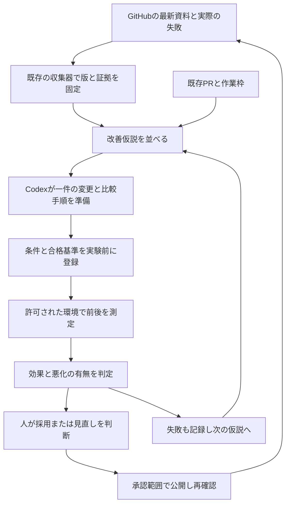

# サーバー構築の自律的な改善実験システム

作成日：2026-09-09。対象：`ns7jp/server`、`ns7jp/ns7jp`、`ns7jp/ns7jp.github.io`。

**実際の困り事を見つけ、小さく方法を変え、前後を測り、役立った方法を次の標準へ育てる仕組みです。**
ここでのイノベーションは、新しい製品を増やすことに限りません。
構築の手戻りが減る、復旧結果を判断しやすくなる、復元の不足を見つけられる、他の人へ引き継げるようになる、といった変化を対象にします。

既存の[週次監査](../portfolio-automation/weekly-operation.md)、[キャリア計画](../engineer-career/README.md)、
[自律型成長](../autonomous-growth/README.md)へ、**仮説 → 比較実験 → 効果判定 → 方法の見直し**を追加します。
本人の週10時間とCodexの原則1件45分の枠を共有します。

**高速な試行錯誤**は、[既存runに接続したローカルモデル探索](fast-loop.md)を使います。
反例に合わせて小さな条件変更を試し、悪化しない案を選んで最大5段階まで自動で進みます（回数は指定可能）。
`node tools/portfolio-loop/loop.mjs iterate-demo` で体験し、通常は `run`、同じ観測での再試行は `iterate` の一行です。

発火点から実際の改善準備へ進むには、[改善への橋渡し](bridge.md)を使います。
`run` が根拠付きの仮説を既存キューへ補い、選ばれた一件の実装手順・比較ケース・戻し方を作成します。
`bridge-show` で一式を開き、実装後のSHAを既存の実験登録へつなぎます。

発火点を自律的に補充する[探索と学習](discovery.md)も実装しました。
記録の不確実な点を抽出し、ローカルモデルで反例を作り、複数の発想法から新しい候補を登録します。
固定8候補が終了しても候補を補充し、実測の結果に応じて追試と探索配分を変えます。

## 使い始める順番

| 順番 | 文書 | 分かること |
| --- | --- | --- |
| 1 | [詳細設計](design.md) | 目的、構成、状態、優先順位、自律化の範囲、指標 |
| 2 | [8つの改善仮説と最初の実験](experiments.md) | 現在の実測から何を改善し、どう比較するか |
| 3 | [CLIと記録形式](tool-guide.md) | 実行コマンド、入力、期待出力、エラー |
| 4 | [週次・月次の運用](operation.md) | 発見から修正、評価、引き継ぎ、停止まで |
| 5 | [検証記録](validation.md) | 今回動かした機能とNOT RUN |
| 6 | [発火点の探索と学習](discovery.md) | 能動的な反例、新仮説の登録、結果から次の探索へ戻す循環 |

## 全体の流れ



機械がすることは、対象資料の取得・条件の照合・候補の整列・実験票の生成・比較判定です。
週次のCodexは関連コードと記録を読み、根拠のある仮説や小さな変更を作り、既存の検査を行います。
実験の実施者は対象環境の許可に従って測定し、本人の理解・第三者の評価は実際の回答と観察で確認します。

## 今回の実装

- 既存のGitHub収集器を再利用する改善キュー。古い収集、不明な出典、既存PRの競合、未完了CIを区別します。
- 構築・復旧・復元・設定ずれ・監視・認証・引き渡し・欠測に関する8つの仮説。
- 実験前に比較する版、環境、指標、全試行数、悪化させない条件を登録するCLI。
- 全試行、ローカル証拠ファイルのハッシュ、環境の対応を確認し、中央値と最悪値で判定するCLI。
- 同じ提案の再通知を抑え、実行履歴と作成済み実験票を保持する保存処理。
- 既存の文書CIに接続した自動テスト。追加のAI APIやAPIキーは不要です。
- 出典付きsignal、3種類のローカルプローブ、5発想法、独自提案の取り込み、永続する候補台帳。
- 比較結果のコピー・再検証・二重学習抑止と、結果を受けた追試の生成。

任意のサーバー変更、測定値の自動生成、自動マージはこのCLIの機能ではありません。
8仮説は初期候補です。探索処理が動的に候補を補充しますが、全リポジトリの問題を網羅した機械診断ではありません。
自律的な改善は、定期的に起動するCodexの作業とこのCLIを組み合わせて進めます。

## 最初の到達点

初期版の最初の候補は `INV-001` の復旧記録の改善でした。
拡張版はローカルモデルの不一致から候補を補充し、JSON形式の復旧記録の生成方法など、より具体的な新仮説へ進みます。
9月8日のD-1はHTTP復帰2秒を記録していますが、1回・当該VM・限定した計測区間の結果です。
今回の改善案は、この2秒をさらに短縮できたと主張するものではありません。
異なる意味の時間と証拠を分けて、判定に必要な確認作業を減らせるかを調べます。

まず合成データで道具を試せます。

```text
node --test tools/server-innovation/tests/*.test.mjs
node tools/server-innovation/demo.mjs .local/innovation-demo
```

デモの期待結果は `DEMO_ONLY`。デモにはVM操作・障害注入・外部送信がありません。
測定で有望と判定しても、本人の技能認定、本番適用、公開の許可には変換しません。
