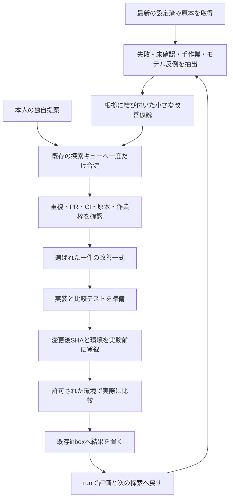

# 発火点から改善へつなぐ橋渡し

**原本の未確認点や反例を拾い、改善仮説へ変換し、選ばれた一件を実装手順・比較ケース・戻し方までつなぎます。**
既存の探索キュー、候補数の上限、PR競合の確認、共通作業枠を使います。
通常の `run` に組み込み、探索結果を見て人が一から依頼文を作る手間を減らします。

## いつもの一行で回す

```text
node tools/portfolio-loop/loop.mjs run
```

監査、計画、実測の取り込みに続いて、発火点の抽出、改善仮説の補充、候補選択、改善一式の生成を行います。
機械が担当するのは実装準備です。実コードの変更、実機の比較、実験の採否は、それぞれの実行と記録が必要です。

| 場面 | コマンド |
| --- | --- |
| 保存済みの新しい観測から準備する | `node tools/portfolio-loop/loop.mjs bridge` |
| 改善一式を検査して開く | `node tools/portfolio-loop/loop.mjs bridge-show` |
| 合成データで一巡を体験する | `node tools/portfolio-loop/loop.mjs bridge-demo` |

`bridge` はネットワークを使わず、既存計画も再確認します。観測がない場合や24時間を超えた場合は `run` による再取得が必要です。
`bridge-show` は保存した内容を表示するだけです。表示された原本の版を、適用前に `bridge` で再確認してください。
`bridge-demo` は専用の一時領域に合成の原本と台帳を用意します。本人の私用台帳に成果を追加しません。
JSONが必要なら `--json`、既存の私用台帳を使う場合は `--root "リポジトリの絶対パス"` を指定します。
デモには `--root` と `--offline` を指定しません。

## 一巡の流れ



今回の追加はB〜Gと、次の行動の順序です。H以降で必要な実操作・本人判断を、モデルの計算結果で代用しません。
実装後の候補SHAを用意する必要があるため、案内は **実装準備 → 実験登録 → 比較 → 評価** の順にします。

## 何を発火点にするか

| 発火点 | 自動で用意する橋渡し | 未確認のまま残すもの |
| --- | --- | --- |
| D-1のモデル反例 | 完了した比較で改善した一条件を、既存判定への小変更として提案 | 実コードへの適用効果、入力が現実に到達するか |
| 原本に記載された失敗・不一致 | 入力・前提・期待値・観測値をそろえる比較仕様と検査の案 | 現在も再現する欠陥かどうか |
| 手動確認・転記・繰り返し | 一工程を読み取り専用の比較器へ置き換える案 | 実際に削減できる時間 |
| 未確認・根拠不足 | 必要な入力と採録項目、未確認を明示する対応表 | まだ存在しない証拠や測定値 |

探索するのは既存の収集設定に含まれるファイルです。取得していないページや任意のインターネット情報を読んだことにはしません。
原本の文字列は問いの出典です。「FAIL」等の記述があるだけで現在の欠陥と認定しません。
収集対象外のファイルや、欠落フラグに古い本文を混ぜた入力は拒否します。

## 既存キューへの合流

自動提案は、既存の独自提案と同じ7項目へ変換します。

```text
signal_id / title / hypothesis / change / paths / metric / rollback
```

一回の自動提案は最大2件で、全提案の上限4件を超えません。
`--proposals` で渡した本人の提案を先に保持し、残りの枠だけを使います。本人の提案が4件あれば自動提案は0件です。
根拠の一意な行、原本SHA、既存候補との重複、PRの変更範囲、同じ版のCIを、既存の探索処理で確認します。

橋渡しのために別の作業キューや時間枠を作りません。
順位は既存の優先度・スコア・ID順に従うため、新しい自動提案が必ず選ばれるわけではありません。
既存候補や本人の提案が選ばれた場合も、その一件について改善一式を用意します。
選択なし、使用中の作業枠、PR・CI・原本の問題がある場合は準備を止め、元の判断を優先します。

## 改善一式の中身

保存先は `.local/improvement-bridge/bundles/<内容ID>/` です。

| ファイル | 内容 |
| --- | --- |
| `implementation.md` | なぜ直すか、原本の版と行、変更対象、実装の手順、比較方法、戻し方、次の登録操作 |
| `handoff.json` | 選択候補の構造化された内容。変更案・指標・出典・入力の由来・登録待ち項目 |
| `regression-cases.json` | 正常例・反例・期待結果、検証の手順、関連するモデル比較 |
| `proposals.json` | 自動で作った改善仮説と原本の由来。選択された候補の全情報はhandoff.json |
| `manifest.json` | 各ファイルのSHA256と内容ID |

関連するD-1モデルがある場合は、全ケースと採らなかった案も比較資料として残します。
モデルを用意していない原本では、実行可能なケースを創作せず、必要な入力と期待結果を確定する手順を記載します。
原本が合成だった場合は、一式を単独で開いても `input_data_kind: synthetic` と分かるように表示します。

一件の候補について、最初に読むのは `implementation.md` です。
対象版を確認して最小変更を作り、同じ条件の正常系と反例を比較します。
変更後のSHA・環境・scopeを用意してから、既存の `register` を使います。準備段階の候補SHAは `NOT SET` です。
同じ候補でも原本のHEADが進んだときは旧下書きを残して新しい実験票の下書きを用意し、引き継ぎと比較元の版をそろえます。

## 状態の読み方

| 状態 | 意味と次の行動 |
| --- | --- |
| READY | 改善一式を準備済み。PREPARE_IMPLEMENTATIONの案内から内容を確認 |
| NO_SELECTION | 既存キューで準備対象が選ばれていない。作業枠・PR・本人判断を先に確認 |
| NEEDS_REFRESH | 観測を再取得してから再実行 |
| REVIEW_SOURCE | 原本の版・本文・一意な行の対応を確認 |
| REVIEW_GATES | 選択状態・CI・PR競合などの条件を確認 |
| REVIEW_PROTECTED_SOURCE | 本人の学習や実測の原本など、保護対象へ自動変更案を渡さない |
| ARCHIVE_REVIEW | 保存上限。残す一式と整理対象を本人が確認 |

READYは資料の準備状態です。実装済み、実機合格、公開可能という意味ではありません。
本人が停止中なら処理を止め、負荷調整の確認待ちなら探索の候補追加と新しい橋渡しを保留します。
一式が準備済みでも、学習枠の接続や実験結果の採否など、既存の優先行動が先に表示されます。

## 保存・再実行・停止

同じ内容の一式はハッシュを確認して再利用します。評価日時やモデル処理時間だけでは新しい一式を作りません。
原本HEADが変わった場合は、その版に対応した一式を保存します。本文や改善内容が同じなら、HEADだけの変更では再通知しません。
指標・比較条件・改善内容が変わった場合は通知します。

一式は最大32件、各ファイル2MiB以下、一式の合計4MiB以下です。保存上限でも既存の同じ一式は再利用できます。
ファイルが壊れている場合は通常のrunの書き込み前に止まります。壊れた内容や残存ロックを自動で消しません。
保存時は全ファイルとmanifestができてからフォルダを切り替えます。
全システムをまとめたトランザクションではないため、途中停止時は既存の監査・探索記録も確認してから再実行します。

## 実測と次の改善へ戻す

実施した比較の記録は既存のinboxへ置き、`run` で評価・feedback・次の探索へ戻します。
モデルの合成ケースや準備資料を実測結果へ変更して投入しません。
採用・却下・保留は既存の本人用台帳へ記録し、それに基づいて次回の候補が変わります。
`LEARNINGS.md`、技能合否、本人のキャリア原本、実測の原本を自動更新する処理はありません。

[検証記録](bridge-validation.md) / [既存の探索](discovery.md) / [高速試行](fast-loop.md) / [実験登録と記録形式](tool-guide.md)
