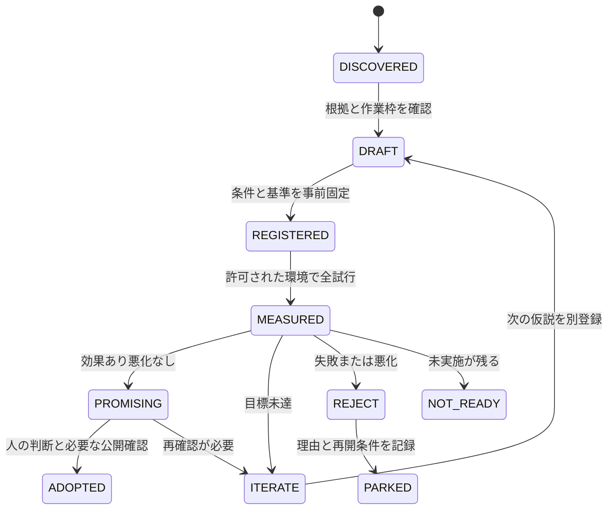

# 自律的な改善実験の詳細設計

## 1. 解決する問題

サーバー構築では、一度動いたことと、同じ条件で再現できることに差があります。
資料や技術を増やしても、構築時の手戻り、復旧判断、復元の完全性、引き渡し時の質問が改善したかは分かりません。
このシステムは、既存の成果を土台にして、**改善したい結果・変更する方法・測定条件・採否**を一つにつなぎます。

例：「復旧できた」から「どの機能が、どの時点で、どの根拠で戻ったと言えるかを短時間で確認できる」へ進めます。
仮説が外れた結果も、同じ方法を繰り返さないための成果として保存します。

## 2. 現在の構成と正本

2026-09-09に公開GitHubの既定ブランチを読み取り、既存の週次監査と学習支援CLIを確認しました。
監査の初期試作品PR #102は取り込み済みで、現在は9月8日の自動収集・限定修正案生成も含まれます。
プロフィール画面の表示だけで最新の実測範囲を推定せず、対象SHAのコードと日付付き記録を使います。

| 管理対象 | 正本 | このシステムからの扱い |
| --- | --- | --- |
| 実装、試験、環境ごとの実測 | `ns7jp/server` | 改善対象。過去の試験結果は元の版・環境のまま参照 |
| プロフィール、文書、監査・学習ツール | `ns7jp/ns7jp` | 改善運用と実験判定の実装場所 |
| 公開サイト | `ns7jp/ns7jp.github.io` | 根拠付きの成果を伝える場所。実測の正本にしない |
| 本人の技能・説明 | 既存SE台帳 | 実際の試行と評価だけを読む。合否を書き換えない |
| 案件承認・引き渡し | 既存PJ台帳や所属先の正本 | 実験判定と業務承認を分ける |
| 学習・作品・就職活動の時間 | 既存career計画 | 合計週10時間と既約束を維持 |
| 改善の私用状態 | `.local/`等の実行先 | context、実験登録、測定原本、判定、採否理由を保持 |

`LEARNINGS.md`、本人の実行記録・資格・経験・理解は本人が管理します。
機械の提案、AIによる準備、本人による試行、評価者の判断を別々に記録します。

## 3. 三つの時間幅で改善する

| 周期 | 主にすること | 生成するもの |
| --- | --- | --- |
| 実習や障害の直後 | 予想と実出力の差、どこで迷ったか、未解決の仮説を残す | 既存の本人記録と改善候補への参照 |
| 毎週の既存自動化 | 最新情報取得、前提確認、一件の準備または修正、必要な検査 | 改善キュー、差分、実験票、判定結果、必要な確認事項 |
| 月次レビュー | 採用した方法の継続効果、誤検知、手間、未解決事項を見直す | 続ける方法、取り下げる方法、次月に試す一件 |

月次レビューも同じ週次実行の該当週に行い、別スケジューラや追加の作業時間を作りません。
原則として3回の既存手順改善に対して1回、新しい方法の探索を候補にします。
この比率は運用上の初期案で、CLIが強制する配分ではありません。期限のある不具合・案件を優先します。

追加した `discovery.mjs` は毎回の完全な収集で能動プローブと候補補充を行い、生成回数と実測評価から発想法の配分を調整します。
具体的な重み、実行上限、失敗後の追試生成は[探索と学習](discovery.md)で定義しています。

## 4. コンポーネントと入出力

| 部品 | 入力 | 出力・責務 |
| --- | --- | --- |
| 既存 `github.mjs` | 3リポジトリの設定 | GET収集、完全SHA、Git blob SHA、SHA-256、open PR、HEADのActions run |
| 既存 `cycle.mjs` | スナップショット、運用状態 | 既存の監査結果、限定修正案、重複・取得失敗の状態 |
| `catalog.json` | レビューした課題の型 | 8仮説、根拠を探す位置、変更パス、比較する指標 |
| `innovation.mjs plan` | 同じスナップショット、作業枠context | 順序付きキュー、一件の準備提案、出典付きレポート |
| `register` | 条件を埋めたDRAFT | 登録時刻付きの実験計画、結果と結ぶSHA-256 |
| `evaluate` | 登録計画、測定値、ローカル証拠 | 比較可能性、全試行、悪化、効果の判定 |
| `probes.mjs` | 対応する採録済みD-1ソース | 境界・反例・JSON出力のローカルモデル比較 |
| `discovery.mjs cycle` | 拡張snapshot、作業枠、前回台帳、任意の独自提案 | signal、動的候補、重複検査、一件の準備提案 |
| `feedback` | 登録計画、実測全試行、原本 | 原本の保管と再評価、学習履歴、追試・探索重みの更新 |
| 週次Codex | 上記出力と最新の関連資料 | 仮説の見直し、隔離した修正、検査、採否のための資料 |

追加CLIはリポジトリ本文やPRにあるコマンドを実行しません。
新仮説の補充は機械処理でも進み、汎用の意味理解とコード修正は、週次のCodexが実際のファイルを読んで行います。
新しい外部AIサービスや別のエージェント群を稼働させる必要はありません。

## 5. 仮説を作る方法

次の問いから一つ選びます。

1. **なくす**：何度も転記・確認している手作業をなくせるか。
2. **分ける**：HTTP復帰、healthy、データ復元のように違う成功条件を分けると誤判定が減るか。
3. **組み合わせる**：構築入力、試験ID、実出力を結ぶと引き渡しが楽になるか。
4. **早める**：メモリやDNS等の不備を変更前に見つけられるか。
5. **逆を試す**：正しい認証だけでなく、間違いを拒否できるか。
6. **条件を変える**：新規ホスト、別の日、別の実施者でも成立するか。

仮説は「対象の困り事 → 一つの変更 → 予想する改善 → 悪化させない条件」で書きます。
根拠は失敗、原出力、手順の欠落、本人・受け手の具体的な反応です。
流行しているだけの技術、GitHubの活動数、AIが生成した資料の量を改善の根拠にしません。

初期カタログの検出は、証跡台帳の指定された見出し・表の行です。
拡張探索は17ファイルの文章とD-1コードを読み、固定見出し以外からも新しい問いを抽出します。
語句に基づく抽出の限界と独自仮説を追加する手順は[探索と学習](discovery.md)にあります。
見出しが残っていても後続の記録で課題が進んでいる可能性があります。
したがって `PREPARABLE` は調査・準備できる候補であり、現在の欠陥や未実施の断定ではありません。
Codexが日付付き本文と後続記録を読んでから変更を作ります。

## 6. 優先順位と作業枠

まず既存の監査で見つかった重大な不具合や誤った実績表現を扱います。
改善実験内ではP1を中心的な構築・復旧・復元、P2をその品質を高める比較、P3を将来の探索とします。

同じ優先度では、`(2 × value + learning) / preparation_minutes` の大きい順に並べます。
valueとlearningは1〜5のレビュー用提案値です。順位にはIDで安定した順序を付けます。
得点は能力・採用率・利益の予測ではありません。

機械が強制する条件は以下です。

- スナップショットが設定上の鮮度内で収集完了している。
- 根拠の指定位置が一つだけ見つかる。
- 変更予定のパスがopen PRと競合していない。
- 取得範囲の対象リポジトリHEADのCIがすべて完了・successである。
- `occupied=false` で、未終了の別作業に枠を使っていないとの最新contextがある。
- ローカル準備の提案は一件、1〜45分に限定する。

**本人の実機実験にかかる時間は、準備の45分とは別の実測・見積が必要です。**
既存career計画の明示した技術枠へ収まると確認してから組み込みます。自動で時間を追加しません。
通常のコード修正も既存方針の5ファイル250変更行を目安にし、今回の初期システム構築とは区別します。

contextはCodexが既存pendingと台帳を確認して作る入力です。
新CLIが別タスクの台帳を自動で読んで占有を検証する機能はありません。
未確認なら `occupied=true`。現在の記録に基づかずfalseへ切り替えないことが運用の責任です。

## 7. 実験と意思決定の状態

CLIはDRAFT・REGISTEREDのファイル生成と比較判定までを実装しています。
加えてdiscoveryの台帳が新仮説と実験結果を結び、terminal結果から追試を生成します。
ADOPTED・PARKED、公開後確認の記録は週次Codexと本人の判断で別の採否記録へ残します。
`closed` はその記録を確認して作る候補除外リストです。キューから消えただけで採用済みにしません。

## 8. 比較と証拠の契約

実験前に、旧版・新版の完全SHA、同じ環境ID、環境条件ファイルのSHA-256、範囲、3〜10組の比較回数を固定します。
環境条件にはOS、CPU/RAM、初期データ、負荷、ネットワーク、依存版、計測器、実施者・支援量、リセット方法を含めます。
変更するのは仮説に対応する一つの方法です。違う環境や課題を混ぜて平均しません。

中央値の改善率は、低いほどよい指標なら `(旧中央値 − 新中央値) / 旧中央値 × 100`。
高いほどよい指標は差の向きを逆にします。旧中央値が0なら `INCONCLUSIVE` とします。
最悪値の悪化も別に確認し、初期設定では悪化を許しません。

高速化と引き換えに認証・データ・機能を落とさないよう、guardrailsを事前に定義します。
例：機能試験1＝合格、内容照合1＝一致、意図しない公開0＝なし。
実験に不要な観点を黙って1にせず、登録前にその実験で確認する具体的な項目へ置き換えます。

全組の旧・新がPASSで値と証拠を持ち、目標以上の改善かつ悪化なしの場合だけ `PROMISING`。
一度でも実行失敗があれば `REJECT`。未実施・環境制約は `NOT_READY`、成功例だけを抜き出しません。
3組は実用性を探る初期比較で、統計的有意差・一般的な因果効果・SLOを証明する試行数ではありません。
測定ばらつきが大きければ、別計画で追加試行や別日再確認をします。

登録ファイルのハッシュは、結果が同じ条件を参照しているかの検査に使います。
信頼できる第三者の時刻署名ではなく、意図的な記録捏造を防げる仕組みではありません。
原ログのハッシュも内容の同一性を示すもので、数値の意味や実験実施の真実性はレビューが必要です。

## 9. 成果指標

| 指標 | 計り方 | 誤解を避ける条件 |
| --- | --- | --- |
| 構築時間 | 同じ初期状態から受け入れ確認まで | ダウンロード待ち・手動待ちを含む区間を先に固定 |
| 復旧時間 | 異常発生から指定機能の連続成功まで | HTTP、healthy、データ、通知を混ぜない |
| 再現性 | 条件を満たした成功回数 / 予定全回数 | 未実施や失敗を分母から除外しない |
| 検出率 | 事前定義した不具合の発見数 / 全ケース | 後から有利なケースを足したり除いたりしない |
| 引き渡し負担 | 完了までの質問数・時間・介入数 | 初見・支援量・課題の違いを記録 |
| 運用の手間 | 本人確認時間、誤検知、未処理候補 | 提案件数自体を成功としない |
| 継続効果 | 採用後の再発・別日確認・戻した変更 | PR作成やmergeだけで改善完了としない |

初期の15〜30%という目標は検討用の提案値です。費用削減や効果を保証する実測値ではありません。
月次に「確認の負担が利益を上回る自動化」を取り下げることも改善に含めます。

## 10. 実装上の失敗への対応

収集不全・古い入力では修正依存作業を止めて再取得します。
PR競合は既存PRの確認へ戻し、未完了CIは原因と実行範囲を読みます。
登録条件の不一致や証拠改変は終了2で拒否し、値を補って成功扱いにしません。
同じ保存先の同時実行はロックで拒否します。ロックのPIDを確認せず削除しません。
状態が壊れたら履歴と原本を使って復元し、壊れたlatestを黙って初期化しません。

実行履歴は追記、latestだけが原子的に差し替わります。
実験票のコピーが残っていても同じ意味の提案を繰り返し新規生成しません。
外部通知サービスは追加せず、既存タスクで意味のある変化だけを通知します。

## 11. 参照した一次資料

- [GitHubのイベントと定期実行](https://docs.github.com/en/actions/reference/workflows-and-actions/events-that-trigger-workflows)：Actionsのスケジュールを将来採用する場合は既定ブランチや遅延の条件を確認する。今回のスケジューラは既存Codexタスクを使用。
- [GitHub Actionsの安全な利用](https://docs.github.com/en/actions/reference/security/secure-use)：収集した文字列を実行命令へ埋め込まず、必要な権限に限定する。
- [Ansibleのcheck/diff mode](https://docs.ansible.com/projects/ansible/latest/playbook_guide/playbooks_checkmode.html)：check modeは予測であり、対応しないモジュールもある。実適用後の機能確認とは区別する。
- [Prometheusのアラート設計](https://prometheus.io/docs/practices/alerting/)：利用者への影響を捉える観点を参考にし、HTTP・内部状態・通知の計測を分ける。
- [Codexの定期タスク](https://learn.chatgpt.com/docs/automations?surface=app)：登録と実際の実行結果を分けて確認する。

参照日：2026-09-09。採用する設定の版や実行条件は変更時に再確認します。
