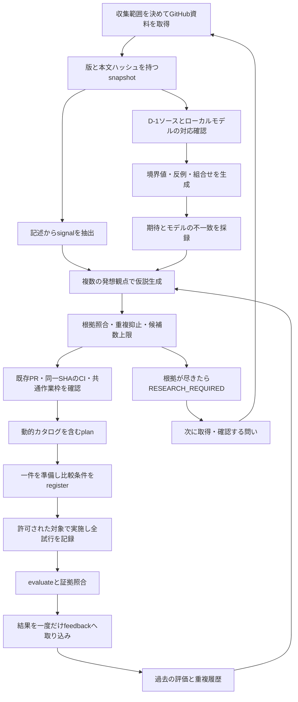

# 改善の発火点を作る探索と学習

この仕組みは、既存の8候補から選ぶ処理の前に、**新しい疑問を見つけ、反例を作り、仮説として補充する循環**を追加します。
実験の結果を次回の探索へ戻すため、候補が終了しても、同じ一覧の選び直しだけで終わりません。
対象は `ns7jp/server`、`ns7jp/ns7jp`、`ns7jp/ns7jp.github.io` の、収集設定に明示した資料です。

「発火点」は、現状と期待の食い違い、比較すると分かる未確認の条件、次に調べる価値のある問いです。
新技術の名前を増やすことや、案の生成数を増やすことを成果にしません。
まず復旧判定のような狭い対象で、判断の曖昧さを減らす実験へ変換します。

## 1. 自律的に行うこと

| 段階 | 入力 | 自動処理 | 残すもの |
| --- | --- | --- | --- |
| 違和感を拾う | 取得済みREADME、日付付き記録、対象コード | 失敗、不確実、繰り返し、引き渡し等の記述を抽出 | 出典と抜粋を持つsignal |
| 発見の機会を作る | 対応を確認したD-1判定のローカルモデル | 境界値、反例、条件の組み合わせを生成し比較 | 入力、期待、モデルの結果、不一致 |
| 複数の仮説を作る | signal、比較結果、過去の評価 | 工程削減、結合、前提反転、条件変更、説明の各観点を適用 | 指標と変更案を持つ仮説 |
| 実験候補へ登録する | 仮説、出典、既存候補、PR、CI、作業枠 | 根拠照合、重複抑止、上限確認、既存planへの接続 | 動的カタログと一件の準備提案 |
| 結果から探索を変える | 登録済み計画、全試行、証拠ファイル | evaluateを再実行し、未取り込みの結果だけ学習 | 次に使う観点、探索対象、追試の問い |

資料中に「FAIL」「未実施」等の文字が見つかっただけでは、現在の欠陥とは認定しません。
過去に修正済みの失敗、手順の注意書き、未実施条件があるためです。
signalは「この箇所からこの問いを作った」という出典であり、現状の合否判定は後続の確認へ分けます。

## 2. 構成と情報の流れ



探索CLIは、取得済みファイルを読むローカル処理です。
GitHubの取得は[既存収集器](tool-guide.md)、任意の文脈を読む調査・一件の変更準備は週次Codexが担当します。

直接のAPI取得が403等になった場合は、その結果を完全扱いにしません。
接続済みGitHubのGETが利用可能なら、同じ対象・完全SHA・blob・PR全ページ・CI・取得前後HEADを読み取り、
応答列を私用のcaptureへ保存して `connector-replay.mjs CAPTURE.json NEW_SNAPSHOT.json` で既存collectの検証を通せます。
blobが復号済みテキストで返る場合も元のGit blob SHAとサイズを照合します。
captureは `started_at`、`completed_at`、`responses` を持ち、responsesはAPI routeから実際の取得順の応答配列への対応です。
取得前後の同じrouteは二つの応答を保存します。古い応答を複製して再取得の代わりにしません。
取得不能なら次回の再取得を待ち、認証情報の抜き取りや不完全データの成功扱いは行いません。
仮説生成は明示した観点と入力から再現できる処理で、追加のAI APIキーを必要としません。
自由な調査や新しい観点の実装が必要になった場合は、次の問いとして週次作業へ渡します。

## 3. 違和感を残す方法

採録対象は、[探索用収集設定](../../tools/server-innovation/discovery.config.json)にあるファイルの本文です。
文章のsignal抽出はMarkdownとHTMLの一意な本文行を対象とし、コードフェンス内、見出し、短すぎる行等を除きます。
コードはD-1プローブの出典として別に扱います。全ソースを一般的に意味解析する処理ではありません。
各signalを、対象リポジトリ、ファイル、収集時の完全SHA、本文ハッシュ、抜粋と結び付けます。
後で正本が変わった際は、新しい資料と照合し直します。
以前のsignalを新しい版で確認したことにはしません。

| 観点 | 記述から作る問いの例 | 次の確認 |
| --- | --- | --- |
| 失敗 | 過去の失敗は、現在の判定手順でも再発を見つけられるか | 後続の修正と現在のコードを確認 |
| 不確実 | 「復旧した」は、HTTP応答、プロセス再起動、監視復帰のどれか | 主指標と合格条件を分ける |
| 繰り返し | 同じ値を複数の記録へ転記していないか | どの情報が正本か、工程を除けるか確認 |
| 引き渡し | 作業者以外が証拠から同じ結論へ到達できるか | 説明に必要な条件と原本を確認 |

READMEの概要と日付付き実測記録を同じ意味で扱わないことが要点です。
例えば「実機確認待ち」という概要が残っていても、後続の実測記録がある場合はその対応確認が必要です。
欠測は失敗へ、過去のPASSは現在のPASSへ自動変換しません。
履歴や本人の学習記録を書き換えて不整合を消すことも行いません。

## 4. 発見の機会を作るD-1プローブ

最初の探索対象は、`ns7jp/server` の `scripts/drills/d1-process-down.sh` にある復旧判定です。
取得した本文ハッシュを確認し、改行を正規化したソース全体のハッシュがレビュー済みモデルと一致する場合に、入力ケースを作ります。
シェルスクリプト自体を実行したり、コンテナやプロセスを停止したりする処理ではありません。

モデルでは、例えば「HTTP成功かつRTO以内」の判定と、
再起動回数などを加えて確認する判定を比較します。
後者は調査する仮説であり、あらゆる環境で正しいと認定された合格条件ではありません。

| 作り方 | 入力例 | 見つけたい問い |
| --- | --- | --- |
| boundary | RTOを299・300・301秒へ変える。HTTP状態とcurl終了値、負の経過秒も入力する | 境界で合否が意図どおり切り替わるか |
| counterexample | HTTP成功、RTO以内で再起動回数が変わらない、または確認先が別対象 | HTTP成功だけで対象プロセスの自動再起動まで確認できるか |
| combination | 人向けログとRESULT_JSONを併記し、service名の引用符・改行等を組み合わせる | JSONエスケープや最終行の読取り境界が崩れないか |

プローブが見つけた不一致は、**同じ合成入力に対するモデル間の差**です。
実際にその状態が起きた証明でも、実機の復旧失敗でもありません。
入力例を根拠に、「記録するだけだった再起動回数を判定へ加えると、誤って成功と扱うケースが減るか」などの仮説を作ります。
実際の改善案を評価する際には、正常な復旧を誤って落とさない条件も必要です。

JSON比較も、取得したprintf形式を文字列操作で再現するローカルモデルです。
特殊文字を持つservice名が実際にDocker Composeの先行チェックを通るかは未確認です。
curl終了値とHTTP状態の組も合成入力であり、HTTPリクエストを送って挙動を実測していません。

ソースの対応確認ができなくなったら `MODEL_UNSUPPORTED` とし、ケースを実行せず `MODEL_REVIEW` の問いを出します。
変更を調査し、モデルと反例の対応をレビューしてから再開します。
コードの任意の変更を解析できる一般的なシェル実行器や形式検証器ではありません。

## 5. 問いを複数の仮説へ変える

同じsignalにも複数の発想観点を適用し、最初に思い付いた解決策だけに固定しません。

| 観点 | 意味 | 復旧判定に対する仮説例 |
| --- | --- | --- |
| remove | 不要な工程を除く | 重複転記をなくし、原本一つから判断できるか |
| combine | 分かれた条件を組み合わせる | HTTP応答と再起動の証拠を合わせると判断漏れを減らせるか |
| invert | 成立している前提を逆から試す | 成功ログがあるのに成功と扱うべきでない入力を見つけられるか |
| vary | 条件を変えて確かめる | RTOの境界や負荷条件を変えても改善が残るか |
| explain | 他者の説明・判断を確認する | 計測区間と証拠を明示すると説明に必要な確認作業を減らせるか |

各仮説には、出典、変更対象、期待する効果、主指標、目標、準備時間、戻し方を持たせます。
「品質を上げる」のように比較できない表現だけでは実験を登録しません。
指標の例は、誤って成功と扱ったケース数、判定に必要な確認時間、同じ情報の転記箇所数です。
比較する条件と測り方は、実験前の登録で具体化します。

動的候補IDは `INV-` に16桁の16進数を続けた形式で、初期候補の `INV-001` 等と共存します。
候補には出典本文の `source_sha256` を保持します。
候補IDと重複判定用 `novelty_key` は、出典と仮説の意味を追跡するために使います。
時刻が変わった、タイトルの言い方が少し変わった、無関係なHEADが進んだというだけで、別の改善案を量産しません。
重複判定は、同じnovelty_key、正規化した仮説の一致、
または同じリポジトリ・ファイル・operatorにおける3文字組のJaccard類似度0.9以上で行います。
正規化はNFKC・小文字化・URL除去・空白や句読点等の除去です。
同義に近い候補の抑止はこの範囲で行います。
自然言語のあらゆる同義表現や、別リポジトリの概念的な重複を完全に判定する機能ではありません。

## 6. 動的カタログと一件の実験をつなぐ

新しい候補は、既存8候補と合わせてplanへ渡します。
固定カタログを手作業で増やさなくても、保存された探索状態から次回の候補を補充できます。
根拠が見つかったことと、今すぐ準備できることは別々に記録します。

候補の準備前に、次の条件を確認します。

1. snapshotが収集設定に対して完全で、許容期間内である。
2. 出典の版・本文・該当箇所が候補の根拠と対応する。
3. 変更予定パスと既存open PRが競合していない。
4. 対象と同じSHAのCIが確認でき、未完了や失敗を成功扱いしていない。
5. 作業枠contextが新しく、共通の一件が空いている。
6. 終了済み候補との重複や、保存する候補数の上限に抵触していない。

条件を満たす候補を一件選び、実験票をDRAFTとして準備します。
既存の[registerとevaluate](tool-guide.md)を使い、
比較する二つのSHA、同じ環境と条件ファイル、3〜10組の予定試行数、主指標、悪化を許さない条件を固定します。
準備候補の選択を、実機操作、外部公開、PR作成、マージの許可へ変換しません。

| 上限 | 件数 | 意味 |
| --- | --- | --- |
| 一回に使うsignal | 40 | プローブを優先し、対象と行順を固定して採用 |
| 一回の新規候補 | 4 | 独自提案と結果からの派生案も共通枠 |
| 未終了の動的候補 | 12 | 到達時はBACKLOG_FULLとして既存候補を進める |
| 動的候補の登録履歴 | 240 | 終了・SUPERSEDEDも含む。自動で履歴を消さない |
| feedbackの保存記録 | 100 | NOT_READYの途中結果も含む |

上限に達したら、新案を無制限に追記せず、既存候補と終了記録を先に確認します。
登録履歴・feedbackの上限まで来た場合、長期保存と新しい状態への移行はレビュー対象です。自動アーカイブ機能はありません。
過去の履歴を消して候補を新規扱いに戻す運用は避けます。
終了した候補を別条件で試す場合は、元の候補と結果への対応を残した追試にします。
出典本文が更新された動的候補は `SUPERSEDED` にし、以前の本文を新しい根拠として使いません。

## 7. 結果から次の探索を変える

feedbackには、判定名だけを書いた自己申告を渡しません。
登録済み計画、results、証拠ディレクトリを渡し、evaluateによる来歴・全試行・証拠ハッシュの確認を経て取り込みます。
計画SHA-256とresultsのSHA-256を組み合わせて識別し、同じ結果を再送しても成功回数や探索の優先順位を重複して更新しません。
NOT_READY以外の実測判定はterminalとして候補を閉じ、同じ登録計画の結果を書き換える取り込みを拒否します。
NOT_READYは未完了なので、後で試行が揃ったresultsを同じ計画へ取り込めます。

| evaluateの判定 | 学習での扱い | 次の問い・探索 |
| --- | --- | --- |
| PROMISING | 当該条件で有望な観察として記録 | varyで別条件の追試 |
| ITERATE | 目標に届かなかった結果として記録 | combineで別の観点を接続 |
| REJECT | 試行失敗や悪化を含む結果として保持 | invertで反例を残した別案 |
| INCONCLUSIVE | 今の指標では比較不能として保持 | combineで比較方法を見直す案 |
| NOT_READY | 未実施・欠測・環境制約として保持。効果評価件数から除外 | 残りの条件や証拠を確認。自動の派生候補は作らない |
| DEMO_ONLY | feedbackは拒否し実測の学習台帳に保存しない | evaluateで動作練習として確認 |

派生先が元のoperatorと同じ場合は、explainへ切り替えます。
現在のsignalが元候補の出典へ対応する場合だけ派生案を作り、元候補IDと判定理由を残します。
新規候補の共通上限を守るため、同じ回に全派生案が登録されるとは限りません。

学習は、どの発想観点を次に試すかという重みと、後続の候補生成へ反映します。
operatorごとの重みは、`(1 + promising) / (2 + evaluated + rejected) + 1 / (1 + generated)` です。
evaluatedはNOT_READYを除く一意な計画の最新結果、generatedは当該operatorの登録履歴の件数です。
前半で有望・棄却の観察を反映し、後半でまだ使っていない観点へ配分します。
初期8候補やcustom案の結果からも派生案は作りますが、この5operatorの重み計算には直接加算しません。
別テーマを持つsignalの組み合わせも探し、一度有望だった方法だけを固定して使い続けないようにします。
これは少数の比較結果に基づく探索上の選択です。
最適な方式の保証、因果関係や統計的有意差の証明、本人の技能認定には使いません。

## 8. 実行手順と保存状態

実行場所はリポジトリルートです。`SNAPSHOT.json`、`WORK-CONTEXT.json`、`STATE_DIR` は実際のパスへ置き換えます。
STATE_DIRにはGit管理外の私用保存先を使います。実験の原本もここへ保存されます。
探索にはD-1コード等の拡張範囲が必要なので、既存収集器へ探索用設定を渡します。

```text
node tools/portfolio-audit/scripts/cycle.mjs tools/server-innovation/discovery.config.json .local/portfolio-operations
```

出力のreportと同じ実行ディレクトリのsnapshotを使います。
作業枠contextは[CLIの使い方](tool-guide.md)に沿って作り、24時間以内の実際のpending・採否確認を反映します。

```text
node tools/server-innovation/discovery.mjs cycle SNAPSHOT.json WORK-CONTEXT.json STATE_DIR
```

cycleは、signalとプローブからの仮説生成、重複と上限の確認、動的カタログ作成、plan接続をまとめて進めます。
出力先と選択状態を読み、選択された一件だけ準備します。
同じ入力・同じ結果で再実行した場合は、候補や学習を二重に増やさず、意味の変化がない通知を抑えます。

Codexの追加調査で作った独自仮説も、現在のsignalを出典として登録できます。
任意の第4引数PROPOSALS.jsonは次の形式です。例のsignal_idはcycleに出た実際のIDへ置き換えます。

```json
{
  "schema_version": 1,
  "proposals": [
    {
      "signal_id": "SIG-現在のsignalの16桁ID",
      "title": "復旧結果の照合箇所を減らす",
      "hypothesis": "同じ原本から期待値と実測を対比できれば確認時間を短縮できる可能性がある。",
      "change": "比較用の記録に期待値・実測・未確認の対応表を追加する。",
      "paths": ["docs/evidence/2026-09-08-lab-base01-d1-practice.md"],
      "metric": {"name": "根拠確認時間", "unit": "seconds", "direction": "lower", "target_percent": 20},
      "rollback": "対応表の変更だけを戻し、原本と全試行は残す。"
    }
  ]
}
```

```text
node tools/server-innovation/discovery.mjs cycle SNAPSHOT.json WORK-CONTEXT.json STATE_DIR PROPOSALS.json
```

一回最大4提案です。根拠のないsignal_id、未知の項目、不正な指標・パス等は拒否します。
出典、候補ID、operatorはCLIが付け、独自案も重複・候補上限・PR・CI・作業枠の確認を通します。
候補を実験せず終了する場合は、動的候補IDと具体的理由を記録します。

```text
node tools/server-innovation/discovery.mjs dismiss STATE_DIR CANDIDATE_ID "後続記録で解消済みのため。対象の記録を確認した。"
```

初期8候補の終了はcontext.closedに記録します。dismissは動的候補用です。
同じ候補を再度dismissしても、終了記録や通知を重複して増やしません。

実験前の登録と実験後の取り込みは次の順です。

```text
node tools/server-innovation/innovation.mjs register DRAFT.json REGISTERED.json
node tools/server-innovation/innovation.mjs evaluate REGISTERED.json RESULTS.json EVIDENCE_DIR
node tools/server-innovation/discovery.mjs feedback STATE_DIR REGISTERED.json RESULTS.json EVIDENCE_DIR
```

実際に測った値は `measured`、合成値は `synthetic` にします。
未実施は `NOT_RUN`、必要な環境がない場合は `SKIP_ENV` とし、測定値や証拠を捏造して埋めません。
feedback後のcycleで更新した探索状態を使い、次の候補を生成・選択します。

保存状態と探索結果には、処理済み入力、signal、プローブの発見、候補、結果の識別情報、探索の学習履歴を保持します。

| 保存先 | 内容 |
| --- | --- |
| latest.json | 最新のstate・resultへの相対パス、state_sha256、fingerprint、selected、notify |
| runs/UUID/state.json | その時点の候補・feedback・dismissals・処理済みround等 |
| runs/UUID/result.json | 当該処理の結果。cycleではsignal、プローブ、質問、planを含む |
| runs/UUID/report.md / catalog.json | cycleの説明と固定・動的候補を合わせたカタログ |
| runs/UUID/protocol.draft.json | 前回参照と準備候補IDが変わった場合の実験票 |
| feedback/UUID/input.json | 登録済み計画とresultsのコピー |
| feedback/UUID/evidence/ | 条件ファイルと各試行の原本コピー |
| discovery.lock | 同時更新を防ぐ実行中のロック |

各実行履歴は新しいUUIDディレクトリへ追記し、最新参照を一時ファイルから置き換えます。
feedbackは原本を私用保存先へコピーし、コピーもevaluateで照合してから学習へ登録します。
次の読込みごとにstateのハッシュを検証し、保存済みfeedbackの原本を再evaluateします。
学習用に書いた判定だけを信頼して、原本の改変や欠落を見過ごすことを避けます。
最新参照と保存内容が一致しない場合や、同時実行のロックがある場合は、黙って初期化せず確認します。
ローカルハッシュは保存内容の照合に使うもので、測定の真実性や第三者による時刻証明を保証しません。

終了コード0は処理完了です。cycleの候補なし、feedbackのNOT_READY取り込みも含みます。
cycleの収集不全は3、入力・ハッシュ・ロック・上限等のエラーは2です。
feedbackの終了0を実験のPROMISINGと読み替えず、保存したverdictを確認します。

## 9. 止まる条件と再開方法

| 状態・条件 | 停止する範囲 | 再開するための確認 |
| --- | --- | --- |
| NEEDS_REFRESH | 新しい準備候補の選択 | 収集器で完全な最新snapshotを取得 |
| SOURCE_REVIEW | 当該出典を前提とする準備 | ソース、後続記録、根拠の対応を確認 |
| MODEL_UNSUPPORTED / MODEL_REVIEW | 当該モデルのケース生成 | 更新ソースとモデルの対応をレビュー |
| EXISTING_PR_REVIEW | 競合する変更の準備 | 既存PRの目的・状態と重複を確認 |
| CI_REVIEW | 当該SHAの変更準備 | 同一SHAのCI状態を確認 |
| 作業枠使用中 | 新しい一件の選択 | 既存の作業とpendingを確認してcontextを更新 |
| BACKLOG_FULL | 未終了候補12件を超える登録 | 保存済み候補を評価し、採否と終了を記録 |
| 登録履歴・feedbackの上限 | 上限を超える更新 | 原本保持と移行方針をレビュー |
| RESEARCH_REQUIRED | 同じ根拠からの新規仮説量産 | 出力された問いに対応する資料や結果を取得 |
| 入力・履歴・ハッシュ不整合 | 不整合な状態の更新 | 元ファイルと登録記録を確認し復元 |

RESEARCH_REQUIREDは、仕組みが壊れた状態とは限りません。
有限の資料から、重複せずに試せる案を使い切ったときにも生じます。
その際は「次に何を取得・確認すると探索が進むか」を残します。
例えば、別条件の復旧記録、判断に迷った具体例、改善前後の全試行などです。
存在しない証拠を補ったり、古い結果へ新しい日時を付けたりして再開しません。

## 10. 週次の予算と運用

既存の毎週月曜9時、日本時間の運用に接続します。
新しい定期ジョブを重ねて候補ごとに別枠を消費せず、本人の週10時間、Codex原則一件45分の共通枠を使います。

週次は、最新資料の取得、前回結果の未取り込み確認、cycle、既存PR・pending確認、一件の準備という順です。
準備する変更には、狙い、差分、比較手順、実行した確認、NOT RUNを残します。
実機実験が必要な場合は、その環境と実施範囲に沿って進めます。
45分に収まらない候補は、一件の比較で判断できる問いへ分割して再登録します。
分割しても総作業枠が増えたことにはしません。

通知は、意味のある新しい候補・結果・停止理由・必要な本人作業が生じた場合を対象にします。
単に時刻が進んだ、同じ状況を再取得した、未実施が引き続き未実施であるというだけでは通知を増やしません。
外部への投稿やメッセージ送信は、探索CLIの動作に含めません。

## 11. 効果の確かめ方

| 確かめたいこと | 見る記録 | 読み方 |
| --- | --- | --- |
| 固定8候補が尽きても補充できる | 初期候補を閉じた状態のcycleと動的カタログ | 新しい出典付き候補、または具体的な次の調査の問いがあるか |
| 発見の機会を作れている | 生成した入力とモデル比較結果 | 正常例だけでなく境界・反例・組合せを調べたか |
| 重複で候補数を水増ししていない | 同じ入力の再実行、fingerprint、終了履歴 | 言い換えや日時変更だけで候補が増えていないか |
| 結果が次回へ戻る | feedback前後の状態と次のcycle | 一意な結果で探索先や追試候補が変わるか |
| 未実施を成功扱いしない | NOT_READY、DEMO_ONLY等の取り込み | 実測の成功学習と明確に区別されるか |
| 保存と再開が信頼できる | 追記履歴、最新参照、改変入力の拒否 | 再起動で学習を失わず、不整合を検出できるか |
| 実務で役立つ | 登録した主指標と全試行 | 前後比較で目標を満たし、機能等が悪化していないか |

前半はローカルの機能検証、最後は対象条件での実測です。
テストが通ったことから、復旧が速くなった、引き渡しができた、本番で安全に運用できたとは結論しません。
今回の実行済み範囲と未実施範囲は[検証記録](validation.md)を正本にします。

## 12. 学びを残す演習

1. HTTPが成功しているのに、自動復旧を確認できたと言い切れない入力を一つ説明してください。
2. 過去のFAIL記録から現在の欠陥を断定できない理由と、次に確認するファイルを挙げてください。
3. 一つのsignalにremoveとcombineを適用し、異なる指標を持つ仮説を作ってください。
4. PROMISINGだった実験について、効果が消えるかもしれない条件を一つ選び、追試の問いにしてください。
5. 固定候補と動的候補が終了したとき、架空の改善案を追加せずに収集すべき証拠を説明してください。

回答は本人の言葉で学習記録へ残します。
CLIは問いと比較材料を用意しますが、本人が理解・説明したという記録を自動で作成しません。
