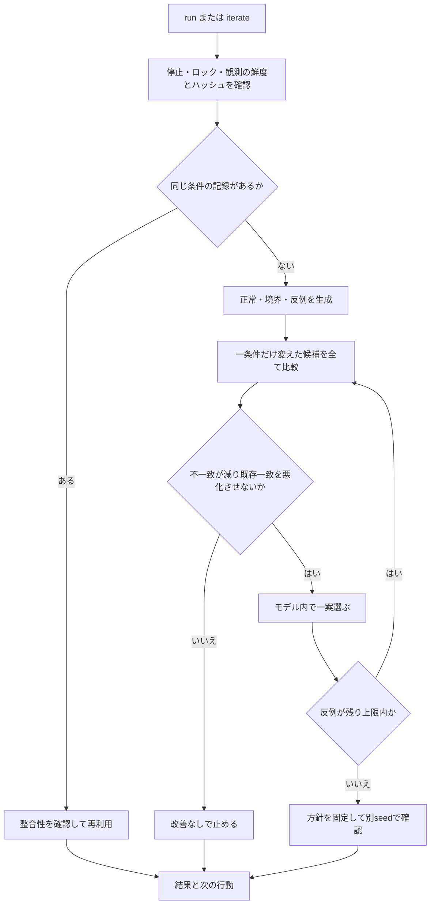

# 高速な自律型試行錯誤ループ

**反例を見つける → 小さな修正案を試す → 比較する → 悪化しない案を選ぶ → 次の反例へ進む**処理を、一度のコマンドで回します。
最初の対象は、既存D-1復旧判定のローカルモデルです。取得したシェルやサーバーを動かす機能ではありません。
通常の改善ループに接続し、同じ観測での繰り返しはGitHub取得と既存の週次計画を省きます。

## まず一回試す

追加パッケージやAPIキーを使わず、ネットワークなしで体験できます。リポジトリのルートで実行します。

```text
node tools/portfolio-loop/loop.mjs iterate-demo
```

一時ディレクトリへ合成ケースの試行記録を保存します。既定では22ケースの不一致が10件から0件になり、5回の小変更と別seedの確認を記録します。
これは、既知の比較方針にモデルが合うようになった結果です。サーバーの復旧速度や本人の技能の改善ではありません。

## 普段の操作

| 場面 | 一行で実行 | 自動で行うこと |
| --- | --- | --- |
| 通常の週次運用 | `node tools/portfolio-loop/loop.mjs run` | 従来の監査・計画・改善準備・繁栄判断に続きモデル試行 |
| 同じ観測で再試行 | `node tools/portfolio-loop/loop.mjs iterate` | 新しい保存済み観測を読み、モデル試行または保存結果の再利用 |
| まず一つの小変更だけ | `node tools/portfolio-loop/loop.mjs iterate --rounds 1` | 1ラウンドで止め、残った反例を記録 |
| 別の生成値で試す | `node tools/portfolio-loop/loop.mjs iterate --seed 42` | 選んだseedで比較し、探索後は異なるseedでも確認 |
| 時間枠を変える | `node tools/portfolio-loop/loop.mjs iterate --budget-ms 3000` | ローカル探索の時間枠を3秒にする |
| 取得済み入力を指定 | `node tools/portfolio-loop/loop.mjs iterate --offline SNAPSHOT.json` | 指定した観測の鮮度と内容を確認して実行 |

同じ `--root "本人台帳を含むリポジトリの絶対パス"` を使えます。JSON出力は `--json` です。
`iterate-demo` は専用の一時領域を使うため、`--root` と `--offline` は指定しません。
既存の `demo` は従来の週次ループのデモで、今回の試行デモは `iterate-demo` です。

初回の観測がないときや、24時間を超えたときは `NEEDS_REFRESH` になります。通常の `run` で一度取得してください。
`iterate` 自体はネットワークを呼ばず、観測日を現在時刻へ書き換えて再利用することもありません。
本人の停止・負荷縮小の確認待ちを尊重します。新しいスケジュール、週の作業時間、外部操作の許可は追加しません。

## 自動で回る中身



一ラウンドでは、その時点で未追加の条件を一つずつ加えた全候補を試します。
最も不一致が減る案を選び、同点は固定した順番で決めます。以前一致していたケースが不一致になる案は採りません。
不一致だったケースも正常対照も残し、成功した試行だけへ絞りません。
候補ごとの結果と、選択・同点・効果不足・悪化・時間切れの理由を保存します。

## 今回試せる五つの小変更

| 小変更 | 確認する問い |
| --- | --- |
| HTTP 200の確認 | curl終了コードだけで応答を成功と扱ってよいか |
| 非負の経過時間 | 負の経過時間が成功へ混ざらないか |
| restart countの増加 | 元の回数以下なのに復旧したと判断しないか |
| 対象の一致 | 別の対象の正常応答で成功と判断しないか |
| JSONのエスケープ | 引用符・改行等を含む文字列でも機械向け結果を読めるか |

これは有限の候補から比較方針への整合を探す機能です。自由なプログラム生成や任意コードの自己書換えではありません。
対応を確認したソース全体のハッシュが違えば `MODEL_UNSUPPORTED` として止めます。
実際には前段の入力検査で除外される値も合成ケースに含むため、反例が実機で到達可能かは別に確認します。

## 上限と停止理由

| 項目 | 既定と上限 |
| --- | --- |
| ラウンド | 既定5、指定可能1〜8。追加できる変更は現在5種類 |
| 探索時間 | 既定1,000ms、指定可能1〜5,000ms |
| seed | 既定0、0〜4,294,967,295の整数 |
| ケース | 現行モデルは正常・境界・反例・文字列の22ケース |
| 入力 | 読み取るJSONは8MiB以下 |
| 試行記録 | 1ファイル2MiB以下、保存領域は32記録まで |

時間は有限の評価処理の間で確認します。厳密なプロセス強制終了の期限ではなく、ファイル入出力や起動時間を含む総時間の保証でもありません。
途中で時間切れになったラウンドの比較は保存しますが、その未完了ラウンドの案は採用しません。

| 停止理由 | 読み方と次の行動 |
| --- | --- |
| CONVERGED | 探索ケースの不一致が0。モデル結果と別seedの確認を読み、実コードに適用するなら比較条件を準備 |
| ROUND_LIMIT | 回数上限。残った反例を読み、必要なら回数を増やす |
| TIME_LIMIT | 時間上限。残した途中結果を読み、必要なら時間枠やseedを変える |
| NO_IMPROVEMENT | 許可された一変更では改善しない。仮説や比較方針を見直す |
| MODEL_UNSUPPORTED | 原本とモデルが不一致。対応関係のレビューが必要 |
| NEEDS_REFRESH | 観測なし・古い・不全。通常のrunで再取得 |
| PAUSED / REVIEW_LOAD | 本人の停止または負荷調整を先に確認 |
| LOCKED | ほかの処理が動作中。終わってから再試行 |
| ARCHIVE_REVIEW | 保存上限。残す記録と整理対象を本人が判断 |

条件が同じなら完了した保存済み結果を返します。時間切れだけは次回に同条件で再試行し、前の途中結果も残します。
回数・時間・seedを変えると別の試行になります。完了済みの同条件では新しいファイルを作りません。

## 記録とキャッシュ

保存先は `.local/innovation-iterations/` です。既存の実測feedback、採否台帳、本人の成果記録には書き込みません。

| ファイル | 内容 |
| --- | --- |
| `latest.json` | 最新の状態、次の行動、観測日、ソースURL、通知の要否、処理時間、保存先 |
| `runs/<入力キー>.json` | 初期方針、全ケース、各修正候補の結果と理由、最終方針、残件、別seed確認、内容ハッシュ。時間切れ後の再試行は入力キーに一意IDを付けて別ファイルへ保持 |
| `run.lock` | 同時実行の抑止。残存ロックは自動で消さない |

入力キーは対象ソースのハッシュ、モデル版、探索コードとプローブのハッシュ、観測の由来、回数・seed・時間枠から計算します。
結果を使い回す場合も、観測の鮮度と本文のハッシュ、保存結果の内容ハッシュを確認します。
観測日時だけの変化では同じモデル試行をやり直しませんが、今回読んだ観測日時とURLは最新のものを出力します。
壊れた記録は自動で直さず停止します。32件の上限に達しても、既存の正常なキャッシュは利用できます。

通知は状態または試行条件の変化があったときだけです。通常の `run` のJSONには `innovation_iteration` を追加し、トップレベルの `notify` にも反映します。
繁栄側に優先行動があるときはそれを先に表示し、モデル試行は短い状態表示にします。
詳しい試行を確認するときは `iterate` を実行します。キャッシュ利用ならモデルの再実行はありません。

## 実測へつなぐとき

モデル内で良かった案を実コードに適用するには、対象ソース、期待する比較方針、現実に到達する入力、戻し方を確認します。
実際に比較する版と環境を用意してから、既存の[実験登録と測定](tool-guide.md)へ進みます。
モデル結果を `data_kind: measured` に変更して実測台帳へ投入しません。
実験の実施、採否、公開は既存の記録と許可に従います。

すべての試行出力は `execution_scope: local-model`、`data_kind: synthetic`、`runtime_status: NOT_RUN`、`authorization: NONE` です。
別seedの確認も固定の正常・境界ケースを共有するため、独立した統計的な検証ではありません。

[検証記録と処理時間](fast-loop-validation.md) / [既存の探索と学習](discovery.md) / [週次ループ](../portfolio-loop/README.md)
