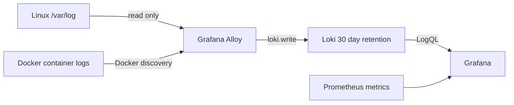

# 01. Loki + Grafana Alloy によるログ集約

> 状態更新（2026-05-27）: この設計は
> [server-monitor](https://github.com/ns7jp/server-monitor) に実装済みである。
> 当初検討した Promtail は 2026 年 3 月 2 日に EOL となったため、現在の収集エージェントは
> Grafana Alloy である。実行ログの証跡は server-monitor の証跡台帳へ追加する。

## 目的

メトリクスで異常を検知した後に、同じ Grafana 上でコンテナログと Linux ホストログを
検索できるようにする。障害切り分け時に「何が落ちたか」と「なぜ落ちたか」の確認を
別ツールへ分断しないことが狙いである。

## 実装構成

| 要素 | 実装内容 | セキュリティ判断 |
| --- | --- | --- |
| Alloy | `/var/log` と Docker logs を収集し、ラベルを付与して Loki へ送信 | socket とログ path は read-only、`no-new-privileges` |
| Loki | ファイルシステム storage、30 日 retention、LogQL query | API は loopback のみ公開 |
| Grafana | Prometheus と Loki の datasource、ログ panel | 認証された運用者向け |

## ラベル設計

| 対象 | ラベルにする値 | 本文検索のままにする値 |
| --- | --- | --- |
| コンテナログ | `service`、`container`、`compose_project`、`stream` | request ID、URL、client IP |
| Nginx access log | `method`、`status` | path、client IP |
| ホストログ | `job`、`host`、`process` | message 本文 |

高カーディナリティ値を label にしないことで、学習用の単一ホスト Loki でも
index の増大を抑える。

## 実装参照

| 内容 | server-monitor 側の正本 |
| --- | --- |
| 収集設定 | `deploy/alloy/config.alloy` |
| サービス構成 | `compose.yaml` の `alloy` / `loki` |
| 設定検証 CI | `.github/workflows/python-check.yml` |
| Query 例 | `docs/loki-queries.md` |
| 権限設計 | `docs/security.md` |

## 検証項目

| 確認 | 証跡として残すもの |
| --- | --- |
| Alloy 構文 | CI の `alloy validate` 結果 |
| Docker / host log 取り込み | Grafana Explore のマスク済み screenshot と LogQL |
| label cardinality | 使用 label 一覧と不要な動的 label がないこと |
| 再起動後の継続収集 | Alloy restart 前後の timestamp を含む結果 |

実行前の構成コードだけで「収集を確認済み」とは表現せず、
[検証証跡台帳](https://github.com/ns7jp/server-monitor/blob/main/docs/evidence/README.md) に
結果が追加された後に実績へ更新する。

## 参考

- [Grafana Alloy documentation](https://grafana.com/docs/alloy/latest/)
- [Promtail lifecycle and EOL notice](https://grafana.com/docs/loki/latest/send-data/promtail/)
- [Migrate from Promtail to Alloy](https://grafana.com/docs/grafana-cloud/send-data/alloy/set-up/migrate/from-promtail/)
