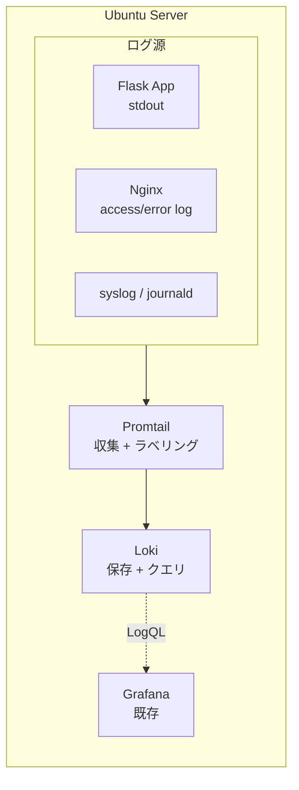
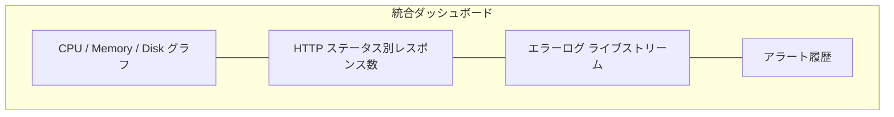

# 01. Loki + Promtail によるログ集約

## 1. 背景・課題

現状の server-monitor は Prometheus + node-exporter で **メトリクス** は収集できているが、**ログ** は収集していない。

実運用では、障害発生時に「メトリクスでアラート → ログで原因特定」の流れが基本のため、ログ集約は必須機能と判断した。

| 課題 | 現状 |
| --- | --- |
| アラート発火時、ログを SSH で個別確認 | 障害解析に時間がかかる |
| 複数コンテナのログが分散 | 横断検索ができない |
| アプリケーションログとシステムログが別物 | 因果関係の追跡が難しい |

---

## 2. 採用技術

### なぜ Loki か

| 候補 | 採用判断 | 理由 |
| --- | --- | --- |
| **Loki + Promtail** | ◎ 採用 | Prometheus と同じ Grafana Labs 製、Grafana 統合がシームレス、軽量 |
| Elasticsearch + Logstash + Kibana | × | リソース消費大、単一ホスト構成では過剰 |
| Fluentd + 自前ストレージ | △ | 柔軟だが構築工数が大きい |

**決め手**：既存の Prometheus / Grafana スタックに `docker-compose.yml` の追記 2 サービスで統合できる。

---

## 3. アーキテクチャ



---

## 4. 実装計画

### 4.1 `docker-compose.yml` 追記

```yaml
services:
  loki:
    image: grafana/loki:2.9.0
    container_name: loki
    restart: unless-stopped
    ports:
      - "127.0.0.1:3100:3100"
    volumes:
      - ./loki/loki-config.yml:/etc/loki/loki-config.yml:ro
      - loki-data:/loki
    command: -config.file=/etc/loki/loki-config.yml
    networks:
      - monitor-net

  promtail:
    image: grafana/promtail:2.9.0
    container_name: promtail
    restart: unless-stopped
    volumes:
      - ./promtail/promtail-config.yml:/etc/promtail/config.yml:ro
      - /var/log:/var/log:ro
      - /var/lib/docker/containers:/var/lib/docker/containers:ro
      - /var/run/docker.sock:/var/run/docker.sock:ro
    command: -config.file=/etc/promtail/config.yml
    depends_on:
      - loki
    networks:
      - monitor-net

volumes:
  loki-data:
```

### 4.2 Promtail 設定（抜粋）

```yaml
server:
  http_listen_port: 9080

positions:
  filename: /tmp/positions.yaml

clients:
  - url: http://loki:3100/loki/api/v1/push

scrape_configs:
  # システムログ
  - job_name: system
    static_configs:
      - targets: [localhost]
        labels:
          job: varlogs
          host: server-monitor-01
          __path__: /var/log/{syslog,auth.log}

  # Docker コンテナログ
  - job_name: containers
    docker_sd_configs:
      - host: unix:///var/run/docker.sock
        refresh_interval: 5s
    relabel_configs:
      - source_labels: ['__meta_docker_container_name']
        regex: '/(.*)'
        target_label: container
      - source_labels: ['__meta_docker_container_log_stream']
        target_label: stream
```

### 4.3 Grafana データソース追加

- Type: Loki
- URL: `http://loki:3100`
- 既存ダッシュボードに「Logs」パネルを追加し、メトリクスと並べて表示

---

## 5. 検証計画

| 項目 | 検証方法 | 合格基準 |
| --- | --- | --- |
| ログ収集 | `journalctl` で発生させたエントリが Grafana から検索可能か | 1 分以内に反映 |
| アプリログ | Flask アプリが stdout に出した ERROR ログが検索可能か | LogQL `{container="flask"} \|= "ERROR"` でヒット |
| Nginx ログ | Nginx の access.log がパースされて status code 別に集計可能か | LogQL でステータスコード別カウントが取れる |
| 容量 | 30 日保持で 5GB 以内に収まるか | 想定リテンション設定で実測 |
| アラート連動 | Loki のログから Alertmanager にアラート発火できるか | Loki Ruler で `5xx スパイク` を検知 |

---

## 6. ダッシュボード設計



**ポイント**：上から下に向けて「全体感 → アプリ → ログ → 履歴」となる視線誘導にする。

---

## 7. ロールアウト手順

1. ステージング相当の開発機で構築・動作確認（3 日）
2. ログ量とディスク使用量を実測、`loki-config.yml` でリテンション調整（2 日）
3. 本番機への適用（メンテナンスウィンドウ 1 時間）
4. 1 週間モニタリング、問題なければ完了

---

## 8. リスクと対策

| リスク | 対策 |
| --- | --- |
| ログ量爆増でディスク逼迫 | リテンション 14 〜 30 日で開始、`compactor` 設定で削減 |
| Promtail のラベル設計ミスでカーディナリティ爆発 | 動的ラベル（リクエスト ID 等）はラベルにせず本文に含める |
| Loki 単一障害点 | v2.0 で AWS S3 にチャンクを保存し、Loki 自体は使い捨て構成にする |

---

## 9. 完了条件（Definition of Done）

- [ ] `docker-compose up -d` で Loki / Promtail が起動する
- [ ] Grafana から既存の `system-overview` ダッシュボードでログが見える
- [ ] LogQL クエリのサンプル 5 件を `docs/loki-queries.md` に整理
- [ ] README に「ログ集約」セクションを追加
- [ ] CI（GitHub Actions）に Loki 設定の構文チェックを追加

---

## 10. 参考

- [Loki documentation](https://grafana.com/docs/loki/latest/)
- [Promtail configuration](https://grafana.com/docs/loki/latest/clients/promtail/configuration/)
- [LogQL cheatsheet](https://grafana.com/docs/loki/latest/logql/)
