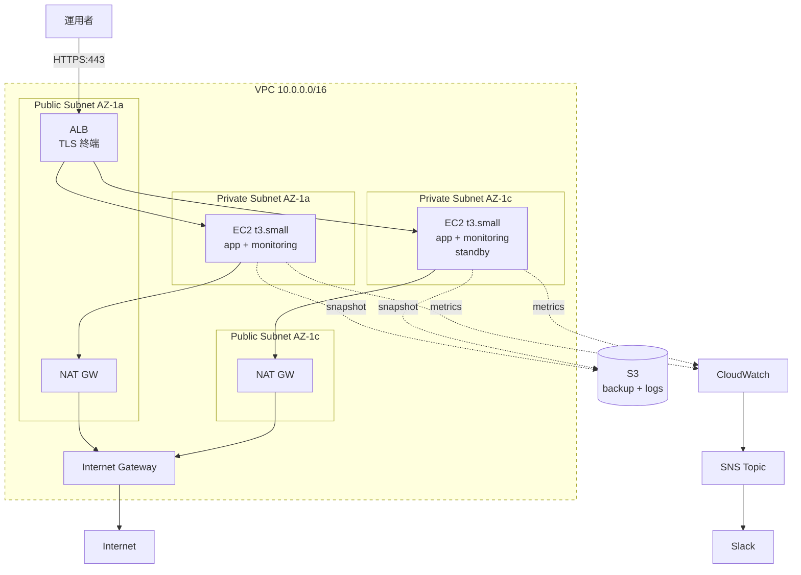
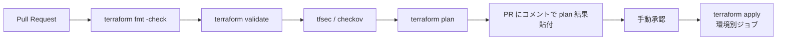

# 03. AWS + Terraform 化

## 1. 背景・目的

現状の server-monitor は単一ホスト構成（オンプレ or 単一 VM）。
求人で頻出する **「AWS / Terraform」** 経験を積むため、また「冗長化」「IaC」「クラウド運用」を実体験するために、AWS 上に Terraform で再構築する。

学習目的を兼ねるため、**無料利用枠 + ごく小規模な有料リソース** で完結させる。

---

## 2. 採用技術と判断

| 領域 | 採用 | 理由 |
| --- | --- | --- |
| クラウド | AWS | 国内求人比率最大、無料枠が手厚い |
| IaC | Terraform | クラウド非依存、コミュニティ最大、宣言的 |
| OS 設定 | Ansible（[02 参照](./02-ansible-automation.md)） | Terraform は OS 内に踏み込まない設計判断 |
| シークレット | AWS Secrets Manager + Terraform `sensitive` | git に平文を残さない |
| State 管理 | S3 + DynamoDB ロック | チーム開発を想定した標準構成 |

---

## 3. アーキテクチャ



---

## 4. ディレクトリ構成

```
server-monitor/
└── terraform/
    ├── environments/
    │   ├── dev/
    │   │   ├── main.tf
    │   │   ├── variables.tf
    │   │   ├── outputs.tf
    │   │   └── terraform.tfvars
    │   └── prod/
    │       └── ... (同上)
    ├── modules/
    │   ├── network/        # VPC / Subnet / IGW / NAT / Route Table
    │   ├── compute/        # EC2 / SG / Key Pair / EBS
    │   ├── alb/            # ALB / Target Group / Listener / ACM
    │   ├── monitoring/     # CloudWatch Alarms / SNS
    │   └── backup/         # AWS Backup / S3
    ├── backend.tf          # remote state (S3 + DynamoDB)
    ├── versions.tf         # provider バージョンピン
    └── README.md
```

---

## 5. モジュール設計

### 5.1 `network` モジュール（抜粋）

```hcl
variable "name"        { type = string }
variable "cidr_block"  { type = string }
variable "azs"         { type = list(string) }

resource "aws_vpc" "this" {
  cidr_block           = var.cidr_block
  enable_dns_support   = true
  enable_dns_hostnames = true
  tags = { Name = "${var.name}-vpc" }
}

resource "aws_subnet" "public" {
  for_each                = toset(var.azs)
  vpc_id                  = aws_vpc.this.id
  cidr_block              = cidrsubnet(var.cidr_block, 8, index(var.azs, each.value))
  availability_zone       = each.value
  map_public_ip_on_launch = true
  tags = { Name = "${var.name}-public-${each.value}" }
}

resource "aws_subnet" "private" {
  for_each          = toset(var.azs)
  vpc_id            = aws_vpc.this.id
  cidr_block        = cidrsubnet(var.cidr_block, 8, index(var.azs, each.value) + 100)
  availability_zone = each.value
  tags = { Name = "${var.name}-private-${each.value}" }
}

# ... IGW, NAT, Route Table 略
```

### 5.2 `compute` モジュール（抜粋）

```hcl
resource "aws_security_group" "monitor" {
  name        = "${var.name}-sg"
  description = "Monitoring EC2 security group"
  vpc_id      = var.vpc_id

  ingress {
    description     = "HTTPS from ALB"
    from_port       = 443
    to_port         = 443
    protocol        = "tcp"
    security_groups = [var.alb_sg_id]
  }

  ingress {
    description = "SSH from bastion only"
    from_port   = 22
    to_port     = 22
    protocol    = "tcp"
    cidr_blocks = [var.bastion_cidr]
  }

  egress {
    from_port   = 0
    to_port     = 0
    protocol    = "-1"
    cidr_blocks = ["0.0.0.0/0"]
  }
}

resource "aws_instance" "monitor" {
  for_each      = toset(var.azs)
  ami           = data.aws_ami.ubuntu.id
  instance_type = var.instance_type
  subnet_id     = var.private_subnet_ids[each.value]
  vpc_security_group_ids = [aws_security_group.monitor.id]
  iam_instance_profile   = aws_iam_instance_profile.monitor.name

  metadata_options {
    http_tokens = "required"   # IMDSv2 強制
  }

  root_block_device {
    volume_type           = "gp3"
    volume_size           = 30
    encrypted             = true
    delete_on_termination = true
  }

  tags = {
    Name        = "${var.name}-${each.value}"
    Environment = var.environment
  }
}
```

### 5.3 Remote State

```hcl
# backend.tf
terraform {
  backend "s3" {
    bucket         = "ns7jp-tfstate"
    key            = "server-monitor/prod/terraform.tfstate"
    region         = "ap-northeast-1"
    dynamodb_table = "terraform-lock"
    encrypt        = true
  }
}
```

---

## 6. コスト試算

学習目的のため、**月額 3,000 円以内** を目標とする。

| リソース | 仕様 | 月額（東京リージョン目安） |
| --- | --- | --- |
| EC2 t3.small × 2 | 24h 稼働 | 約 4,000 円 |
| EBS gp3 30GB × 2 | | 約 720 円 |
| ALB | 24h 稼働 | 約 2,500 円 |
| NAT Gateway × 1 | AZ 単独 | 約 4,500 円 |
| S3 | 10GB | 約 30 円 |
| Data Transfer | 想定 5GB | 約 80 円 |
| **合計（24h）** | | **約 12,000 円 / 月** |
| **削減策（夜間停止）** | | **約 4,000 円 / 月** |

**コスト削減の工夫**

- EC2 は EventBridge + Lambda で 22:00 停止 / 7:00 起動
- NAT Gateway は単一 AZ（冗長性を犠牲にコスト優先、学習目的なので妥協）
- 学習が一段落したら `terraform destroy` で完全削除

---

## 7. セキュリティ設計

| 項目 | 設定 |
| --- | --- |
| EC2 認証 | SSH 鍵 + IAM SSM Session Manager 推奨 |
| パブリック IP | EC2 はプライベートのみ、ALB のみパブリック |
| IMDS | v2 強制（`http_tokens = "required"`） |
| EBS | 全ボリューム暗号化 |
| S3 | バケット暗号化、Public Access Block 全有効 |
| IAM | 最小権限（インスタンスプロファイル × ロール分離） |
| Secrets | Secrets Manager + KMS、Terraform では `sensitive` |
| CloudTrail | 全リージョン有効、S3 へ集約 |
| Config | 主要リソースの構成変更を記録 |
| GuardDuty | 有効化（無料枠 30 日後は月数百円） |

---

## 8. CI/CD



GitHub Actions ワークフロー例（抜粋）

```yaml
jobs:
  plan:
    runs-on: ubuntu-latest
    permissions:
      id-token: write
      contents: read
      pull-requests: write
    steps:
      - uses: actions/checkout@v4
      - uses: aws-actions/configure-aws-credentials@v4
        with:
          role-to-assume: arn:aws:iam::123456789012:role/tf-ci
          aws-region: ap-northeast-1
      - uses: hashicorp/setup-terraform@v3
      - run: terraform fmt -check -recursive
      - run: terraform init -backend-config=environments/prod/backend.hcl
      - run: terraform validate
      - uses: aquasecurity/tfsec-action@v1.0.3
      - run: terraform plan -out=plan.bin
      - run: terraform show -no-color plan.bin > plan.txt
      - uses: marocchino/sticky-pull-request-comment@v2
        with:
          path: plan.txt
```

---

## 9. 検証項目

| 項目 | 検証方法 | 合格基準 |
| --- | --- | --- |
| 0 → 1 構築 | 空アカウントで `terraform apply` | 30 分以内に完了 |
| 1 → 0 削除 | `terraform destroy` | リソース完全削除、課金停止 |
| 障害復旧 | EC2_A を terminate | EC2_B が ALB から応答継続、新 EC2 が自動起動 |
| バックアップ | EBS スナップショットからの復元 | 最新スナップから 15 分以内に復旧 |
| セキュリティ | tfsec / checkov | High 以上 0 件 |
| コスト | Cost Explorer | 月額 5,000 円以内 |

---

## 10. 段階的構築計画

| 週 | 内容 |
| --- | --- |
| 1 | AWS アカウント整備、IAM、CloudTrail、tfstate 用 S3 / DynamoDB 構築 |
| 2 | `network` モジュール作成、VPC / Subnet 構築 |
| 3 | `compute` モジュール作成、EC2 起動、Ansible で構成適用 |
| 4 | `alb` + `monitoring` + `backup` モジュール、動作検証、コスト試算 |

---

## 11. リスクと対策

| リスク | 対策 |
| --- | --- |
| 想定外の課金 | AWS Budgets で 3,000 円 / 月のアラート、毎日 Cost Explorer 確認 |
| 認証情報の git 漏洩 | Secrets Manager + GitHub Secrets、`pre-commit` で `gitleaks` |
| Terraform state 破損 | S3 バージョニング有効、定期バックアップ |
| 学習途中で放置 → 課金継続 | 毎週金曜に `terraform destroy` を実行する運用ルール |

---

## 12. 完了条件（Definition of Done）

- [ ] `terraform/` ディレクトリ配下にモジュールが揃っている
- [ ] `terraform apply` で AWS 上に環境が再現できる
- [ ] Ansible playbook で EC2 内の構成が適用できる（[02 参照](./02-ansible-automation.md)）
- [ ] ALB の DNS にアクセスし、Grafana が表示される
- [ ] tfsec / checkov が緑（High 0 件）
- [ ] コスト試算と実測値を `docs/cost-report.md` に記録
- [ ] AWS Budgets / GuardDuty / CloudTrail が有効

---

## 13. 参考

- [Terraform AWS Provider](https://registry.terraform.io/providers/hashicorp/aws/latest/docs)
- [AWS Well-Architected Framework](https://aws.amazon.com/architecture/well-architected/)
- [tfsec](https://aquasecurity.github.io/tfsec/)
