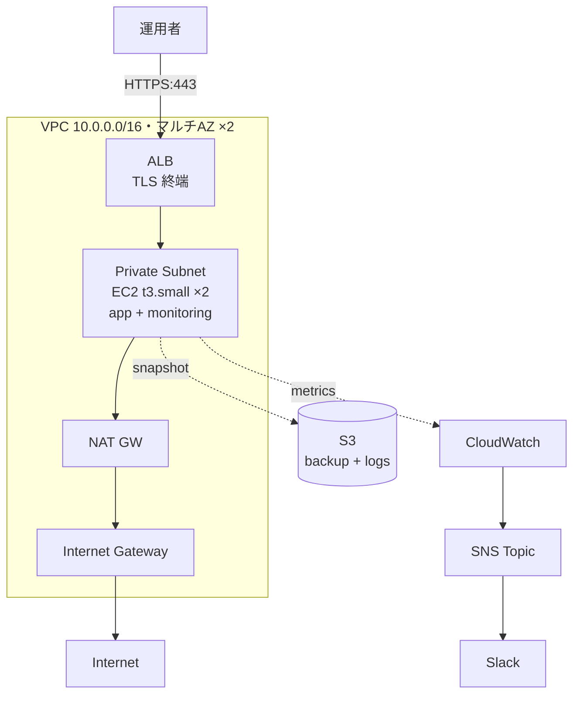
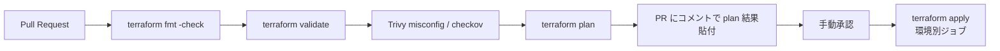

# 03. AWS + Terraform 化

> 状態更新（2026-05-27）: Terraform modules と dev / prod 環境コードは
> [server-monitor](https://github.com/ns7jp/server-monitor) に実装済みである。
> `terraform apply` / `destroy`、復旧試験、Cost Explorer の実費は未収録であり、
> AWS 稼働実績としてはまだ提示しない。現行の費用・観測境界は server-monitor 側の
> `docs/cost-report.md` と `docs/aws-architecture.md` を正本とする。
>
> この設計は AWS の公式ドキュメントやベストプラクティス集を参考に組み立てたものであり、
> 実務での AWS 運用経験に基づくものではない。設定値の妥当性やトレードオフを面接で
> 深く問われた場合、体系立てて説明できるレベルには達していない。

## 1. 背景・目的

現状の server-monitor は単一ホスト構成（オンプレ or 単一 VM）。求人で頻出する **「AWS / Terraform」** 経験を積むため、また「冗長化」「IaC」「クラウド運用」を実体験するために、**無料利用枠 + ごく小規模な有料リソース** の範囲で AWS 上に Terraform で再構築する。

---

## 2. 採用技術と判断

| 領域 | 採用 | 理由 |
| --- | --- | --- |
| クラウド | AWS | 国内求人比率が高く、無料枠も使えるため |
| IaC | Terraform | 教材が多く独学しやすいため（詳細は [ADR-0005](../adr/0005-terraform-for-iac.md)） |
| OS 設定 | Ansible（[02 参照](./02-ansible-automation.md)） | Terraform は OS 内の設定までは行わない構成にした |
| シークレット | AWS Secrets Manager + Terraform `sensitive` | git に平文の認証情報を残さないため |
| State 管理 | S3 + S3 ネイティブロック（`use_lockfile`） | Terraform 1.11 以降の GA 機能。DynamoDB ロックは廃止方向のため使わない |

---

## 3. アーキテクチャ


```mermaid
flowchart TB
    User[運用者] -->|HTTPS:443| ALB[ALB<br/>TLS 終端]

    subgraph VPC[VPC 10.0.0.0/16・マルチAZ ×2]
        ALB --> EC2[Private Subnet<br/>EC2 t3.small ×2<br/>app + monitoring]
        EC2 --> NAT[NAT GW] --> IGW[Internet Gateway]
    end

    IGW --> Internet
    EC2 -.snapshot.-> S3[(S3<br/>backup + logs)]
    EC2 -.metrics.-> CW[CloudWatch] --> SNS[SNS Topic] --> Slack[Slack]
```

AZ を跨いで EC2 を 2 台配置し、片系が落ちてももう片方が応答を継続する構成にしている。

---

## 4. ディレクトリ構成

```text
server-monitor/
└── terraform/
    ├── environments/
    │   ├── dev/    # main.tf, variables.tf, outputs.tf, terraform.tfvars
    │   └── prod/   # 同上
    ├── modules/
    │   ├── network/        # VPC / Subnet / IGW / NAT / Route Table
    │   ├── compute/        # EC2 / SG / Key Pair / EBS
    │   ├── alb/            # ALB / Target Group / Listener / ACM
    │   ├── monitoring/     # CloudWatch Alarms / SNS
    │   └── backup/         # AWS Backup / S3
    ├── backend.tf          # remote state (S3 + ネイティブロック)
    ├── versions.tf         # provider バージョンピン
    └── README.md
```

---

## 5. モジュール設計

`network` / `compute` / `alb` / `monitoring` / `backup` の 5 モジュールに分割している。VPC・Subnet は `for_each` と `cidrsubnet()` で AZ ごとに動的生成し、EC2 は IMDSv2 強制・EBS 暗号化・セキュリティグループでの通信制御を入れている（抜粋）。

```hcl
resource "aws_instance" "monitor" {
  for_each                = toset(var.azs)
  ami                     = data.aws_ami.ubuntu.id
  instance_type           = var.instance_type
  subnet_id               = var.private_subnet_ids[each.value]
  vpc_security_group_ids  = [aws_security_group.monitor.id]
  iam_instance_profile    = aws_iam_instance_profile.monitor.name

  metadata_options {
    http_tokens = "required"   # IMDSv2 強制
  }

  root_block_device {
    volume_type = "gp3"
    volume_size = 30
    encrypted   = true
  }
}
```

### 5.3 Remote State

```hcl
# backend.tf
terraform {
  backend "s3" {
    bucket       = "ns7jp-tfstate"
    key          = "server-monitor/prod/terraform.tfstate"
    region       = "ap-northeast-1"
    use_lockfile = true   # S3 ネイティブロック（Terraform 1.11 以降で GA）
    encrypt      = true
  }
}
```

> **2026-07 追記**：State ロックは S3 ネイティブロック（`use_lockfile`）に切り替えた。
> 旧 DynamoDB ロック方式からの変更経緯は [ADR-0005](../adr/0005-terraform-for-iac.md) を参照。

---

## 6. コスト試算

学習目的のため、**月額 3,000 円以内** を目標とする。

| リソース | 仕様 | 月額（東京リージョン目安） |
| --- | --- | --- |
| EC2 t3.small × 2 + EBS gp3 30GB × 2 | 24h 稼働 | 約 4,720 円 |
| ALB | 24h 稼働 | 約 2,500 円 |
| NAT Gateway × 1 | AZ 単独 | 約 4,500 円 |
| S3 | 10GB | 約 30 円 |
| Data Transfer | 想定 5GB | 約 80 円 |
| **合計（24h）** | | **約 12,000 円 / 月** |
| **削減策（夜間停止）** | | **約 4,000 円 / 月** |

**コスト削減の工夫**

- EC2 は EventBridge + Lambda で 22:00 停止 / 7:00 起動
- NAT Gateway は単一 AZ（冗長性を犠牲にコスト優先、学習目的なので妥協）
- 学習が一段落したら `terraform destroy` で完全削除

---

## 7. セキュリティ設計

| 項目 | 設定 |
| --- | --- |
| アクセス制御 | EC2 はプライベートのみ（ALB のみパブリック）、SSH 鍵 + IAM SSM Session Manager 推奨、IMDSv2 強制 |
| 暗号化 | EBS 全ボリューム暗号化、S3 バケット暗号化 + Public Access Block 全有効 |
| IAM / Secrets | インスタンスプロファイルでロールを分離、機密情報は Secrets Manager + KMS（Terraform では `sensitive`） |
| 監査・検知 | CloudTrail（全リージョン）/ Config / GuardDuty を有効化 |

---

## 8. CI/CD


```mermaid
flowchart LR
    PR[Pull Request] --> Fmt[terraform fmt -check]
    Fmt --> Val[terraform validate]
    Val --> Sec[Trivy misconfig / checkov]
    Sec --> Plan[terraform plan]
    Plan --> Comment[PR にコメントで plan 結果貼付]
    Comment --> Approve[手動承認]
    Approve --> Apply[terraform apply<br/>環境別ジョブ]
```

IaC の静的セキュリティスキャンには Trivy（misconfig スキャン）を使う（2026-07 に tfsec から切り替え。checkov も候補）。

GitHub Actions ワークフロー例（抜粋）

```yaml
jobs:
  plan:
    runs-on: ubuntu-latest
    permissions:
      id-token: write
      contents: read
    steps:
      - uses: actions/checkout@v4
      - uses: aws-actions/configure-aws-credentials@v4
        with:
          role-to-assume: arn:aws:iam::123456789012:role/tf-ci
          aws-region: ap-northeast-1
      - uses: hashicorp/setup-terraform@v3
      - run: terraform fmt -check -recursive
      - run: terraform validate
      - uses: aquasecurity/trivy-action@0.28.0
        with:
          scan-type: config
          severity: HIGH,CRITICAL
          exit-code: '1'
      - run: terraform plan -out=plan.bin
      # plan 結果を PR にコメント投稿する処理は省略
```

---

## 9. 検証項目

| 項目 | 検証方法 | 合格基準 |
| --- | --- | --- |
| 構築・削除 | `terraform apply` / `destroy` | apply は 30 分以内に完了、destroy でリソース完全削除・課金停止 |
| 障害復旧 | EC2 を 1 台 terminate | もう 1 台が ALB から応答継続、新 EC2 が自動起動 |
| バックアップ | EBS スナップショットからの復元 | 最新スナップから 15 分以内に復旧 |
| セキュリティ | Trivy（misconfig）/ checkov | High 以上 0 件 |
| コスト | Cost Explorer | 月額 5,000 円以内 |

---

## 10. 段階的構築計画

| 週 | 内容 |
| --- | --- |
| 1 | AWS アカウント整備、IAM、CloudTrail、tfstate 用 S3 構築（ネイティブロック利用のため DynamoDB テーブルは不要） |
| 2 | `network` モジュール作成、VPC / Subnet 構築 |
| 3 | `compute` モジュール作成、EC2 起動、Ansible で構成適用 |
| 4 | `alb` + `monitoring` + `backup` モジュール、動作検証、コスト試算 |

---

## 11. リスクと対策

| リスク | 対策 |
| --- | --- |
| 想定外の課金 | AWS Budgets で 3,000 円 / 月のアラート、毎日 Cost Explorer 確認 |
| 認証情報の git 漏洩 | Secrets Manager + GitHub Secrets、`pre-commit` で `gitleaks` |
| Terraform state 破損 | S3 バージョニング有効、定期バックアップ |
| 学習途中で放置 → 課金継続 | 毎週金曜に `terraform destroy` を実行する運用ルール |

---

## 12. 完了条件（Definition of Done）

- [ ] `terraform/` ディレクトリ配下にモジュールが揃っている
- [ ] `terraform apply` で AWS 上に環境が再現できる
- [ ] Ansible playbook で EC2 内の構成が適用できる（[02 参照](./02-ansible-automation.md)）
- [ ] ALB の DNS にアクセスし、Grafana が表示される
- [ ] Trivy（misconfig スキャン）/ checkov が緑（High 0 件）
- [ ] コスト試算と実測値を `docs/cost-report.md` に記録
- [ ] AWS Budgets / GuardDuty / CloudTrail が有効

---

## 13. 参考

- [Terraform AWS Provider](https://registry.terraform.io/providers/hashicorp/aws/latest/docs)
- [AWS Well-Architected Framework](https://aws.amazon.com/architecture/well-architected/)
- [Trivy Documentation — Misconfiguration Scanning](https://trivy.dev/latest/docs/scanner/misconfiguration/)
