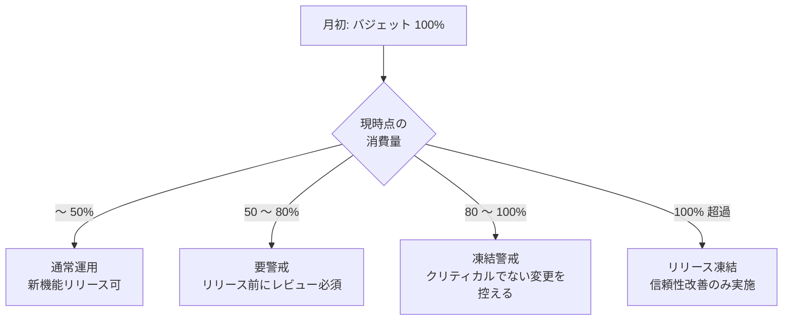

# 04. SLO / SLI / エラーバジェット設計

## 1. 背景

現状の server-monitor は「障害アラート」は仕込んでいるが、**「どこまでの品質を守るべきか」** の合意水準（SLO）が定義されていない。

これがないと以下の判断ができない。

- アラートの優先度（即対応 vs 翌営業日対応）
- 新機能リリースを進めて良いか（エラーバジェット消費判断）
- 改善投資の優先順位

ポートフォリオとしても、**SLO を語れる運用担当者** は希少価値があるため、設計と運用ルールを整備する。

---

## 2. 用語整理

| 用語 | 意味 | 例 |
| --- | --- | --- |
| **SLI** (Service Level Indicator) | サービス品質の指標 | 月間可用性 |
| **SLO** (Service Level Objective) | SLI に対する目標値 | 月間可用性 99.5% |
| **SLA** (Service Level Agreement) | 契約上の保証値（通常 SLO より緩い） | 月間可用性 99.0%、下回ったら返金 |
| **エラーバジェット** | SLO 達成のために許容される「失敗の量」 | 99.5% SLO → 月 219 分の失敗を許容 |

---

## 3. 対象サービスと特性

server-monitor は **社内向け監視ダッシュボード**。以下の特性を踏まえる。

| 特性 | 内容 |
| --- | --- |
| 利用者 | 運用担当者（社内のみ） |
| 利用時間帯 | 平日 9:00 〜 22:00 が中心、夜間障害対応で随時 |
| クリティカリティ | 「監視の監視」なので、止まると一次障害に気づけない |
| 許容ダウンタイム | 計画停止は早朝・週末で 1 時間 / 月 |

---

## 4. SLI / SLO 定義

### 4.1 可用性 SLI/SLO

| 項目 | 内容 |
| --- | --- |
| SLI 定義 | `(ALB の 2xx + 3xx + 4xx) / 全リクエスト` を 1 分粒度で集計 |
| 計測方法 | Prometheus blackbox-exporter で `/health` を 30 秒毎にプローブ |
| SLO | **月間 99.5%**（許容ダウンタイム：219 分 / 月） |
| 例外 | 計画停止（事前周知 + 早朝 / 週末）は分母から除外 |

### 4.2 レイテンシ SLI/SLO

| 項目 | 内容 |
| --- | --- |
| SLI 定義 | `/health` の 95 パーセンタイル応答時間 |
| 計測方法 | Prometheus histogram_quantile() |
| SLO | **p95 < 500ms を 28 日間で 99%** |

### 4.3 アラート発火 SLI/SLO

| 項目 | 内容 |
| --- | --- |
| SLI 定義 | テスト障害を起こしてから Alertmanager 通知到達までの時間 |
| 計測方法 | 月 1 回、手動テスト（CPU 高負荷）で計測 |
| SLO | **2 分以内に Slack 通知到達** |

---

## 5. エラーバジェット

### 5.1 計算

| SLO | 期間 | バジェット |
| --- | --- | --- |
| 可用性 99.5% | 30 日 = 43,200 分 | 0.5% × 43,200 = **216 分** |
| レイテンシ 99% | 28 日のリクエスト数 N | 0.01 × N リクエスト |

### 5.2 運用ルール



### 5.3 月次レビュー

毎月 1 日に前月のエラーバジェット消費を集計し、以下を判断する。

- バジェット内で完了：通常運用継続
- バジェット超過：原因分析 → 改善計画策定 → 翌月の SLO 見直し（緩めるか、改善するか）

---

## 6. ダッシュボード設計

### 6.1 SLO 専用ダッシュボード

```text
┌────────────────────────────────────────────────────┐
│ 当月の可用性 SLO 達成率              99.62% ✓     │
├────────────────────────────────────────────────────┤
│ エラーバジェット残量                                │
│ ████████████░░░░░░░░  62% 残  (バジェット 216 分)  │
├────────────────────────────────────────────────────┤
│ 直近 28 日の p95 レイテンシ                         │
│  [折れ線グラフ]                                     │
├────────────────────────────────────────────────────┤
│ インシデント履歴 (当月)                             │
│  - 05/12 02:34 (15 分)  Disk full on /var/log      │
│  - 05/18 11:02 ( 8 分)  Nginx restart for cert     │
└────────────────────────────────────────────────────┘
```

### 6.2 Prometheus クエリ例

```promql
# 当月の可用性
sum_over_time(probe_success{job="health"}[30d])
  /
count_over_time(probe_success{job="health"}[30d])

# エラーバジェット消費率
1 - (
  sum_over_time(probe_success{job="health"}[30d])
    /
  count_over_time(probe_success{job="health"}[30d])
) / (1 - 0.995)
```

---

## 7. アラート設計（SLO ベース）

「とりあえず CPU 80%」のような閾値型アラートではなく、**SLO 消費速度** でアラートする。

### 7.1 Multi-Window Multi-Burn Rate アラート

Google SRE Workbook の推奨手法を採用。

| アラート | 短窓 / 長窓 | バーンレート | 意味 |
| --- | --- | --- | --- |
| Fast burn | 5 分 / 1 時間 | 14.4 | 1 時間でバジェットの 2% を消費（即対応） |
| Slow burn | 30 分 / 6 時間 | 6 | 6 時間でバジェットの 5% を消費（業務時間中対応） |

### 7.2 サンプルルール

```yaml
groups:
  - name: slo-burn-rate
    rules:
      - alert: SLOFastBurn
        expr: |
          (
            (1 - (
              sum(rate(probe_success[5m]))
              /
              sum(rate(probe_success[5m]) + rate(probe_failure[5m]))
            )) > (14.4 * 0.005)
          )
          and
          (
            (1 - (
              sum(rate(probe_success[1h]))
              /
              sum(rate(probe_success[1h]) + rate(probe_failure[1h]))
            )) > (14.4 * 0.005)
          )
        for: 2m
        labels:
          severity: critical
        annotations:
          summary: "Error budget being consumed too fast"
          description: "At current rate, the error budget for 30d will be exhausted within hours."
```

---

## 8. ランブックとの連動

各 SLO 違反パターンに対応するランブックを紐付ける。

| アラート | ランブック |
| --- | --- |
| SLOFastBurn (可用性) | `runbooks/service-down.md` |
| LatencyHigh | `runbooks/latency-spike.md` |
| AlertmanagerDown | `runbooks/alertmanager-down.md`（監視の監視） |

---

## 9. 段階的導入

| 週 | 内容 |
| --- | --- |
| 1 | SLI 計測（blackbox-exporter 導入、Prometheus に組込み） |
| 2 | SLO ダッシュボード作成（Grafana） |
| 3 | バーンレートアラート設定、ランブック紐付け |
| 4 | 初回月次レビュー実施、運用に乗せる |

---

## 10. 完了条件（Definition of Done）

- [ ] `docs/slo.md` に SLI / SLO 定義が文書化されている
- [ ] Grafana に SLO 専用ダッシュボードがある
- [ ] バーンレートアラートが Alertmanager に登録されている
- [ ] 各アラートにランブック URL が annotation で紐付いている
- [ ] 初回月次レビューを実施し、議事録を `docs/slo-reviews/YYYY-MM.md` に残す

---

## 11. 参考

- [Google SRE Book — Chapter 4: Service Level Objectives](https://sre.google/sre-book/service-level-objectives/)
- [Google SRE Workbook — Alerting on SLOs](https://sre.google/workbook/alerting-on-slos/)
- [Prometheus: Multi-Window Multi-Burn-Rate Alerts](https://promlabs.com/blog/2024/04/08/multi-window-multi-burn-rate-alerts/)
