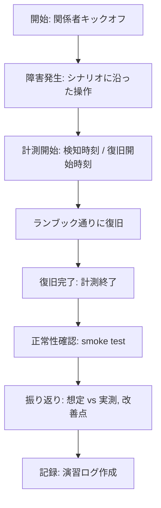

# 05. バックアップ・復旧演習

> 状態更新（2026-05-27）: backup verification CI、D-1 script、D-2 runbook と
> 記録テンプレートは [server-monitor](https://github.com/ns7jp/server-monitor) に実装済みである。
> 実際の D-1 / D-2 実行ログおよび RTO / RPO 実測はまだ収録されていない。

## 1. 背景

現状の server-monitor には `docs/architecture.md` 配下に **バックアップ復旧設計** が記載されているが、これは **「設計だけ」** の段階。
実際に復旧できることを **演習で実証** していない限り、「いざというとき動かない手順書」になりがち。

本ドキュメントでは、復旧演習の計画・実施・記録までを設計する。

> 教訓：「バックアップではなく、リストアが運用できることが価値」

---

## 2. 演習の目的

| 目的 | 内容 |
| --- | --- |
| 手順の検証 | 設計通りに復旧できるかを確認 |
| RTO / RPO の実測 | 実時間で目標値（[SLO](./04-slo-design.md)）を満たすか |
| 人の習熟 | 担当者が手順を体に覚える |
| 設計の改善 | 不備や曖昧さを発見し、ランブックを改訂 |

---

## 3. バックアップ対象と方式（再整理）

| 対象 | 方式 | 取得頻度 | 保持 |
| --- | --- | --- | --- |
| Prometheus データ | EBS スナップショット | 日次 02:00 | 14 世代 |
| Grafana DB（dashboards） | SQLite ダンプ → S3 | 日次 02:30 | 30 世代 |
| Alertmanager 設定 | git 管理 | コミット毎 | 無期限 |
| アプリ設定（compose / nginx / secrets） | git + Ansible Vault | コミット毎 | 無期限 |
| Loki チャンク | S3 直接保存 | リアルタイム | 30 日 |
| OS / コンテナイメージ | Ansible で再構築 | 不要 | — |

**設計方針**

- 状態を持つもの（DB / メトリクス）のみスナップショット
- 再現可能なもの（設定 / コード）は git
- これにより「バックアップ容量を最小化」できる

---

## 4. RTO / RPO 目標

| 障害種別 | RTO | RPO | 根拠 |
| --- | --- | --- | --- |
| プロセスダウン | 5 分 | 0 | systemd / docker restart |
| ホスト障害（OS 起動不能） | 60 分 | 24 時間 | EBS スナップから復元 |
| AZ 障害（v2.0 以降） | 15 分 | 0 | 2 AZ アクティブスタンバイで自動切替 |
| リージョン障害 | 24 時間 | 24 時間 | 別リージョンへ Terraform 再適用 |
| 操作ミスでデータ削除 | 30 分 | 24 時間 | 前日のスナップから戻す |

---

## 5. 演習計画

### 5.1 演習シナリオ一覧

| # | シナリオ | 頻度 | 想定時間 |
| --- | --- | --- | --- |
| D-1 | プロセスダウン → 自動復旧確認 | 月次 | 15 分 |
| D-2 | ホスト障害 → 別ホストに復元 | 四半期 | 2 時間 |
| D-3 | 操作ミス（メトリクス削除）→ スナップから復元 | 四半期 | 1 時間 |
| D-4 | AZ 障害シミュレーション（v2.0 以降） | 半期 | 3 時間 |
| D-5 | リージョン障害（Terraform 別リージョン再適用） | 年次 | 半日 |

### 5.2 演習当日の進行テンプレ



---

## 6. シナリオ詳細：D-2「ホスト障害」

最も実用度の高い D-2 を詳述する。現環境（ローカル Linux + Docker Compose）で
そのまま実行できる **ローカル Docker 版（§6.1）** と、
**v2.0（AWS 移行後）に実施する AWS 版（§6.2）** に分ける。
初回実施と RTO / RPO 実測はローカル Docker 版で行う。

### 6.1 ローカル Docker 版（現環境で実施）

#### 6.1.1 想定シナリオ

> Docker ホストのストレージ障害で、監視スタックのデータボリューム
> （Grafana DB / Prometheus TSDB）が失われた。
> コンテナは再作成できるが、データはバックアップからの復元が必要。

- 設定（compose / nginx / rules）は git にあるため復元対象はデータボリュームのみ（§3 の設計方針通り）
- ボリューム名・ポートは環境により異なるため、`docker volume ls` と compose の公開設定で実名を確認してから実行する

#### 6.1.2 事前準備（バックアップ取得 = RPO 起点）

```bash
cd ~/server-monitor
PROJECT=server-monitor                          # compose プロジェクト名
BACKUP_DIR="$HOME/backups/drill-$(date +%Y%m%d)"
mkdir -p "$BACKUP_DIR"

# バックアップ取得時刻を記録（この時刻が RPO の起点になる）
date +%Y-%m-%dT%H:%M:%S | tee "$BACKUP_DIR/backup-timestamp.txt"

# 静止点を作ってからボリュームを tar で退避
docker compose stop grafana prometheus
docker run --rm \
  -v "${PROJECT}_grafana-data":/data:ro -v "$BACKUP_DIR":/backup \
  alpine tar czf /backup/grafana-data.tar.gz -C /data .
docker run --rm \
  -v "${PROJECT}_prometheus-data":/data:ro -v "$BACKUP_DIR":/backup \
  alpine tar czf /backup/prometheus-data.tar.gz -C /data .
docker compose start grafana prometheus
```

#### 6.1.3 障害注入 → 復元

```bash
# 1. 障害注入：コンテナ停止 + データボリューム破壊（検知計測の起点）
echo "[$(date +%H:%M:%S)] 障害発生: データボリューム消失"
docker compose down
docker volume rm "${PROJECT}_grafana-data" "${PROJECT}_prometheus-data"

# 2. 復元：ボリューム再作成 → バックアップ展開
docker volume create "${PROJECT}_grafana-data"
docker volume create "${PROJECT}_prometheus-data"
docker run --rm \
  -v "${PROJECT}_grafana-data":/data -v "$BACKUP_DIR":/backup:ro \
  alpine tar xzf /backup/grafana-data.tar.gz -C /data
docker run --rm \
  -v "${PROJECT}_prometheus-data":/data -v "$BACKUP_DIR":/backup:ro \
  alpine tar xzf /backup/prometheus-data.tar.gz -C /data

# 3. 起動
docker compose up -d
```

#### 6.1.4 ヘルスチェック

```bash
# 全コンテナが Up になっていること
docker compose ps

# エンドポイント疎通（ポート / 認証は compose の公開設定に合わせる）
curl -fsS http://localhost:8080/healthz         # アプリ（Nginx 経由）
curl -fsS http://localhost:3000/api/health      # Grafana
curl -fsS http://localhost:9090/-/healthy       # Prometheus

# データが戻ったことの確認：
# - Grafana のダッシュボード一覧が破壊前と一致する
# - Prometheus にバックアップ取得時刻以前のデータが残っている
#   （バックアップ以降〜障害までのデータは失われる = 実測 RPO）
echo "[$(date +%H:%M:%S)] 復旧完了"
```

#### 6.1.5 RTO / RPO 実測表

| 項目 | 想定 | 実測 |
| --- | --- | --- |
| 障害注入 → 検知（`docker compose ps` / アラート） | 2 分 | _要記録_ |
| ボリューム再作成 + バックアップ展開 | 5 分 | _要記録_ |
| `docker compose up -d` → 全コンテナ Up | 3 分 | _要記録_ |
| ヘルスチェック 3 点 OK | 2 分 | _要記録_ |
| **合計（RTO）** | **12 分** | _要記録_ |
| **RPO（バックアップ取得時刻 → 障害注入時刻）** | **24 時間以内** | _要記録_ |

### 6.2 AWS 版（v2.0：AWS 移行後に実施）

> 以下の手順は AWS CLI（EBS スナップショット / EC2）前提であり、
> 現環境（ローカル Linux + Docker Compose）では実行できない。
> **v2.0（AWS 移行後）に実施する手順** として隔離して残す。

#### 6.2.1 事前準備

- 演習用環境を本番と同等に構築（staging）
- 「最新のバックアップ」が存在することを確認
- 関係者（観測役・操作役）の役割分担
- Slack 演習チャンネルを開設し、時刻を都度記録

#### 6.2.2 想定シナリオ

> staging サーバー `monitor-stg-01` が突如応答しなくなった。
> 監視ダッシュボード（Grafana / Prometheus）が全停止している。

#### 6.2.3 復旧手順

```bash
# 0. 障害宣言（演習チャンネルへ）
echo "[$(date +%H:%M:%S)] 障害発生: monitor-stg-01 応答なし"

# 1. 現状確認
ssh monitor-stg-01 || echo "SSH 不可"
aws ec2 describe-instance-status --instance-ids i-xxxx

# 2. インスタンス停止 → 起動を試行
aws ec2 stop-instances --instance-ids i-xxxx
aws ec2 wait instance-stopped --instance-ids i-xxxx
aws ec2 start-instances --instance-ids i-xxxx
aws ec2 wait instance-running --instance-ids i-xxxx

# (起動不可の場合)

# 3. 最新スナップショットを特定
LATEST_SNAP=$(aws ec2 describe-snapshots \
  --filters "Name=tag:Source,Values=monitor-stg-01" \
  --query 'Snapshots | sort_by(@,&StartTime)[-1].SnapshotId' \
  --output text)
echo "最新スナップ: $LATEST_SNAP"

# 4. スナップから新 EBS を作成
NEW_VOL=$(aws ec2 create-volume \
  --snapshot-id $LATEST_SNAP \
  --availability-zone ap-northeast-1a \
  --volume-type gp3 \
  --query VolumeId --output text)
aws ec2 wait volume-available --volume-ids $NEW_VOL

# 5. 新 EC2 を起動（Terraform で）
cd terraform/environments/staging
terraform apply -var "recovery_volume_id=$NEW_VOL" -auto-approve

# 6. Ansible で OS 構成を適用
cd ansible
ansible-playbook -i inventory/staging.yml playbooks/site.yml

# 7. ヘルスチェック
curl -fsS https://monitor-stg.example.com/health
```

#### 6.2.4 計測項目

| 項目 | 想定 | 実測 |
| --- | --- | --- |
| 検知（アラート受信） | 1 分 | _要記録_ |
| 1 次切り分け完了 | 5 分 | _要記録_ |
| スナップショット特定 | 2 分 | _要記録_ |
| 新 EC2 起動完了 | 10 分 | _要記録_ |
| Ansible 適用完了 | 15 分 | _要記録_ |
| ヘルスチェック OK | 5 分 | _要記録_ |
| **合計（RTO）** | **38 分** | _要記録_ |

### 6.3 演習ログ テンプレート（ローカル版 / AWS 版共通）

```markdown
# 復旧演習記録: D-2 ホスト障害

## メタ
- 実施日時: 2026-MM-DD HH:MM
- 環境: staging
- シナリオ: D-2
- 参加者: 観測役 / 操作役

## タイムライン
| 時刻 | イベント |
| --- | --- |
| 14:00:00 | 演習開始（障害発生操作） |
| 14:00:42 | Alertmanager から Slack 通知 |
| 14:02:15 | 1 次切り分け開始 |
| ...      | ... |

## 計測結果
| 項目 | 目標 | 実測 | 評価 |
| --- | --- | --- | --- |
| RTO | 60 分 | 47 分 | ✓ |
| RPO | 24 時間 | 18 時間 | ✓ |

## 発見事項
- ランブック X 行目の手順が AWS CLI のバージョン差で動かない
- スナップ命名規則が一貫しておらず特定に時間がかかった
- 関係者 Slack の周知テンプレが無く即興で打った

## 改善アクション
- [ ] ランブックを `aws --version` ピン留めに更新（担当 / 期限）
- [ ] スナップ命名規則を `docs/backup-naming.md` に明文化
- [ ] Slack 周知テンプレを `docs/incident-comms.md` に追加
```

---

## 7. CI による「日次の自動検証」

人手の演習は四半期に 1 回が限界。それを補うため、**毎日 CI で簡易バックアップ検証** を回す。

```yaml
name: backup-verify
on:
  schedule:
    - cron: '0 4 * * *'  # 毎日 04:00 UTC

jobs:
  verify:
    runs-on: ubuntu-latest
    permissions:
      id-token: write
      contents: read
    steps:
      - uses: aws-actions/configure-aws-credentials@v4
        with:
          role-to-assume: arn:aws:iam::xxx:role/backup-verify
          aws-region: ap-northeast-1

      - name: 最新スナップショットの存在確認
        run: |
          LATEST=$(aws ec2 describe-snapshots \
            --filters "Name=tag:Source,Values=monitor-prd-01" \
            --query 'Snapshots | sort_by(@,&StartTime)[-1].StartTime' \
            --output text)
          AGE_HOURS=$(( ($(date +%s) - $(date -d "$LATEST" +%s)) / 3600 ))
          if [ "$AGE_HOURS" -gt 25 ]; then
            echo "::error::最新スナップが $AGE_HOURS 時間前 (>25h)"
            exit 1
          fi

      - name: S3 バックアップの存在確認
        run: |
          aws s3 ls s3://ns7jp-monitor-backup/$(date -u +%Y%m%d)/grafana.db.gz
```

---

## 8. 完了条件（Definition of Done）

- [ ] バックアップ取得が自動化され、毎日成功している（CI で監視）
- [ ] D-1 演習を月次で実施し、ログを蓄積
- [ ] D-2 演習を初回実施し、RTO 60 分以内を達成
- [ ] 演習で発見された改善アクションが全て対応済み
- [ ] `runbooks/restore-from-snapshot.md` が最新化されている
- [ ] 演習記録のフォーマットが `docs/drill-template.md` に整備されている

---

## 9. 参考

- [AWS Backup ベストプラクティス](https://docs.aws.amazon.com/aws-backup/latest/devguide/best-practices.html)
- [Google SRE Book — Chapter 26: Data Integrity](https://sre.google/sre-book/data-integrity/)
- [Disaster Recovery of Workloads on AWS](https://docs.aws.amazon.com/whitepapers/latest/disaster-recovery-workloads-on-aws/disaster-recovery-workloads-on-aws.html)
