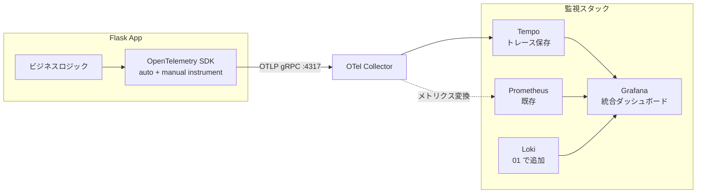
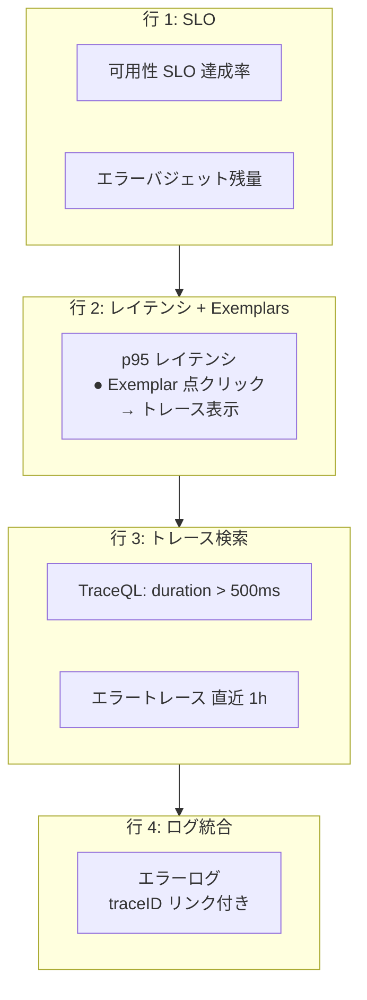

# 06. 分散トレーシング（Tempo + OpenTelemetry）

## 1. 背景・課題

現状の server-monitor は Prometheus（メトリクス）を採用し、[01](./01-loki-log-aggregation.md) で Loki（ログ）を追加する計画。
これで **可観測性の三本柱** のうち 2 本（Metrics / Logs）が揃うが、**Traces（分散トレース）が欠けている**。

| 観点 | 現状 / 計画 |
| --- | --- |
| Metrics | Prometheus + node-exporter（実装済み） |
| Logs | Loki + Grafana Alloy（[01](./01-loki-log-aggregation.md) で追加済み） |
| Traces | **未整備** |

トレースが無いと、レイテンシ悪化時に「Nginx か、Gunicorn か、アプリ内のどの処理か」を切り分けるために SSH + 個別ログ調査が必要になり、[04. SLO](./04-slo-design.md) で定義する `p95 < 500ms` の改善活動に時間がかかる。

> ポートフォリオ観点：SRE 求人で必ず聞かれる「Observability の三本柱」を **設計レベルで語れる** ことを示す。

---

## 2. 採用技術

| 候補 | 採用判断 | 理由 |
| --- | --- | --- |
| **Grafana Tempo** | ◎ 採用 | 既存の Grafana スタックと統合、ストレージは S3 互換で軽量、メトリクス・ログとの Exemplar / Correlated 表示が可能 |
| **OpenTelemetry SDK** | ◎ 採用 | ベンダー中立。将来 Tempo を Jaeger / Datadog に置き換えてもアプリ側コードは無変更 |
| Jaeger（単体） | × | Tempo の方が Grafana 統合が深い、保存先も柔軟 |
| Zipkin | × | エコシステムが小さい、新規採用案件が減少傾向 |
| ベンダー SaaS（Datadog 等） | × | コスト面で学習目的に合わない |

**決め手**：OTel で計装し、バックエンド（送信先）として Tempo を選ぶ構成は、現場で最も再現性が高い。

---

## 3. アーキテクチャ



**ポイント**

- アプリは OTel Collector にだけ送る。Collector が **ルーティング / サンプリング / バックエンド差し替え** のハブになる
- Tempo は **TraceID をキーに** Grafana から Loki ログ・Prometheus メトリクスへ相互ジャンプできる（Exemplars / Trace to Logs）

---

## 4. 実装計画

### 4.1 アプリ側計装（Flask）

```python
# app/observability.py
from opentelemetry import trace
from opentelemetry.sdk.resources import Resource
from opentelemetry.sdk.trace import TracerProvider
from opentelemetry.sdk.trace.export import BatchSpanProcessor
from opentelemetry.exporter.otlp.proto.grpc.trace_exporter import OTLPSpanExporter
from opentelemetry.instrumentation.flask import FlaskInstrumentor
from opentelemetry.instrumentation.requests import RequestsInstrumentor
from opentelemetry.instrumentation.logging import LoggingInstrumentor


def setup_tracing(app, service_name: str, otlp_endpoint: str) -> None:
    resource = Resource.create({"service.name": service_name})
    provider = TracerProvider(resource=resource)
    provider.add_span_processor(
        BatchSpanProcessor(OTLPSpanExporter(endpoint=otlp_endpoint, insecure=True))
    )
    trace.set_tracer_provider(provider)

    FlaskInstrumentor().instrument_app(app)
    RequestsInstrumentor().instrument()
    LoggingInstrumentor().instrument(set_logging_format=True)
```

```python
# app/__init__.py（抜粋）
from .observability import setup_tracing

app = create_app()
setup_tracing(
    app,
    service_name="server-monitor-dashboard",
    otlp_endpoint=os.environ["OTLP_ENDPOINT"],  # http://otel-collector:4317
)
```

### 4.2 `docker-compose.yml` 追記

```yaml
services:
  tempo:
    image: grafana/tempo:2.4.0
    container_name: tempo
    restart: unless-stopped
    command: ["-config.file=/etc/tempo/tempo.yml"]
    volumes:
      - ./tempo/tempo.yml:/etc/tempo/tempo.yml:ro
      - tempo-data:/var/tempo
    ports:
      - "127.0.0.1:3200:3200"   # tempo http
    networks:
      - monitor-net

  otel-collector:
    image: otel/opentelemetry-collector-contrib:0.96.0
    container_name: otel-collector
    restart: unless-stopped
    command: ["--config=/etc/otelcol-contrib/config.yml"]
    volumes:
      - ./otel/config.yml:/etc/otelcol-contrib/config.yml:ro
    ports:
      - "127.0.0.1:4317:4317"   # OTLP gRPC
    depends_on:
      - tempo
    networks:
      - monitor-net

volumes:
  tempo-data:
```

### 4.3 OTel Collector 設定（抜粋）

```yaml
receivers:
  otlp:
    protocols:
      grpc:
        endpoint: 0.0.0.0:4317

processors:
  batch:
    timeout: 5s
  tail_sampling:
    decision_wait: 10s
    policies:
      - name: errors
        type: status_code
        status_code: { status_codes: [ERROR] }
      - name: slow
        type: latency
        latency: { threshold_ms: 500 }
      - name: probabilistic
        type: probabilistic
        probabilistic: { sampling_percentage: 10 }

exporters:
  otlp/tempo:
    endpoint: tempo:4317
    tls: { insecure: true }

service:
  pipelines:
    traces:
      receivers: [otlp]
      processors: [batch, tail_sampling]
      exporters: [otlp/tempo]
```

**サンプリング設計**

- エラー（4xx 一部 / 5xx 全）と遅延（>500ms）は **必ず保存**
- それ以外は 10% 確率サンプリングでストレージ節約

### 4.4 Grafana データソース連携

- Type: Tempo、URL: `http://tempo:3200`
- Loki 側で `traceID` ラベルを抽出する derivedField を設定 → ログから 1 クリックでトレースへ
- Prometheus 側で `histogram_quantile` メトリクスに **Exemplars** を有効化 → ダッシュボードのレイテンシグラフから対応するトレースへジャンプ可能

---

## 5. ダッシュボード設計



「メトリクスで気づく → Exemplar からトレースへ → トレースからログへ」という **1 画面で完結する障害解析動線** を確立する。

---

## 6. 検証項目

| 項目 | 検証方法 | 合格基準 |
| --- | --- | --- |
| トレース送信 | `curl /health` を叩く | Grafana Tempo タブで TraceID が見える |
| サンプリング | 遅い処理を模擬（`time.sleep(0.6)`） | 100% 保存される（エラー + slow ポリシー） |
| Exemplars | レイテンシヒストグラムを表示 | 点クリックで Tempo へ遷移できる |
| Trace to Logs | エラートレースを開く | 関連ログが横にプレビュー表示される |
| ストレージ | 7 日運用 | Tempo のディスク使用量が想定（< 2 GB）内 |
| アプリ性能影響 | 計装あり / なしで `wrk` ベンチマーク | p95 オーバーヘッド < 5% |

---

## 7. ロールアウト手順

1. ローカル（docker-compose）で計装込みアプリを起動、Tempo にトレースが届くことを確認（2 日）
2. サンプリング率・保存先・リテンションを調整（2 日）
3. ステージング相当環境に反映、1 週間の挙動観察（並走）
4. 本番反映（メンテナンスウィンドウ 1 時間）
5. SLO ダッシュボード（[04](./04-slo-design.md)）に Exemplars を追加

---

## 8. リスクと対策

| リスク | 対策 |
| --- | --- |
| トレース量爆発でストレージ逼迫 | Tail Sampling で「エラー + 遅延のみ全量保存」、それ以外は 10% に絞る |
| 計装オーバーヘッドでレイテンシ悪化 | `BatchSpanProcessor` で非同期送信、ベンチで影響を計測 |
| TraceID とログの相関がうまく取れない | OTel `LoggingInstrumentor` で `trace_id` をログにも自動付与 |
| Tempo がダウンしてアプリも巻き込まれる | OTLP 送信失敗時はバッファ上限で破棄、アプリ側は **fire-and-forget** |

---

## 9. 完了条件（Definition of Done）

- [ ] Flask アプリが OTel SDK で計装されている
- [ ] OTel Collector → Tempo の経路でトレースが保存される
- [ ] Grafana から TraceQL でトレース検索ができる
- [ ] Prometheus ヒストグラムに Exemplars が表示され、Tempo へ遷移できる
- [ ] Loki ログから `traceID` で 1 クリックでトレースへ遷移できる
- [ ] `docs/observability.md` に「三本柱の使い分け」を明文化

---

## 10. 関連設計書

- [01. Loki ログ集約](./01-loki-log-aggregation.md)（ログ側の相関）
- [04. SLO 設計](./04-slo-design.md)（Exemplars 連携先）
- [07. インシデント対応プロセス](./07-incident-response.md)（解析動線として活用）

---

## 11. 参考

- [Grafana Tempo Documentation](https://grafana.com/docs/tempo/latest/)
- [OpenTelemetry Python](https://opentelemetry.io/docs/languages/python/)
- [Tail Sampling Processor](https://github.com/open-telemetry/opentelemetry-collector-contrib/tree/main/processor/tailsamplingprocessor)
- [Google SRE Book — Chapter 6: Monitoring Distributed Systems](https://sre.google/sre-book/monitoring-distributed-systems/)
