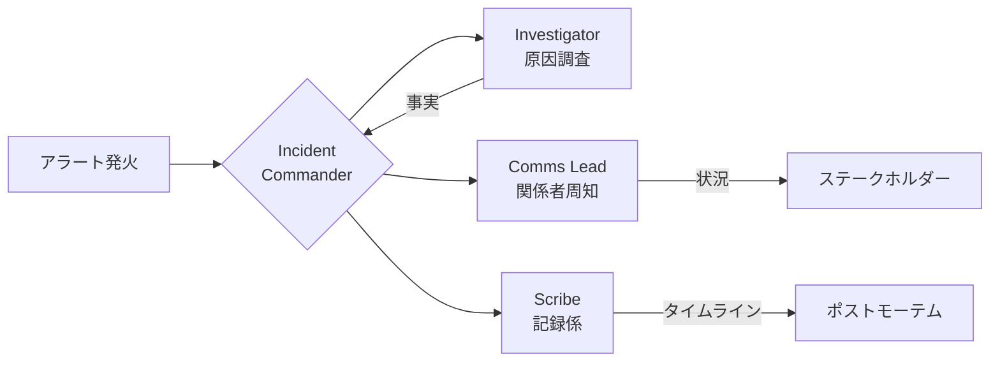
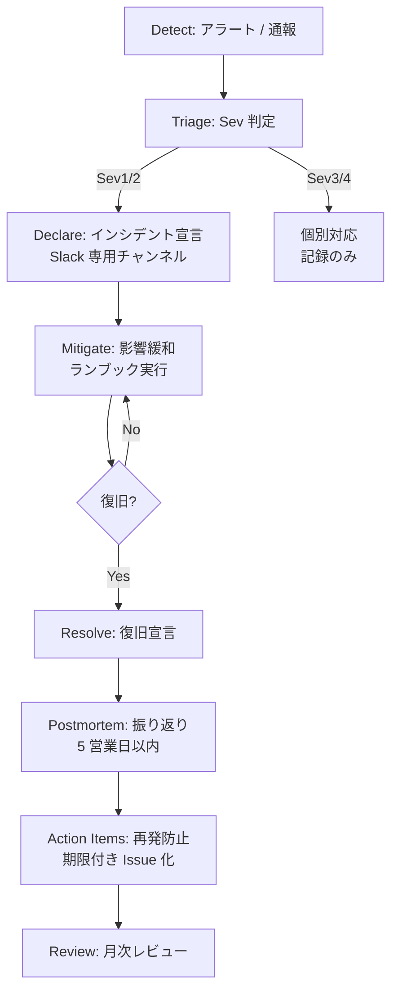
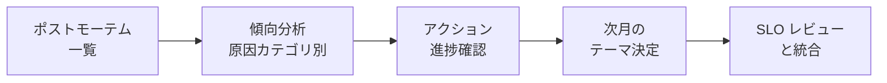

# 07. インシデント対応プロセス・ポストモーテム

## 1. 背景・課題

現状の server-monitor には以下がある。

- 障害ランブック（`runbooks/service-down.md` 等）
- Alertmanager から Slack 通知
- [04. SLO](./04-slo-design.md) でアラート優先度の数値根拠

一方で、**「インシデント発生 → 一次対応 → 復旧 → 振り返り → 再発防止」** という運用プロセス全体は未整備。

| 抜けている要素 | 影響 |
| --- | --- |
| Severity 定義 | 「いつ起こすか」「誰を巻き込むか」が判断できない |
| インシデントコマンダー（IC）役割 | 障害時に「誰が指揮するか」が決まらない |
| 周知テンプレ | Slack 通知が即興になり情報抜けが起きる |
| ポストモーテム手順 | 障害後の学びが個人の頭の中で終わる |
| アクションアイテム追跡 | 「次回防ぐ」ための具体的タスクが消滅する |

> ポートフォリオ観点：障害「対応の技術」だけでなく、**「組織として障害から学ぶ仕組み」** を語れることが、運用担当者の評価軸として大きい。

---

## 2. Severity（重大度）定義

| Sev | 例 | 検知 | 初動 | エスカレーション |
| --- | --- | --- | --- | --- |
| **Sev1** | 全停止、データロス可能性 | バーンレート Fast burn（[04](./04-slo-design.md)） | 即時オンコール起動、IC 任命 | 30 分以内に上長へ報告 |
| **Sev2** | 機能の一部停止、性能劣化 | バーンレート Slow burn | 業務時間内 1 時間以内に着手 | 翌営業日朝に報告 |
| **Sev3** | 軽微な異常（単発エラー） | 個別アラート | 業務時間内に確認 | 不要 |
| **Sev4** | ノイズ / 誤検知 | 同上 | アラートチューニング対象として記録 | 不要 |

**判定基準は「ユーザー影響」を優先**：技術的に派手でも、ユーザー影響が無ければ Sev3 に格下げ。

---

## 3. ロール定義



| ロール | 責務 | 備考 |
| --- | --- | --- |
| **IC** (Incident Commander) | 全体指揮、意思決定、エスカレーション判断 | 「直さない」「冷静を保つ」が役割 |
| **Investigator** | 仮説検証、コマンド実行、復旧操作 | 複数人でも良い |
| **Comms Lead** | Slack / 上長 / 顧客への報告 | IC を技術判断に集中させる |
| **Scribe** | タイムライン記録 | 全員兼任しがちだが、専任を作るとポストモーテムが速い |

**1 人体制での運用**：小規模チームでは IC が全部兼任。**「自分が今どの帽子を被っているか」を意識する** だけでも品質が変わる。

---

## 4. 対応フロー



**設計方針**

- 「**原因究明より影響緩和を先**」が SRE の鉄則。Mitigate → Resolve → Postmortem の順を崩さない
- ポストモーテムは **5 営業日以内** に書く。記憶が新鮮なうちに

---

## 5. 周知テンプレート

### 5.1 インシデント宣言（Slack）

```text
:rotating_light: [INC-2026-0001] Sev2 宣言
- サマリ：Grafana ダッシュボードへのアクセスが断続的に失敗
- 影響：監視運用者がメトリクスを参照不可、アラート受信は継続
- IC：@noriyuki
- インシデントチャンネル：#inc-2026-0001
- 状況更新：30 分毎
```

### 5.2 状況更新（30 分毎）

```text
[INC-2026-0001] 14:30 状況更新
- 仮説：Nginx の upstream タイムアウト
- 試したこと：Grafana プロセス再起動 → 改善せず
- 次の手：upstream の keepalive 設定を確認
- ETA：15:00 までに判明見込み
```

### 5.3 解決宣言

```text
:white_check_mark: [INC-2026-0001] Resolved
- 復旧時刻：14:52
- 原因（暫定）：Nginx の keepalive_timeout が短く、長時間接続が切れていた
- 暫定対応：keepalive_timeout を 75s に延長
- 恒久対応：ポストモーテム後にチケット化
- ポストモーテム：2026-MM-DD 14:00 〜
```

---

## 6. ポストモーテム

### 6.1 ブレームレス原則

| やる | やらない |
| --- | --- |
| システムやプロセスの欠陥を特定 | 個人を犯人扱い |
| 「なぜそれが正しい選択に見えたか」を理解 | 「なぜ気づかなかったのか」と問い詰める |
| 「次回どう仕組みで防ぐか」を議論 | 「次回は気を付ける」で終わる |

### 6.2 ポストモーテムテンプレ

`docs/postmortems/INC-YYYY-NNNN.md` に保存する。

```markdown
# INC-2026-0001: Grafana 接続断続的失敗

## メタ
- 検知日時: 2026-MM-DD 14:02 JST
- 復旧日時: 2026-MM-DD 14:52 JST
- 影響時間: 50 分
- Severity: Sev2
- 影響範囲: 社内監視運用者 約 3 名（アラート受信は継続）
- IC: @noriyuki
- 著者: @noriyuki
- ステータス: Draft / In Review / Final

## TL;DR
Nginx の keepalive_timeout が 10s と短く、Grafana の長時間ダッシュボード接続が
頻繁に切断されていた。keepalive_timeout を 75s に変更して復旧。

## タイムライン (JST)
| 時刻 | 出来事 |
| --- | --- |
| 14:02 | Alertmanager: GrafanaProbeFailed 発火 |
| 14:05 | Slack で Sev2 宣言、IC アサイン |
| 14:10 | Grafana 再起動 → 改善せず |
| 14:25 | Nginx access.log で 504 多発を確認 |
| 14:40 | upstream timeout を疑い、Nginx 設定を確認 |
| 14:48 | keepalive_timeout 10s → 75s に変更、reload |
| 14:52 | プローブ全成功、Resolved 宣言 |

## 影響
- ユーザー影響: ダッシュボード閲覧の体感断続。ビジネスへの直接影響なし
- SLO 影響: 可用性バジェットを 50 分消費（残バジェット 78%）

## 根本原因（5 Whys）
1. なぜダッシュボードが切れた？ → Nginx が upstream への接続を切ったから
2. なぜ Nginx が切った？ → keepalive_timeout が 10s と短かったから
3. なぜそんな値？ → 初期構築時のデフォルト値を変更していなかった
4. なぜ気づかなかった？ → 短い接続のテストしか CI でしていなかった
5. なぜ長時間接続をテストしていなかった？ → ダッシュボード閲覧シナリオを CI が網羅していなかった

## うまくいったこと
- アラート発火から宣言まで 3 分（運用基準内）
- access.log での切り分けが 15 分でできた

## うまくいかなかったこと
- 最初の仮説（Grafana 自体の問題）にこだわり 10 分ロスした
- IC と Investigator を兼任していたため、周知が遅れた

## アクションアイテム
| # | 内容 | 種別 | 担当 | 期限 | Issue |
| --- | --- | --- | --- | --- | --- |
| 1 | Nginx keepalive_timeout を IaC で明示 | Prevent | @noriyuki | YYYY-MM-DD | #123 |
| 2 | 長時間接続シナリオを Selenium で CI 化 | Detect | @noriyuki | YYYY-MM-DD | #124 |
| 3 | IC と Investigator 分担ルールを Runbook に追記 | Process | @noriyuki | YYYY-MM-DD | #125 |

## 学び
- 「Grafana が悪い」という思い込みを排除し、L7 プロキシ層の設定確認を初動に含める
- 初期構築のデフォルト値は必ず IaC で明示する（再現性 + レビュー可能性）
```

---

## 7. アクションアイテム運用

| 種別 | 意味 | 例 |
| --- | --- | --- |
| **Prevent** | 同じ原因の再発を防ぐ | 設定変更、IaC 化 |
| **Detect** | 同じ事象を早く検知する | 新しいアラート、CI 追加 |
| **Mitigate** | 起きた時の影響を減らす | ランブック更新、自動復旧化 |
| **Process** | 運用プロセスの改善 | テンプレ追加、役割分担見直し |

**運用ルール**

- 全件 GitHub Issue 化、`incident` ラベル + 期限ラベル
- 月次レビューで未完了を棚卸し、放置は別タスクとしてエスカレーション
- 「**完了率 80% 以上**」を運用 KPI として可視化

---

## 8. 月次インシデントレビュー

毎月初に前月分を棚卸し。



| 集計項目 | 例 |
| --- | --- |
| 件数（Sev 別） | Sev1: 0, Sev2: 2, Sev3: 5 |
| MTTR（平均復旧時間） | Sev2: 平均 45 分 |
| 原因カテゴリ | 設定ミス 40%, ハード障害 20%, ... |
| アクション完了率 | 12/15 = 80% |

[04. SLO](./04-slo-design.md) の月次レビューと **同じ会議体で実施** すると効率的。

---

## 9. ツール対応

| 領域 | ツール | 備考 |
| --- | --- | --- |
| 検知 | Alertmanager + Slack | 既存 |
| 宣言・記録 | Slack 専用チャンネル + Issue | チャンネル名は `inc-YYYY-NNNN` 規約 |
| ポストモーテム保管 | GitHub `docs/postmortems/` | 検索性 + レビュー可能 |
| アクション追跡 | GitHub Issues + Projects | `incident` ラベルで一覧化 |
| 統計 | GitHub Actions で月次集計 → Issue として投稿 | 自動化候補 |

---

## 10. 段階的導入

| 週 | 内容 |
| --- | --- |
| 1 | Severity / ロール / フローを `docs/incident-response.md` に明文化 |
| 2 | テンプレ（宣言・更新・解決・ポストモーテム）を整備 |
| 3 | 演習（[05](./05-backup-recovery-drill.md) D-1）で 1 件目のポストモーテムを書く |
| 4 | 月次レビュー会の枠を設定、初回開催 |

---

## 11. 完了条件（Definition of Done）

- [ ] `docs/incident-response.md` に運用ルールが明文化
- [ ] `docs/postmortems/TEMPLATE.md` がリポジトリにある
- [ ] [05](./05-backup-recovery-drill.md) の演習が 1 回終わり、対応する PM が公開されている
- [ ] アクションアイテム用の Issue ラベルと Projects が設定済
- [ ] 月次レビューが [04](./04-slo-design.md) の SLO レビューと統合されている

---

## 12. 関連設計書

- [04. SLO 設計](./04-slo-design.md)（Sev 判定の数値根拠）
- [05. 復旧演習](./05-backup-recovery-drill.md)（初回ポストモーテムの源泉）
- [06. 分散トレース](./06-observability-traces.md)（調査時の解析動線）

---

## 13. 参考

- [Google SRE Workbook — Incident Response](https://sre.google/workbook/incident-response/)
- [Google SRE Book — Chapter 14: Managing Incidents](https://sre.google/sre-book/managing-incidents/)
- [PagerDuty Incident Response Documentation](https://response.pagerduty.com/)
- [Blameless Postmortems (Etsy)](https://www.etsy.com/codeascraft/blameless-postmortems/)
