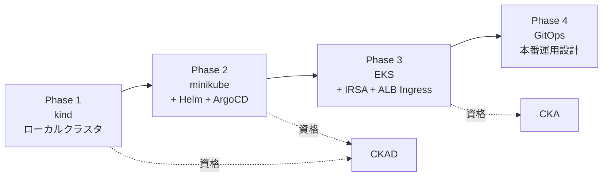
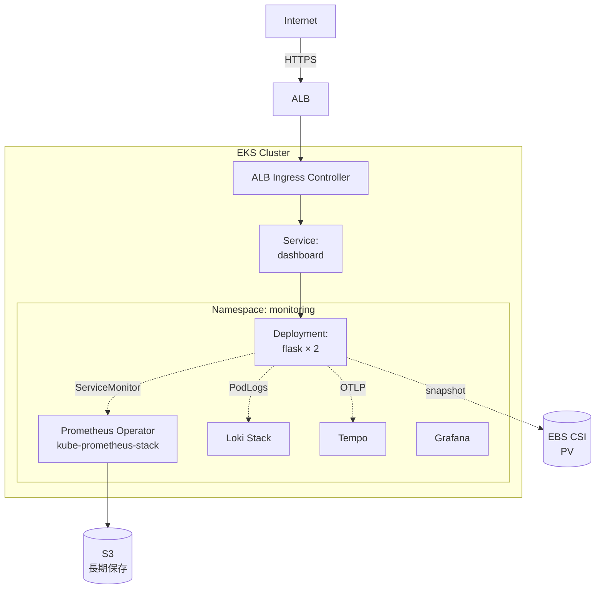
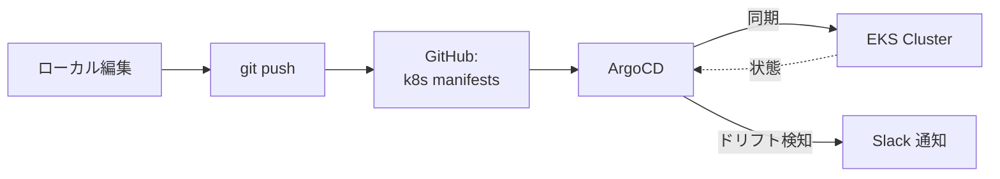

# 08. Kubernetes / EKS への発展計画

> **本ドキュメントの位置付け**
>
> 他の改善計画（01〜07）が **実装着手前提の設計書** なのに対し、本書は **「学習ロードマップ + 高レベル設計ドラフト」** です。
> EKS は学習目的の月額負担が大きく、また LPIC-1 / CCNA / AWS SAA を取得してから着手すべき領域と判断したため、実装着手は 2027 年以降を想定しています。
>
> ポートフォリオでは「視界の広さ」と「**いつ・なぜ K8s に進むかを判断できる**」ことを示すのが目的です。

---

## 1. 背景・課題

| 観点 | 現状 / 計画 |
| --- | --- |
| 現状 | 単一ホスト + Docker Compose |
| [03](./03-terraform-aws.md) | AWS EC2 × 2 AZ + ALB（VM 構成） |
| **求人とのギャップ** | 中堅以上のインフラ求人は **K8s / EKS 経験を要件 or 歓迎** に挙げる割合が高い |

Docker Compose 止まりだと、以下を学べない。

- **宣言的なワークロード定義**（Deployment / StatefulSet）
- **オートスケール**（HPA / Cluster Autoscaler）
- **セルフヒーリング**（Pod / Node 障害時の自動再配置）
- **Service Discovery / Ingress 抽象**
- **GitOps**（ArgoCD / Flux）

---

## 2. 進め方の方針

「**いきなり EKS を立てない**」ことを最優先する。理由：

1. **コスト**：EKS コントロールプレーン $0.10/h ≒ 月 11,000 円。学習中に放置すると痛い
2. **抽象度**：K8s 概念（Pod / Service / Ingress / RBAC）を理解しないまま AWS 固有の便利機能（IRSA / VPC CNI）に進むと、後で原理が分からなくなる
3. **資格との整合**：CKAD（Kubernetes 認定アプリ開発者）→ CKA（管理者）の順で学習教材が整っており、ローカル → クラウドの段階移行が公式に推奨

### 学習フェーズ



| Phase | 環境 | 主な学習領域 | 想定期間 |
| --- | --- | --- | --- |
| 1 | kind | Pod / Deployment / Service / ConfigMap / Secret / kubectl | 1 か月 |
| 2 | minikube | Helm chart 化、ArgoCD、Ingress、Prometheus Operator | 1 か月 |
| 3 | EKS | IRSA、ALB Ingress、EBS CSI、Karpenter、コスト最適化 | 2 か月 |
| 4 | EKS | GitOps、SLO 連動、HPA、Pod 障害演習 | 1 か月 |

---

## 3. server-monitor の K8s 化（高レベル設計）

[03](./03-terraform-aws.md) の VM 構成と並列する **代替案** として、将来 K8s に乗せるなら以下になる。



### 3.1 ワークロード分類

| リソース | 種別 | 理由 |
| --- | --- | --- |
| Flask Dashboard | Deployment | ステートレス、レプリカ 2 で HA |
| Prometheus | StatefulSet (Operator) | TSDB を PV に持つ |
| Loki | StatefulSet | チャンクは S3、インデックスは PV |
| Tempo | StatefulSet | 同上 |
| Grafana | Deployment | DB は RDS or PV |
| 監視ターゲット（node-exporter） | DaemonSet | 全ノードに 1 つ |

### 3.2 サンプル Deployment

```yaml
apiVersion: apps/v1
kind: Deployment
metadata:
  name: dashboard
  namespace: server-monitor
spec:
  replicas: 2
  selector: { matchLabels: { app: dashboard } }
  template:
    metadata:
      labels: { app: dashboard }
      annotations:
        prometheus.io/scrape: "true"
        prometheus.io/port: "9100"
    spec:
      serviceAccountName: dashboard
      securityContext:
        runAsNonRoot: true
        runAsUser: 10001
        fsGroup: 10001
      containers:
        - name: app
          image: ghcr.io/ns7jp/server-monitor:1.2.0
          ports:
            - { name: http, containerPort: 8000 }
            - { name: metrics, containerPort: 9100 }
          env:
            - name: OTLP_ENDPOINT
              value: http://tempo.monitoring:4317
          readinessProbe:
            httpGet: { path: /health, port: http }
            periodSeconds: 5
          livenessProbe:
            httpGet: { path: /health, port: http }
            periodSeconds: 15
          resources:
            requests: { cpu: 100m, memory: 128Mi }
            limits:   { cpu: 500m, memory: 512Mi }
```

### 3.3 オートスケール（HPA）

```yaml
apiVersion: autoscaling/v2
kind: HorizontalPodAutoscaler
metadata:
  name: dashboard
  namespace: server-monitor
spec:
  scaleTargetRef:
    apiVersion: apps/v1
    kind: Deployment
    name: dashboard
  minReplicas: 2
  maxReplicas: 6
  metrics:
    - type: Resource
      resource:
        name: cpu
        target: { type: Utilization, averageUtilization: 70 }
```

---

## 4. GitOps 構成（Phase 4）



- `kubectl apply` を **禁止** し、変更は必ず git 経由
- App-of-Apps パターンで Namespace ごとに ArgoCD Application を管理
- Sync Wave で順序制御（CRD → Operator → ワークロードの順）

---

## 5. コスト試算

| リソース | 仕様 | 月額 |
| --- | --- | --- |
| EKS コントロールプレーン | | 約 11,000 円 |
| EC2 worker × 2 (t3.medium) | 24h | 約 8,000 円 |
| EBS gp3 50GB × 2 | | 約 1,200 円 |
| ALB | | 約 2,500 円 |
| NAT GW × 1 | | 約 4,500 円 |
| **合計（24h）** | | **約 27,000 円 / 月** |
| **節約案（worker を spot + 夜間停止）** | | **約 12,000 円 / 月** |

**判断**：[03](./03-terraform-aws.md) の VM 構成（月 4,000 円）の方が学習目的にはコスト効率が高い。
EKS は **資格学習（CKA / AWS SAA Pro）と連動した期間集中型** で実施し、終了後は `terraform destroy` する運用にする。

---

## 6. 資格との連動

| 時期 | 資格 | 本計画との対応 |
| --- | --- | --- |
| 2027 Q2 | **CKAD**（追加候補） | Phase 1〜2（kind / minikube / Helm） |
| 2027 Q3 | **CKA**（追加候補） | Phase 3（EKS、クラスタ運用） |
| 2027 Q4 | AWS SAA Professional（検討） | Phase 4（GitOps、本番設計） |

詳細は [資格取得ロードマップ](../certifications/roadmap.md) に反映する。

---

## 7. リスクと対策

| リスク | 対策 |
| --- | --- |
| 学習中に EKS を放置して課金累積 | AWS Budgets で月 15,000 円の警報、毎週金曜に `terraform destroy` |
| K8s 概念を理解する前に AWS 固有機能に進む | Phase 1（kind）で **クラウド非依存の概念** を必ず先に固める |
| 過剰な複雑性で「VM 構成より良くなった証拠」が出ない | RTO / コスト / 開発リードタイムの 3 指標で VM 構成（[03](./03-terraform-aws.md)）と比較 |
| 自分一人で運用できなくなる（YAML 量爆発） | Helm + Kustomize で重複削減、不要な抽象は導入しない |

---

## 8. 段階的着手の Definition of Done

### Phase 1（kind）

- [ ] `kind` でローカル K8s クラスタが立つ
- [ ] server-monitor の Dashboard だけを Deployment + Service で動かせる
- [ ] `kubectl logs / describe / exec` を不自由なく使える

### Phase 2（minikube + Helm）

- [ ] Helm chart 化されている（`charts/server-monitor/`）
- [ ] kube-prometheus-stack で Prometheus / Grafana / Alertmanager が立つ
- [ ] ServiceMonitor で Flask アプリのメトリクスが取れる
- [ ] ArgoCD で 1 アプリの同期ができる

### Phase 3（EKS）

- [ ] Terraform で EKS クラスタが立つ（[03](./03-terraform-aws.md) の拡張）
- [ ] IRSA で Pod に IAM ロールが付与できる
- [ ] ALB Ingress で HTTPS 公開できる
- [ ] AWS Budgets で月次コスト警報が動く

### Phase 4（GitOps）

- [ ] ArgoCD で App-of-Apps が動く
- [ ] Sync Wave で順序制御できている
- [ ] HPA で負荷に応じて Pod がスケールする
- [ ] [05](./05-backup-recovery-drill.md) D-2 を K8s 環境で再実施

---

## 9. 参考

- [Kubernetes Documentation](https://kubernetes.io/docs/)
- [kind — Kubernetes in Docker](https://kind.sigs.k8s.io/)
- [kube-prometheus-stack](https://github.com/prometheus-community/helm-charts/tree/main/charts/kube-prometheus-stack)
- [Argo CD Documentation](https://argo-cd.readthedocs.io/)
- [CNCF Cloud Native Trail Map](https://github.com/cncf/trailmap)
- [Google SRE Workbook — Managing Load](https://sre.google/workbook/managing-load/)
