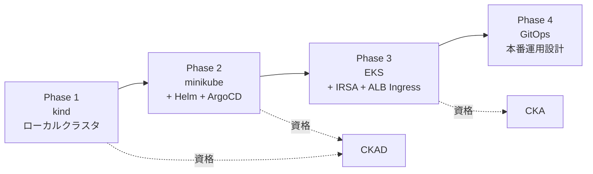
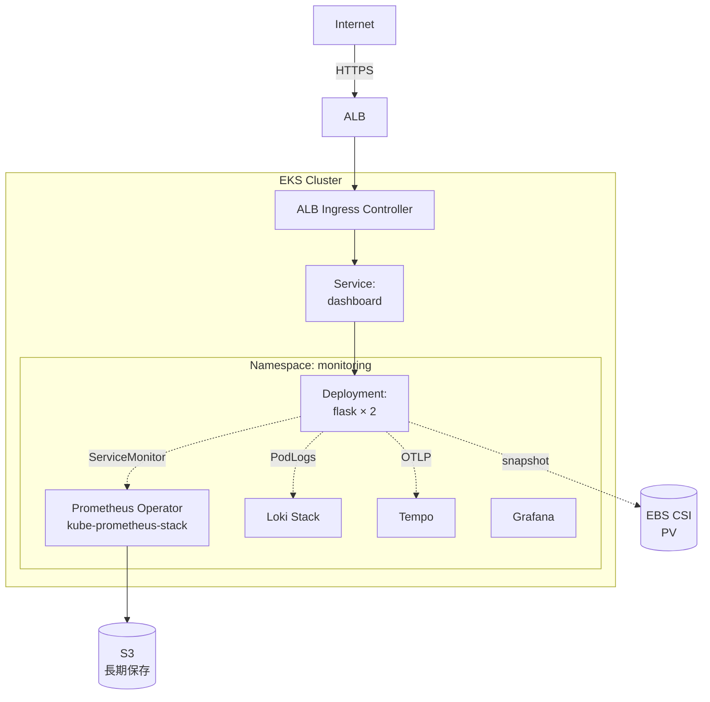
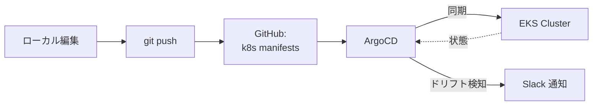

# 08. Kubernetes / EKS への発展計画

> **本ドキュメントの位置付け**
>
> 他の改善計画（01〜07）が **実装着手前提の設計書** なのに対し、本書は **「学習ロードマップ + 高レベル設計ドラフト」** です。
> EKS は学習目的の月額負担が大きく、また LPIC-1 / CCNA / AWS SAA を取得してから着手すべき領域と判断したため、実装着手は 2027 年以降を想定しています。
>
> ポートフォリオでは「視界の広さ」と「**いつ・なぜ K8s に進むかを判断できる**」ことを示すのが目的です。

---

## 1. 背景・課題

| 観点 | 現状 / 計画 |
| --- | --- |
| 現状 | 単一ホスト + Docker Compose |
| [03](./03-terraform-aws.md) | AWS EC2 × 2 AZ + ALB（VM 構成） |
| **求人とのギャップ** | 中堅以上のインフラ求人は **K8s / EKS 経験を要件 or 歓迎** に挙げる割合が高い |

Docker Compose 止まりだと、以下を学べない。

- **宣言的なワークロード定義**（Deployment / StatefulSet）
- **オートスケール**（HPA / Cluster Autoscaler）
- **セルフヒーリング**（Pod / Node 障害時の自動再配置）
- **Service Discovery / Ingress 抽象**
- **GitOps**（ArgoCD / Flux）

---

## 2. 進め方の方針

「**いきなり EKS を立てない**」ことを最優先する。EKS はコントロールプレーンだけで月 11,000 円程度かかり、
K8s の基本概念（Pod / Service / Ingress）を理解しないまま AWS 固有の機能に進むと後で分からなくなるため、
ローカル（kind → minikube）で慣れてから EKS に進む。

### 学習フェーズ

```mermaid
flowchart LR
    P1[Phase 1<br/>kind<br/>ローカルクラスタ] --> P2[Phase 2<br/>minikube<br/>+ Helm + ArgoCD]
    P2 --> P3[Phase 3<br/>EKS<br/>+ IRSA + ALB Ingress]
    P3 --> P4[Phase 4<br/>GitOps<br/>本番運用設計]

    P1 -.資格.-> CKAD
    P2 -.資格.-> CKAD
    P3 -.資格.-> CKA
```

| Phase | 環境 | 主な学習領域 | 想定期間 |
| --- | --- | --- | --- |
| 1 | kind | Pod / Deployment / Service / ConfigMap / Secret / kubectl | 1 か月 |
| 2 | minikube | Helm chart 化、ArgoCD、Ingress、Prometheus Operator | 1 か月 |
| 3 | EKS | IRSA、ALB Ingress、EBS CSI、Karpenter、コスト最適化 | 2 か月 |
| 4 | EKS | GitOps、SLO 連動、HPA、Pod 障害演習 | 1 か月 |

---

## 3. server-monitor の K8s 化（高レベル設計）

[03](./03-terraform-aws.md) の VM 構成と並列する **代替案** として、将来 K8s に乗せるなら以下になる。

```mermaid
flowchart TB
    Internet -->|HTTPS| ALB
    ALB --> Ingress[ALB Ingress Controller]

    subgraph EKS[EKS Cluster]
        Ingress --> SvcApp[Service:<br/>dashboard]
        SvcApp --> DepApp[Deployment:<br/>flask × 2]

        subgraph Monitoring[Namespace: monitoring]
            Prom[Prometheus Operator<br/>kube-prometheus-stack]
            Loki2[Loki Stack]
            Tempo2[Tempo]
            Graf[Grafana]

            DepApp -.ServiceMonitor.-> Prom
            DepApp -.PodLogs.-> Loki2
            DepApp -.OTLP.-> Tempo2
        end
    end

    DepApp -.snapshot.-> EBS[(EBS CSI<br/>PV)]
    Prom --> S3[(S3<br/>長期保存)]
```

### 3.1 ワークロード分類

| リソース | 種別 |
| --- | --- |
| Flask Dashboard | Deployment（レプリカ 2） |
| Prometheus / Loki / Tempo | StatefulSet |
| Grafana | Deployment |
| 監視ターゲット（node-exporter） | DaemonSet |

具体的な manifest（Deployment / HPA など）は、実際に kind で動かし始めてから
このドキュメントに追記する。

---

## 4. GitOps 構成（Phase 4）

```mermaid
flowchart LR
    Dev[ローカル編集] --> Push[git push]
    Push --> Repo[GitHub:<br/>k8s manifests]
    Repo --> ArgoCD[ArgoCD]
    ArgoCD -->|同期| Cluster[EKS Cluster]
    Cluster -.状態.-> ArgoCD
    ArgoCD -->|ドリフト検知| Slack[Slack 通知]
```

`kubectl apply` での直接変更はせず、manifest の変更は必ず git 経由で ArgoCD に反映させる想定。

---

## 5. コスト試算

| リソース | 仕様 | 月額 |
| --- | --- | --- |
| EKS コントロールプレーン | | 約 11,000 円 |
| EC2 worker × 2 (t3.medium) | 24h | 約 8,000 円 |
| EBS gp3 50GB × 2 | | 約 1,200 円 |
| ALB | | 約 2,500 円 |
| NAT GW × 1 | | 約 4,500 円 |
| **合計（24h）** | | **約 27,000 円 / 月** |
| **節約案（worker を spot + 夜間停止）** | | **約 12,000 円 / 月** |

**判断**：[03](./03-terraform-aws.md) の VM 構成（月 4,000 円）の方が学習目的にはコスト効率が高い。
EKS は **資格学習（CKA / AWS SAA Pro）と連動した期間集中型** で実施し、終了後は `terraform destroy` する運用にする。

---

## 6. 資格との連動

| 時期 | 資格 | 本計画との対応 |
| --- | --- | --- |
| 2027 Q2 | **CKAD**（追加候補） | Phase 1〜2（kind / minikube / Helm） |
| 2027 Q3 | **CKA**（追加候補） | Phase 3（EKS、クラスタ運用） |
| 2027 Q4 | AWS SAA Professional（検討） | Phase 4（GitOps、本番設計） |

詳細は [資格取得ロードマップ](../certifications/roadmap.md) に反映する。

---

## 7. リスクと対策

最大のリスクは、学習中に EKS を立てたまま忘れて課金が積み上がること。
対策として AWS Budgets で月 15,000 円の警報を設定し、毎週金曜に `terraform destroy` する運用にする。

---

## 8. 段階的着手の Definition of Done

### Phase 1（kind）

- [ ] `kind` でローカル K8s クラスタが立つ
- [ ] server-monitor の Dashboard だけを Deployment + Service で動かせる
- [ ] `kubectl logs / describe / exec` を不自由なく使える

### Phase 2（minikube + Helm）

- [ ] Helm chart 化されている（`charts/server-monitor/`）
- [ ] kube-prometheus-stack で Prometheus / Grafana / Alertmanager が立つ
- [ ] ServiceMonitor で Flask アプリのメトリクスが取れる
- [ ] ArgoCD で 1 アプリの同期ができる

### Phase 3（EKS）

- [ ] Terraform で EKS クラスタが立つ（[03](./03-terraform-aws.md) の拡張）
- [ ] IRSA で Pod に IAM ロールが付与できる
- [ ] ALB Ingress で HTTPS 公開できる
- [ ] AWS Budgets で月次コスト警報が動く

### Phase 4（GitOps）

- [ ] ArgoCD で App-of-Apps が動く
- [ ] Sync Wave で順序制御できている
- [ ] HPA で負荷に応じて Pod がスケールする
- [ ] [05](./05-backup-recovery-drill.md) D-2 を K8s 環境で再実施

---

## 9. 参考

- [Kubernetes Documentation](https://kubernetes.io/docs/)
- [kind — Kubernetes in Docker](https://kind.sigs.k8s.io/)
- [kube-prometheus-stack](https://github.com/prometheus-community/helm-charts/tree/main/charts/kube-prometheus-stack)
- [Argo CD Documentation](https://argo-cd.readthedocs.io/)
- [CNCF Cloud Native Trail Map](https://github.com/cncf/trailmap)
- [Google SRE Workbook — Managing Load](https://sre.google/workbook/managing-load/)
