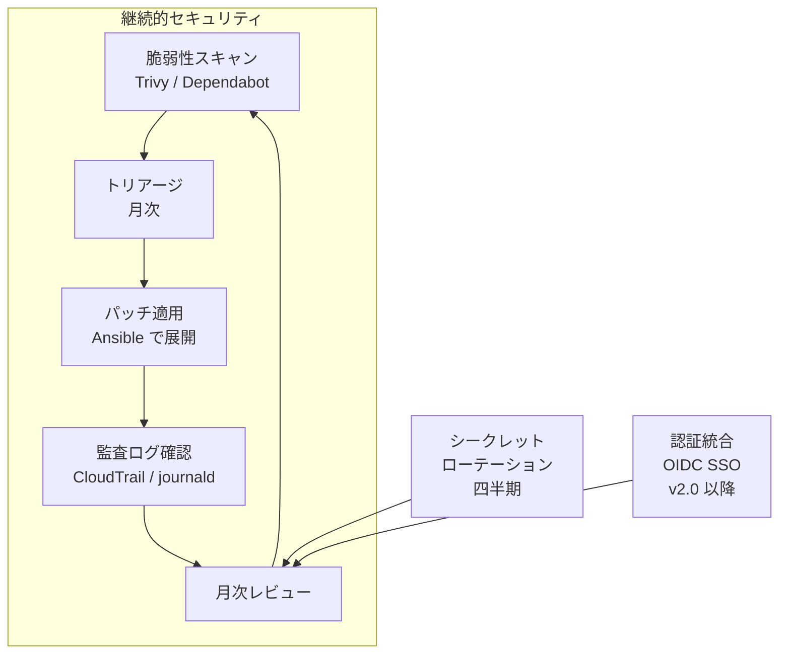
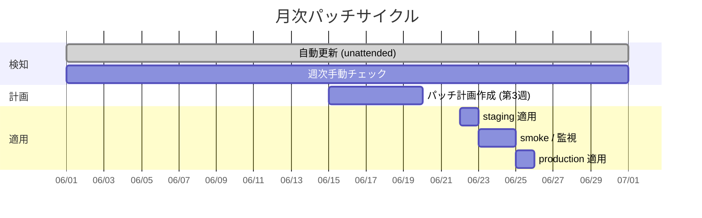

# 09. セキュリティ運用プロセス

## 1. 背景・課題

現状の server-monitor は **個別のセキュリティ設定** は十分に施されている。

- Basic 認証 + Bearer Token、TLS 終端、Docker 非 root、IMDSv2 強制、tfsec チェック等

しかし、これらは「**設計時の一時的な設定**」であり、**「運用としてのセキュリティ」** が抜けている。

| 抜けている要素 | 影響 |
| --- | --- |
| 脆弱性スキャンの定期実行 | 依存パッケージの CVE を見逃す |
| 監査ログのレビュー運用 | 不審な操作を後追いできない |
| シークレットローテーション | 漏洩時の影響範囲が拡大 |
| パッチ管理サイクル | 更新が属人化、放置リスク |
| 認証統合（SSO） | 退職者アカウントの取り残し |

> ポートフォリオ観点：「セキュリティを **運用プロセス** として継続できる」ことは社内 SE / インフラ運用で必ず問われる。

---

## 2. 全体像



「**設定 → 運用 → 改善のループ**」を意識的に回す。

---

## 3. 脆弱性管理

### 3.1 スキャン対象とツール

| 対象 | ツール | 頻度 | 通知 |
| --- | --- | --- | --- |
| Docker イメージ | Trivy（GitHub Actions） | PR 毎 + 日次 cron | Slack（High/Critical） |
| Python 依存（pip） | Dependabot + `pip-audit` | 週次 | GitHub PR 自動作成 |
| OS パッケージ | `unattended-upgrades`（自動） + 月次手動レビュー | 自動 + 月次 | 月次レポート |
| Terraform | tfsec / checkov | PR 毎 | PR ブロック |
| Ansible | ansible-lint + `community.general.cve` | PR 毎 | PR ブロック |
| Secrets | gitleaks（pre-commit + CI） | コミット毎 | PR ブロック |

### 3.2 Trivy CI サンプル

```yaml
name: container-scan
on:
  push:
  pull_request:
  schedule:
    - cron: '0 19 * * *'  # 毎日 04:00 JST

jobs:
  trivy:
    runs-on: ubuntu-latest
    steps:
      - uses: actions/checkout@v4
      - name: Build image
        run: docker build -t server-monitor:scan .
      - name: Trivy scan (fail on HIGH+)
        uses: aquasecurity/trivy-action@master
        with:
          image-ref: server-monitor:scan
          severity: 'HIGH,CRITICAL'
          exit-code: '1'
          ignore-unfixed: true
      - name: Notify Slack on failure
        if: failure()
        uses: slackapi/slack-github-action@v1
        with:
          payload: |
            { "text": ":warning: Trivy: High/Critical CVE detected on ${{ github.ref }}" }
        env:
          SLACK_WEBHOOK_URL: ${{ secrets.SLACK_WEBHOOK }}
```

### 3.3 トリアージ基準

| Severity | 対応 SLA | 例外 |
| --- | --- | --- |
| Critical (CVSS 9.0+) | 24 時間以内に対応 or 緩和策 | エクスプロイト無 + 攻撃面なしと判断できれば 7 日 |
| High (7.0-8.9) | 7 日以内 | 同上で 14 日 |
| Medium (4.0-6.9) | 月次レビューで判断 | — |
| Low / Unfixed | 記録のみ | — |

**緩和策の記録**：対応保留にする場合、必ず `docs/security/exceptions.md` に CVE ID・理由・期限・担当を記録する。

---

## 4. 監査ログ運用

### 4.1 何を残すか

| ログ源 | 内容 | 保管先 | リテンション |
| --- | --- | --- | --- |
| CloudTrail（[03](./03-terraform-aws.md) 以降） | AWS API コール全件 | S3（バージョニング） | 1 年 |
| Linux auditd | sudo / 設定変更 | journald → Loki | 30 日 |
| SSH ログイン | 成功 / 失敗 | journald → Loki | 90 日 |
| Nginx access.log | 全リクエスト | Loki | 14 日 |
| アプリ操作ログ | 認証成功 / 失敗、データ参照 | Loki + 監査トピックタグ | 90 日 |
| Grafana 操作ログ | ダッシュボード閲覧、設定変更 | Loki | 30 日 |

### 4.2 レビュー運用

| 頻度 | 確認内容 | 担当 |
| --- | --- | --- |
| 日次（自動） | SSH 失敗回数の異常スパイク、外部 IP からの sudo | Grafana Alloy + Alertmanager |
| 週次 | 不審な API コール（IAM 変更、Security Group 変更） | 運用者（30 分） |
| 月次 | アカウント・権限の棚卸し | 運用者（1 時間） |

### 4.3 サンプル LogQL アラート

```logql
# SSH 失敗が 1 分間に 10 回以上
sum by (host) (
  count_over_time({job="auth"} |~ "Failed password" [1m])
) > 10
```

---

## 5. シークレット管理とローテーション

### 5.1 シークレット分類

| 種類 | 保管 | ローテーション頻度 |
| --- | --- | --- |
| Basic 認証パスワード | Ansible Vault | 半期 |
| Prometheus Bearer Token | Ansible Vault | 半期 |
| GitHub Actions OIDC | （無し、短命トークン） | 不要 |
| Slack Webhook | GitHub Secrets + AWS Secrets Manager | 漏洩時即時 |
| TLS 証明書（Let's Encrypt） | certbot 自動更新 | 90 日（自動） |
| SSH 鍵 | 各自の YubiKey / `ssh-agent` | 年次 |
| DB パスワード（将来） | AWS Secrets Manager（[03](./03-terraform-aws.md) で導入） | 半期 |

### 5.2 ローテーション手順テンプレ

```markdown
# シークレットローテーション: <種類>

## 事前
- [ ] 新シークレット生成（生成元・長さ・文字種を記載）
- [ ] 古いシークレットの使用箇所を grep で全箇所特定

## 実施
- [ ] 新シークレットを Vault / Secrets Manager に登録
- [ ] 利用側を1箇所ずつ切替、各々で動作確認
- [ ] 古いシークレットを削除（または invalidate）

## 事後
- [ ] 監査ログで「古い値での認証が来ていない」ことを 1 日確認
- [ ] `docs/security/rotation-log.md` に実施記録
```

### 5.3 漏洩検知

- `gitleaks` を pre-commit + CI で常時動作
- GitHub の「シークレットスキャン」を有効化
- 月次で `aws secretsmanager list-secrets` の更新日を棚卸し

---

## 6. 認証統合（SSO） — v2.0 以降

現状は Basic 認証で運用者本人だけが知っているパスワードを使用。これは初期段階としては合理的だが、複数人運用や退職者管理を考えると **OIDC ベース SSO** へ移行が必要。

| 対象 | 認証統合先 | タイミング |
| --- | --- | --- |
| Grafana | OIDC（AWS IAM Identity Center / Google Workspace） | [03](./03-terraform-aws.md) AWS 化と同時 |
| アプリダッシュボード | OIDC | 同上 |
| SSH | AWS SSM Session Manager（鍵レス） | 同上 |

### 6.1 Grafana OIDC 設定例

```ini
# grafana.ini
[auth.generic_oauth]
enabled = true
name = AWS IAM Identity Center
client_id = ${OAUTH_CLIENT_ID}
client_secret = ${OAUTH_CLIENT_SECRET}
scopes = openid email profile
auth_url = https://example.awsapps.com/start/oauth2/authorize
token_url = https://example.awsapps.com/start/oauth2/token
api_url = https://example.awsapps.com/start/oauth2/userInfo
allowed_domains = ns7jp.example.com
allow_sign_up = false
role_attribute_path = contains(groups[*], 'monitor-admin') && 'Admin' || 'Viewer'
```

**退職時運用**：人事から退職連絡 → IdP 側の Group から外す → Grafana / アプリ / AWS 全停止が即時連動。

---

## 7. パッチ管理サイクル



| ステップ | 内容 |
| --- | --- |
| 検知 | unattended-upgrades が自動でセキュリティパッチ適用、結果を Loki に集約 |
| 計画 | 月次レビューでメジャー更新（kernel / Docker / Nginx）を計画化 |
| 適用 | staging で 48h smoke → production 適用 |
| 検証 | 監視で異常が無いことを 24h 確認 |

---

## 8. 月次セキュリティレビュー

| 項目 | チェック内容 |
| --- | --- |
| 脆弱性 | High/Critical の対応状況、保留中の例外一覧 |
| 監査ログ | 不審な SSH / sudo / IAM 変更 |
| アカウント | アクティブユーザー棚卸し、退職者の残存確認 |
| シークレット | ローテーション期限到来分の対応 |
| パッチ | 適用率、未適用ホスト一覧 |
| インシデント | セキュリティ起因の Sev 案件レビュー（[07](./07-incident-response.md)） |
| 学習 | 直近の重大 CVE / 業界インシデントの社内共有 |

「**SLO レビュー / インシデントレビューと同じ会議体に統合**」する。三つの月次レビューを別物にすると形骸化しがち。

---

## 9. 段階的導入

| 週 | 内容 |
| --- | --- |
| 1 | Trivy / gitleaks / Dependabot を CI に追加 |
| 2 | Loki に auditd / SSH ログを取り込み、アラートルール追加 |
| 3 | シークレット棚卸し → `docs/security/inventory.md` 整備、ローテーション計画策定 |
| 4 | 月次レビュー会の枠を SLO / インシデントレビューと統合、初回開催 |
| ... | [03](./03-terraform-aws.md) AWS 化と同時に CloudTrail / GuardDuty / SSO を投入 |

---

## 10. 完了条件（Definition of Done）

- [ ] Trivy / Dependabot / gitleaks / tfsec が CI で常時動作
- [ ] High/Critical CVE 発生時に Slack 通知が届く
- [ ] `docs/security/exceptions.md` に保留 CVE が記録される運用が回っている
- [ ] 監査ログレビュー手順が `docs/security/audit-review.md` にある
- [ ] シークレット棚卸し（`docs/security/inventory.md`）が四半期毎に更新
- [ ] 月次セキュリティレビューが SLO / インシデントレビューと統合運用されている

---

## 11. 関連設計書

- [02. Ansible 自動化](./02-ansible-automation.md)（パッチ適用の実体）
- [03. AWS + Terraform 化](./03-terraform-aws.md)（CloudTrail / GuardDuty / SSO 投入）
- [05. 復旧演習](./05-backup-recovery-drill.md)（漏洩時シナリオ）
- [07. インシデント対応](./07-incident-response.md)（セキュリティ Sev 対応）

---

## 12. 参考

- [CIS Benchmarks](https://www.cisecurity.org/cis-benchmarks)
- [NIST SP 800-53 セキュリティ統制](https://csrc.nist.gov/publications/detail/sp/800-53/rev-5/final)
- [AWS Well-Architected Security Pillar](https://docs.aws.amazon.com/wellarchitected/latest/security-pillar/)
- [Trivy Documentation](https://trivy.dev/)
- [OWASP Cheat Sheet Series](https://cheatsheetseries.owasp.org/)
