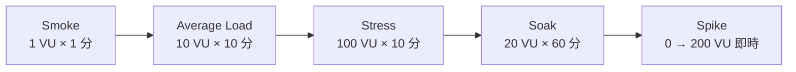
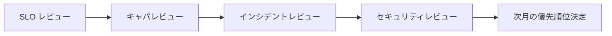

# 10. キャパシティプランニング・負荷試験

## 1. 背景・課題

server-monitor は SLO（[04](./04-slo-design.md)）を定義しているが、**「平常時にどれだけ余裕があるか」「いつスケールアウトを判断するか」** の数値根拠が無い。

| 現状の課題 | リスク |
| --- | --- |
| 通常負荷の数値が記録されていない | アラートしきい値を勘で決めている |
| ピーク負荷で何が崩れるか未検証 | 採用面接で「想定 RPS は？」と聞かれて答えられない |
| スケール判断の閾値が無い | 容量超過に「気付いた人」が対処する属人運用 |
| キャパシティの月次レビューが無い | 半年後に突然枯渇する |

> ポートフォリオ観点：「SLO」と「キャパシティ計画」はセット。**数値で容量を語れる人** は希少価値が高い。

---

## 2. ゴール

1. **ベースライン計測**：平常時 / 想定ピーク時のリソース使用率を計測し記録する
2. **負荷試験**：意図的に負荷を与え、どこで SLO 違反が起きるかの **限界値** を把握する
3. **スケール判断基準**：CPU / メモリ / レイテンシ / 同時接続数の閾値を明文化する
4. **月次レビュー**：成長率を踏まえ、3 ヶ月先・6 ヶ月先の容量見通しを更新する

---

## 3. 計測対象とベースライン

### 3.1 メトリクス対象

| 層 | 計測項目 | データソース |
| --- | --- | --- |
| ホスト | CPU 使用率、Load Average、Mem / Swap、Disk IO / 使用率、NW スループット | node-exporter |
| プロセス | コンテナ別の CPU / Mem、ファイルディスクリプタ | cAdvisor |
| アプリ | HTTP RPS、p50 / p95 / p99 レイテンシ、エラー率、同時接続数 | Flask + prometheus_client |
| Prometheus | scrape 時間、TSDB サイズ、メモリ消費、active series 数 | `prometheus_*` メトリクス |
| Loki | ingestion rate, query duration, chunks size | `loki_*` メトリクス |

### 3.2 ベースライン記録テンプレ

`docs/capacity-baselines/YYYY-MM.md` に毎月記録：

```markdown
# キャパシティベースライン 2026-06

## 平常時（業務時間平均）
- CPU: 12% / Mem: 38% / Disk: 41% (/var/lib/prometheus)
- RPS: 約 4 req/s / p95 レイテンシ: 87ms
- Prometheus active series: 約 35,000

## 業務時間ピーク（14-16 時）
- CPU: 28% / Mem: 47% / Disk: 41%
- RPS: 約 12 req/s / p95: 156ms

## 月次成長率
- active series: +3.1%
- Disk 使用率: +0.6 ポイント
```

---

## 4. 負荷試験

### 4.1 ツール選定

**主：k6**（JavaScript で書ける、Grafana / Prometheus 連携が標準）
**副：Locust**（Python で書ける、Flask 親和性）

| 比較項目 | k6 | Locust | wrk |
| --- | --- | --- | --- |
| 言語 | JavaScript | Python | C / Lua |
| 分散実行 | k6 Cloud / k6 Operator | 標準対応 | 自前 |
| Prometheus 連携 | k6-prometheus output 公式 | 別途 statsd 経由 | 別途 |
| 採用面接での認知 | 高（モダン） | 中 | 中（ベンチ用途） |

→ **k6 を採用**。Prometheus 連携が標準でついており、SLO ダッシュボードに即統合できる。

### 4.2 シナリオ設計



| シナリオ | 目的 | 期待 |
| --- | --- | --- |
| Smoke | 正常動作確認 | 全 2xx |
| Average Load | 想定ピーク負荷の再現 | SLO 内に収まる |
| Stress | 限界値の発見 | どこで p95 が崩壊するかを記録 |
| Soak | リークの検出 | メモリ・FD が増え続けないか |
| Spike | 瞬間負荷耐性 | 5xx を返すか、graceful に degrade するか |

### 4.3 k6 スクリプト例

```javascript
// load-tests/scenarios/average.js
import http from 'k6/http';
import { check, sleep } from 'k6';

export const options = {
  scenarios: {
    average_load: {
      executor: 'ramping-vus',
      startVUs: 0,
      stages: [
        { duration: '2m', target: 10 },   // ramp-up
        { duration: '10m', target: 10 },  // sustain
        { duration: '2m', target: 0 },    // ramp-down
      ],
    },
  },
  thresholds: {
    'http_req_duration{status:200}': ['p(95)<500'],
    'http_req_failed': ['rate<0.01'],
  },
};

export default function () {
  const res = http.get('https://monitor.example.com/health', {
    headers: { Authorization: `Basic ${__ENV.BASIC_AUTH}` },
  });
  check(res, { 'is 200': (r) => r.status === 200 });
  sleep(1);
}
```

### 4.4 安全な実行プロトコル

| 項目 | ルール |
| --- | --- |
| 実行先 | staging のみ。production は事前承認 + 業務時間外 |
| Abort 条件 | 5 分以上 5xx が出続けたら停止、エラーバジェット 10% 以上消費したら停止 |
| 周知 | Slack `#ops` に開始 / 終了を通知（自動） |
| 結果保管 | k6 出力を Prometheus に取り込み、Grafana ダッシュボードに保存 |

---

## 5. スケール判断基準（しきい値）

### 5.1 ホスト層

| メトリクス | 警告 | 危険 | アクション |
| --- | --- | --- | --- |
| CPU 5 分平均 | 60% | 80% | EC2 インスタンスタイプ昇格を検討 |
| Mem 使用率 | 70% | 85% | メモリ増設、不要プロセス整理 |
| Disk 使用率 | 75% | 90% | EBS 拡張、ログ・メトリクス保管期間見直し |
| Disk IOPS | プロビジョン量の 70% | 90% | gp3 IOPS / Throughput 増 |

### 5.2 アプリ層

| メトリクス | 警告 | 危険 | アクション |
| --- | --- | --- | --- |
| p95 レイテンシ | SLO の 70% | SLO の 90% | プロファイル取得、トレース調査 |
| RPS | キャパ試験で確認した限界の 60% | 80% | 水平スケール（ALB + EC2 増設） |
| エラー率 | 0.5% | 1.0% | バーンレートアラート併発、即対応 |
| 同時接続数 | gunicorn worker × 50% | × 80% | worker 数調整、worker_class 見直し |

---

## 6. 月次キャパシティレビュー

### 6.1 アジェンダ（30 分）

1. 先月のベースラインと当月比較（[3.2](#32-ベースライン記録テンプレ)）
2. 成長率トレンド（過去 6 ヶ月分の折れ線）
3. 3 ヶ月先・6 ヶ月先の見通し（線形外挿 + 季節調整）
4. 直近の負荷試験結果と SLO 余裕度
5. 必要なアクション（インスタンス昇格 / リテンション短縮 / 不要メトリクス削減）

### 6.2 SLO レビュー / インシデントレビューと統合

[04 SLO](./04-slo-design.md) / [07 インシデント対応](./07-incident-response.md) / [09 セキュリティ運用](./09-security-operations.md) の月次会議に **同一日に統合** する。形骸化防止と判断連動のため。



---

## 7. ダッシュボード

```text
┌──────────────────────────────────────────────────────────────────┐
│ Capacity Dashboard — server-monitor          Last 30d ▼          │
├──────────────────────────────────────────────────────────────────┤
│ CPU 使用率 (5min avg)                  Disk 使用率 (/var/lib)     │
│   現在: 14%  / 警告 60% / 危険 80%      現在: 42%  / 警告 75%     │
│   ████░░░░░░░░░░░░░░░░░░ 14%           ████████░░░░░░░░░░ 42%     │
├──────────────────────────────────────────────────────────────────┤
│ active series (Prometheus)             Loki ingestion rate        │
│   現在: 38,420 / 月次 +3.4%             現在: 1.2 MB/s             │
│   [折れ線] 過去 6 ヶ月                   [折れ線] 過去 30 日         │
├──────────────────────────────────────────────────────────────────┤
│ 直近の負荷試験結果（Stress シナリオ）                              │
│   100 VU で p95 = 612ms（SLO 500ms 超過）                          │
│   → 限界 RPS: 約 80 req/s                                          │
└──────────────────────────────────────────────────────────────────┘
```

---

## 8. 段階的導入

| 週 | 内容 |
| --- | --- |
| 1 | k6 をローカル / staging で動作確認、smoke / average シナリオ作成 |
| 2 | k6-prometheus output 連携、Grafana ダッシュボード追加 |
| 3 | stress / soak / spike シナリオ追加、初回のベースライン記録 |
| 4 | スケール判断しきい値を [04 SLO](./04-slo-design.md) と整合させる |
| 月次 | キャパシティレビューを SLO / IR / セキュリティと統合運用 |

---

## 9. 完了条件（Definition of Done）

- [ ] k6 シナリオ（smoke / average / stress / soak / spike）が `load-tests/` に格納されている
- [ ] `docs/capacity-baselines/YYYY-MM.md` に初回ベースラインが記録されている
- [ ] Grafana に「Capacity Dashboard」が存在する
- [ ] スケール判断しきい値が `docs/runbooks/capacity-thresholds.md` に明文化されている
- [ ] 月次キャパシティレビューが SLO / IR レビューと統合運用されている
- [ ] 負荷試験を staging に対して最低 1 回実施し、Stress シナリオの限界値を記録

---

## 10. 関連設計書・ADR

- [04 SLO 設計](./04-slo-design.md) — レイテンシ SLO とキャパ判断は連動
- [07 インシデント対応](./07-incident-response.md) — キャパ枯渇は Sev 案件
- [11 変更管理](./11-change-management.md) — スケール変更は Standard Change
- [13 FinOps](./13-finops.md) — スケール判断はコスト判断と一体
- [ADR-0001 Prometheus 採用](../adr/0001-monitoring-stack.md)

---

## 11. 参考

- [Google SRE Book — Chapter 18: Software Engineering in SRE（Capacity Planning）](https://sre.google/sre-book/software-engineering-in-sre/)
- [k6 Documentation](https://k6.io/docs/)
- [Brendan Gregg, "Systems Performance" 2nd ed.](https://www.brendangregg.com/systems-performance-2nd-edition-book.html)
- [USE Method（Brendan Gregg）](https://www.brendangregg.com/usemethod.html)
