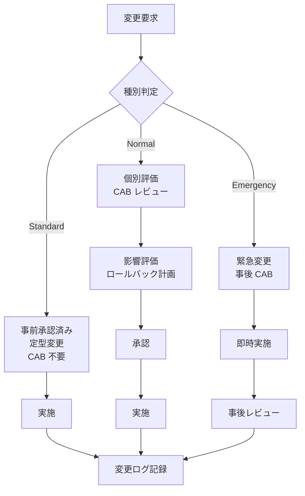
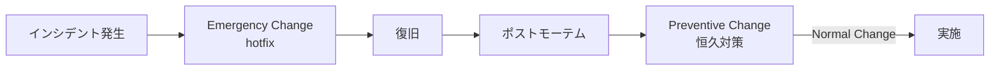

# 11. 変更管理プロセス

## 1. 背景・課題

server-monitor は **「障害対応プロセス」（[07](./07-incident-response.md)）** はあるが、**「平常時の変更」をどう統制するか** が定義されていない。

| 現状の課題 | リスク |
| --- | --- |
| 設定変更が記録されない | 障害発生時、直前の変更が原因か特定できない |
| ロールバック計画が無いまま変更 | 失敗時に手作業で戻すしかない |
| 変更窓・凍結期間が無い | 月末・長期休暇前に重大変更が入る |
| 影響度の判断基準が無い | 軽微な変更も重大変更も同じ重さで扱う |
| 変更レビューが属人化 | 「とりあえず動いたから OK」が積み重なる |

> ポートフォリオ観点：ITIL 4 Foundation の Change Enablement プラクティスに準拠した運用ができることを示す。

---

## 2. 変更の分類

ITIL の「Standard / Normal / Emergency」を採用する。



### 2.1 Standard Change（標準変更）

「**事前にプロセス承認済み・ロールバック容易・影響範囲が限定的**」な定型変更。

| 例 | 判断理由 |
| --- | --- |
| Grafana ダッシュボードの追加 | UI 限定、削除で戻る |
| Prometheus アラートルールの追加（新規） | 既存ルールを変更しない |
| Loki のラベル新規追加（高基数でない） | LogQL の検索性向上、再起動不要 |
| Slack 通知テンプレ追加 | チャネル分岐に影響しない |
| `unattended-upgrades` 由来の自動パッチ | 影響度低、自動ロールバック仕組みあり |

→ **CAB（後述）不要、PR レビュー 1 名で実施可**。

### 2.2 Normal Change（通常変更）

影響評価が必要な変更。事前承認 + ロールバック計画必須。

| 例 |
| --- |
| Nginx 設定変更（upstream / TLS） |
| Prometheus scrape_interval / retention 変更 |
| Alertmanager ルーティング変更 |
| Docker イメージのメジャー更新 |
| Ansible playbook の OS パッケージ群更新 |
| Terraform でのインスタンスタイプ変更 |
| SLO しきい値変更 |

→ **CAB レビュー（軽量版）必須**。

### 2.3 Emergency Change（緊急変更）

セキュリティ / 障害復旧で **即時実施が必要** な変更。

| 例 |
| --- |
| Critical CVE のパッチ即時適用 |
| 障害中の hotfix（インシデント内変更） |
| 攻撃対応（IP ブロック等） |

→ **事前 CAB 省略可、事後 24 時間以内に変更ログと振り返り**。インシデント対応（[07](./07-incident-response.md)）と統合運用。

---

## 3. CAB（Change Advisory Board）軽量版

商用 ITIL の CAB は重い。個人ポートフォリオ / 小規模チームでは **「軽量 CAB」** で運用する。

### 3.1 構成

| 役割 | 担当 |
| --- | --- |
| Change Owner | 変更を提案する人（誰でも） |
| Reviewer | 別の運用担当 1 名（不在なら非同期 Slack レビュー） |
| Approver | 同上の運用担当（Owner と兼任不可） |

「**変更者本人以外が必ず 1 名見る**」をルール化することで、属人化を防ぐ。

### 3.2 PR ベースで運用

CAB を会議体にせず、**GitHub PR の必須レビュー** に統合：

- ラベル `change/standard|normal|emergency` を必須
- Normal Change はテンプレ（後述）に沿った PR description が必須
- 承認は GitHub の Required Reviewer で担保
- Merge = 適用 OK のサイン

これにより、CAB を「会議の手間」ではなく「コードレビュー」として運用できる。

---

## 4. 変更要求テンプレ（Normal Change 用）

`.github/PULL_REQUEST_TEMPLATE/normal-change.md`：

```markdown
# Normal Change Request

## 1. 変更内容
<!-- 何を変える、どの設定 / コードか -->

## 2. 変更理由
<!-- なぜ必要か。リンク：ADR / Issue / インシデント -->

## 3. 影響範囲
- 影響サービス: [ ]
- ダウンタイム: なし / 数秒 / 数分 / 計画停止
- ユーザー影響: なし / 一部 / 全員
- データ影響: なし / 読み取り / 書き込み

## 4. ロールバック計画
<!-- 失敗したら何で戻すか。コマンド・PR・所要時間 -->

## 5. 検証方法
- staging で実施: [ ]
- 監視メトリクス確認項目: 
- ロールバック判断基準（何分以内に何が起きたら戻すか）:

## 6. 変更窓
- 希望日時:
- 凍結期間との衝突確認: [ ]

## 7. 周知
- 関係者通知（#ops 等）: [ ]
- カレンダー登録: [ ]
```

---

## 5. 変更窓と凍結期間

### 5.1 変更窓（推奨実施帯）

| 種別 | 推奨実施帯 |
| --- | --- |
| Standard | 業務時間内いつでも |
| Normal | 火・水・木の 10:00-16:00（ロールバック時間を確保） |
| Emergency | 24/7 |

**避けるべき時間帯**：

- 月曜午前（週次集計が走っている可能性）
- 金曜午後（週末対応が必要になる）
- 月末最終営業日（会計締め）

### 5.2 凍結期間（Change Freeze）

以下の期間は Normal Change を凍結。Emergency のみ実施可：

| 期間 | 理由 |
| --- | --- |
| 年末年始（12/29 - 1/3） | 年間で最も対応者が少ない |
| 大型連休前 1 営業日 | 連休中の障害対応リスク |
| 重要キャンペーン期間（事前合意） | ビジネス影響時間帯 |
| インシデント Postmortem 完了前 | 直近障害の根本原因が未確定 |

---

## 6. 変更ログ

### 6.1 自動化

- GitHub PR Merge イベントから `docs/changelog/YYYY-MM.md` を自動更新
- Ansible / Terraform の適用ログを `journald` → Loki に集約
- 重要変更（Normal/Emergency）は Slack `#ops` に自動投稿

### 6.2 ログ書式

```markdown
# 変更ログ 2026-06

| 日時 | 種別 | 内容 | PR | 結果 |
| --- | --- | --- | --- | --- |
| 06/02 10:32 | Standard | Grafana ダッシュボード追加 | #142 | OK |
| 06/05 14:00 | Normal | Nginx keepalive 75s | #145 | OK（ロールバック演習も実施） |
| 06/12 02:47 | Emergency | OpenSSL CVE-2026-xxxx 対応 | #149 | OK（事後 CAB 06/13） |
```

---

## 7. 変更後レビュー（PIR: Post-Implementation Review）

### 7.1 タイミング

- Normal Change：実施 1 週間後
- Emergency Change：24 時間以内
- 失敗 / ロールバック発生時：即時

### 7.2 確認内容

| 項目 | 内容 |
| --- | --- |
| 計画通り完了したか | 想定外の挙動はなかったか |
| 監視メトリクスに想定通りの変化が出たか | SLO / バーンレートの動向 |
| ロールバック計画は妥当だったか | 検証時に問題なかったか |
| 学び | 次回の変更プロセス改善点 |

---

## 8. インシデント対応との連動



インシデントから出た「**恒久対策アクションアイテム**」（[07 §6](./07-incident-response.md)）は、必ず Normal Change として PR 化する。「次回は気を付けます」で終わらせない。

---

## 9. 段階的導入

| 週 | 内容 |
| --- | --- |
| 1 | PR テンプレ作成、ラベル整備（standard / normal / emergency） |
| 2 | 変更窓・凍結期間カレンダーを公開、`docs/changelog/` 整備 |
| 3 | 既存の運用変更を分類し、Standard リストを `docs/change-management/standards.md` に明文化 |
| 4 | 初回 Normal Change を本プロセスで実施、PIR 議事録を残す |
| 月次 | レビュー（標準化された変更数、緊急変更数、失敗率） |

---

## 10. 完了条件（Definition of Done）

- [ ] `.github/PULL_REQUEST_TEMPLATE/normal-change.md` がリポジトリにある
- [ ] `docs/change-management/standards.md` に Standard Change の一覧がある
- [ ] `docs/change-management/calendar.md` に変更窓・凍結期間がある
- [ ] `docs/changelog/YYYY-MM.md` が月次で自動更新される
- [ ] 1 件以上の Normal Change が本プロセスで実施され、PIR 議事録が残っている
- [ ] Emergency Change の事後 CAB プロセスが [07](./07-incident-response.md) と統合されている

---

## 11. ITIL Foundation との対応

| ITIL 4 プラクティス | 本ドキュメントの対応箇所 |
| --- | --- |
| Change Enablement | §2 種別 / §3 CAB / §5 凍結 |
| Service Configuration Management | [02 Ansible](./02-ansible-automation.md) [03 Terraform](./03-terraform-aws.md) |
| Incident Management | [07 IR](./07-incident-response.md) との §8 連動 |
| Problem Management | §7 PIR / [07 §6](./07-incident-response.md) アクションアイテム |
| Continual Improvement | §10 月次レビュー |

ITIL 4 Foundation 取得（[資格ロードマップ](../certifications/roadmap.md)）の知識を実運用設計に落とし込んでいる。

---

## 12. 関連設計書・ADR

- [04 SLO 設計](./04-slo-design.md) — エラーバジェット消費で変更凍結を発動
- [07 インシデント対応](./07-incident-response.md) — Emergency Change と直結
- [09 セキュリティ運用](./09-security-operations.md) — パッチ管理サイクル
- [13 FinOps](./13-finops.md) — コスト影響を変更レビューに組込む
- [ADR-0004 Ansible 採用](../adr/0004-ansible-for-config.md)
- [ADR-0005 Terraform 採用](../adr/0005-terraform-for-iac.md)

---

## 13. 参考

- [ITIL 4 Foundation: Change Enablement](https://www.axelos.com/certifications/itil-service-management/itil-4-foundation)
- [Google SRE Book — Chapter 16: Tracking Outages](https://sre.google/sre-book/tracking-outages/)
- [Accelerate（Forsgren et al.）— Change Failure Rate / Lead Time for Changes](https://itrevolution.com/product/accelerate/)
