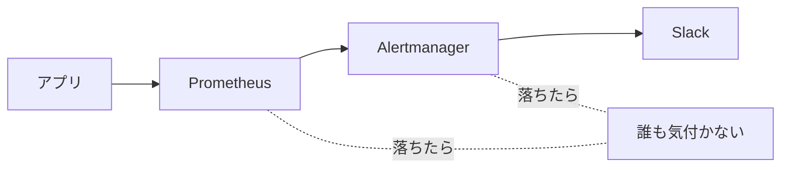
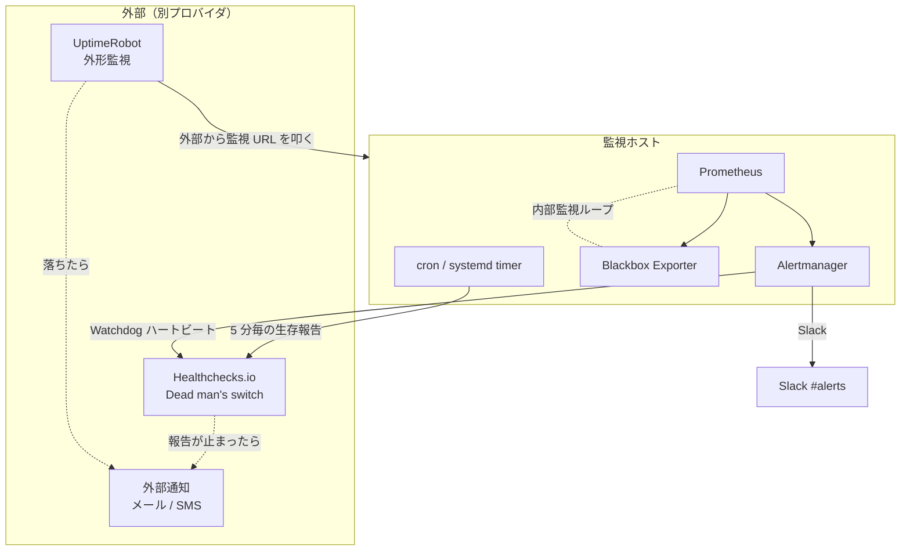
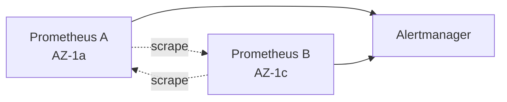

# 12. メタモニタリング（監視の監視）

## 1. 背景・課題

server-monitor は「監視のためのシステム」だが、**「監視そのものが落ちたら誰がどう気付くのか」** の設計が抜けている。



| 現状の課題 | リスク |
| --- | --- |
| Prometheus 自体が停止した時の検知が無い | アラートが発火しない＝何も起きていないと誤認 |
| Alertmanager の Slack 通知が失敗した時の検知が無い | アラートはあるが届かない |
| ホスト自体が消失した時の外部検知が無い | 「全部止まっている」が気付かれない |
| 同一クラウド内 / 同一ホスト内で監視が完結している | 単一障害点 |

> ポートフォリオ観点：自前監視運用（[ADR-0006](../adr/0006-self-host-monitoring.md)）を採用する以上、メタモニタリング設計は **必須課題** として扱う。

---

## 2. 設計原則

1. **監視の監視は、監視されている系の外側から行う**（環境の外、別プロバイダ）
2. **Dead man's switch**（生きてる証明）を採用：「アラートが来ない＝OK」ではなく「定期的に来る生存信号が止まったら NG」
3. **多層化**：単一の監視層に依存しない（Prometheus + 外形監視 + 外部 Dead man's switch）
4. **静的依存最小化**：監視の生存通知は、監視対象の依存ライブラリ・サービスを使わない

---

## 3. 全体像



---

## 4. Dead man's switch（生存通知）

### 4.1 Healthchecks.io（外部 SaaS、無料枠 20 チェック）

監視ホストから 5 分毎に Healthchecks.io へ ping を送る。**ping が 7 分間来なかったら** Healthchecks.io が外部メール / Slack（別 Webhook） / SMS で通知する。

```bash
# /etc/cron.d/healthchecks
*/5 * * * * root curl -fsS -m 10 --retry 5 https://hc-ping.com/<uuid> > /dev/null
```

**重要**：

- Healthchecks.io は **監視ホストとは別プロバイダ**。AWS が落ちても通知が来る
- 通知先のメール / SMS は監視ホスト経由ではないアドレスを設定

### 4.2 Alertmanager の Watchdog アラート

Prometheus に常時 firing するアラート `Watchdog` を仕込み、Alertmanager 経由で Healthchecks.io に転送する。

```yaml
# prometheus/rules/watchdog.yml
groups:
  - name: watchdog
    rules:
      - alert: Watchdog
        expr: vector(1)
        labels:
          severity: none
        annotations:
          summary: "Watchdog heartbeat (intentionally always firing)"
```

```yaml
# alertmanager.yml
route:
  routes:
    - match:
        alertname: Watchdog
      receiver: healthchecks
      group_interval: 1m
      repeat_interval: 5m

receivers:
  - name: healthchecks
    webhook_configs:
      - url: 'https://hc-ping.com/<watchdog-uuid>'
        send_resolved: false
```

これにより **「Prometheus + Alertmanager 全部が動いている」を 5 分粒度で検証**。

### 4.3 多層 Dead man's switch

| 層 | 何の生存を証明するか | 経路 |
| --- | --- | --- |
| Host cron | OS が動いている | cron → Healthchecks.io |
| Prometheus | scrape できている | recording rule → Pushgateway → Healthchecks.io |
| Alertmanager Watchdog | Prometheus + Alertmanager 連携が動いている | Watchdog アラート → Healthchecks.io |

3 つの ping が **どれか 1 つでも止まれば** 通知が飛ぶ。

---

## 5. 外形監視（External Probe）

監視ホストの外側から、**ユーザーと同じ経路で** 監視 URL を叩く。

| 対象 URL | プロバイダ | 頻度 | 通知先 |
| --- | --- | --- | --- |
| `https://monitor.example.com/health` | UptimeRobot 無料枠 | 5 分 | メール |
| `https://monitor.example.com/grafana/api/health` | UptimeRobot | 5 分 | メール |
| TLS 証明書有効期限 | UptimeRobot SSL モニタ | 日次 | メール（30 日前 / 7 日前） |
| DNS 解決 | UptimeRobot DNS モニタ | 5 分 | メール |

**観点**：

- 「サーバーから見て自分のサーバーが OK」だけでは不十分。外部から叩いて初めて「ユーザー視点の可用性」が分かる
- UptimeRobot は **無料枠 50 モニタ / 5 分粒度** で個人運用に十分

---

## 6. 内部メタモニタリング（Prometheus 自体の監視）

Prometheus は自分自身のメトリクスを `/metrics` で公開しているので、これを別の Prometheus インスタンス（または同一インスタンスから自己 scrape）で監視する。

### 6.1 重要メトリクス

| メトリクス | 意味 | 閾値 |
| --- | --- | --- |
| `up{job="prometheus"}` | Prometheus 自身が生きているか | < 1 でアラート |
| `prometheus_tsdb_head_series` | アクティブ系列数 | キャパ計画と連動 |
| `rate(prometheus_tsdb_compactions_failed_total[1h])` | TSDB 圧縮失敗 | > 0 でアラート |
| `prometheus_notifications_dropped_total` | Alertmanager 通知ドロップ | rate > 0 でアラート |
| `prometheus_target_scrape_pool_exceeded_target_limit_total` | scrape target 上限超過 | > 0 でアラート |
| `alertmanager_notifications_failed_total` | Alertmanager 通知失敗 | rate > 0 でアラート |

### 6.2 Self-scrape の限界と回避

「自分で自分を監視」は単一障害点になる。**Prometheus が死ねば自己アラートも発火しない**。
→ Dead man's switch（§4）で補完するのが必須。

### 6.3 二重 Prometheus（v2.0 以降）

v2.0 で AWS / 2 AZ 化（[03](./03-terraform-aws.md)）するタイミングで、**AZ A の Prometheus が AZ B の Prometheus を監視** する相互監視構成へ発展。



---

## 7. 通知経路の冗長化

| 経路 | 通常 Sev | Critical Sev（v1.3 以降） |
| --- | --- | --- |
| 主 | Slack（[ADR-0007](../adr/0007-slack-notifications.md)） | Slack |
| 副 | — | PagerDuty / Opsgenie（電話起こし） |
| 監視層失効時 | — | Healthchecks.io 経由のメール |

**Slack 自体が落ちる場合** も想定する：

- Healthchecks.io が **外部からメール** を送る冗長経路を保持
- 重要アラートは Slack + メール両送信に設定

---

## 8. アラートルール例

```yaml
groups:
  - name: meta-monitoring
    rules:
      # Prometheus 自身の生存
      - alert: PrometheusDown
        expr: up{job="prometheus"} == 0
        for: 5m
        labels:
          severity: critical
        annotations:
          summary: "Prometheus is down on {{ $labels.instance }}"
          runbook_url: "/runbooks/prometheus-down.md"

      # Alertmanager 通知失敗
      - alert: AlertmanagerNotificationFailing
        expr: rate(alertmanager_notifications_failed_total[5m]) > 0
        for: 10m
        labels:
          severity: critical
        annotations:
          summary: "Alertmanager failed to deliver notifications"
          runbook_url: "/runbooks/alertmanager-notify-fail.md"

      # TSDB 圧縮失敗
      - alert: PrometheusTSDBCompactionFailing
        expr: rate(prometheus_tsdb_compactions_failed_total[1h]) > 0
        for: 30m
        labels:
          severity: warning
        annotations:
          summary: "Prometheus TSDB compactions are failing"
          runbook_url: "/runbooks/tsdb-compaction.md"

      # scrape target 取りこぼし
      - alert: ScrapeTargetDown
        expr: up == 0
        for: 5m
        labels:
          severity: warning
        annotations:
          summary: "Scrape target {{ $labels.job }} {{ $labels.instance }} is down"
          runbook_url: "/runbooks/scrape-target-down.md"
```

---

## 9. ランブック対応

| アラート | ランブック | 主な対応 |
| --- | --- | --- |
| `PrometheusDown` | `prometheus-down.md` | コンテナ状態 / ディスク / OOM 確認、再起動、TSDB 復旧 |
| `AlertmanagerNotificationFailing` | `alertmanager-notify-fail.md` | Slack Webhook 有効性、レート制限、ネットワーク |
| `PrometheusTSDBCompactionFailing` | `tsdb-compaction.md` | ディスク容量、Inode、権限 |
| `ScrapeTargetDown` | `scrape-target-down.md` | 対象ホスト疎通、exporter プロセス、SG / FW |
| Healthchecks.io 通知（外部メール） | `meta-monitor-fail.md` | 即時：監視ホストへ SSH、サービス状態、復旧手順 |

---

## 10. 段階的導入

| 週 | 内容 |
| --- | --- |
| 1 | Healthchecks.io アカウント作成、cron からの ping を有効化 |
| 2 | Alertmanager Watchdog アラート + Healthchecks.io webhook 連携 |
| 3 | UptimeRobot で `/health` `/grafana/api/health` の外形監視追加、TLS / DNS モニタ追加 |
| 4 | 内部メタモニタリングのルール追加（PrometheusDown / AlertmanagerNotificationFailing 等）、ランブック整備 |
| 5 | 意図的に Prometheus / Alertmanager を停止して **検知できることを実証**（[17 カオス](./17-chaos-engineering.md)と連動） |

---

## 11. 完了条件（Definition of Done）

- [ ] Healthchecks.io にプロジェクトが存在し、ping が 5 分毎に届いている
- [ ] Watchdog アラートが Healthchecks.io へ 5 分毎に転送されている
- [ ] UptimeRobot で `/health` `/grafana/api/health` が外部監視されている
- [ ] TLS 証明書の 30 日前 / 7 日前メール通知が動作確認済み
- [ ] `PrometheusDown` `AlertmanagerNotificationFailing` 等の内部メタアラートが Prometheus に登録されている
- [ ] ランブック（`prometheus-down.md` 等）が `server-monitor/docs/runbooks/` に存在
- [ ] Game Day で **意図的に Prometheus 停止** → 外部から検知できることを実証（[17](./17-chaos-engineering.md)）

---

## 12. 関連設計書・ADR

- [01 Loki](./01-loki-log-aggregation.md) — Loki 自身のメタモニタリングも本ドキュメントの思想で
- [04 SLO 設計](./04-slo-design.md) — 監視の SLI / SLO は本ドキュメントで担保
- [07 インシデント対応](./07-incident-response.md) — メタ監視からの通知が Sev 起点
- [17 カオスエンジニアリング](./17-chaos-engineering.md) — 検知できることを実証する Game Day
- [ADR-0006 監視自前運用](../adr/0006-self-host-monitoring.md)

---

## 13. 参考

- [Prometheus: Self-Monitoring](https://prometheus.io/docs/operating/monitoring/)
- [Healthchecks.io Documentation](https://healthchecks.io/docs/)
- [Google SRE Book — Chapter 6: Monitoring（"Who watches the watchmen?"）](https://sre.google/sre-book/monitoring-distributed-systems/)
- [Alex Vidal, "Dead Man's Snitch" 論考](https://deadmanssnitch.com/articles)
