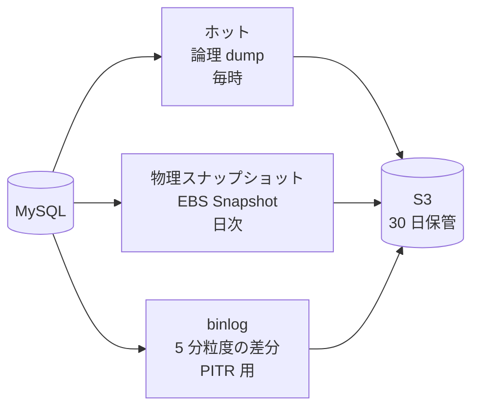
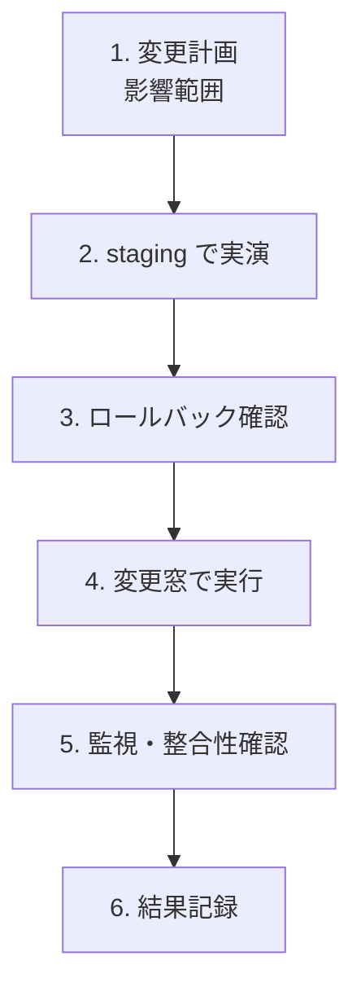
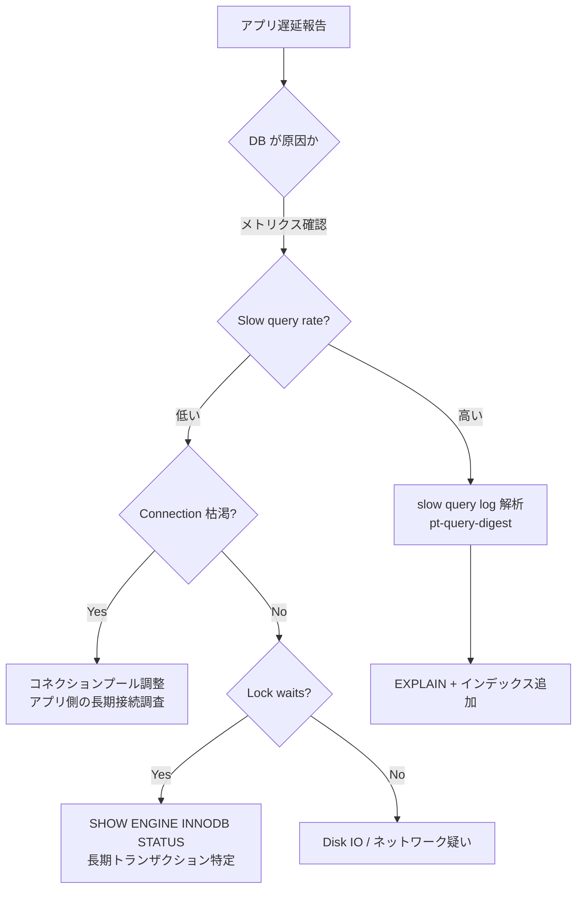

# 14. データベース運用設計

## 1. 背景・課題

server-monitor 本体や周辺アプリ（[掲示板](https://github.com/ns7jp/post) / [Pulse](https://github.com/ns7jp/pulse)）は **SQLite / MySQL** を使用しているが、これまでのポートフォリオでは **DB 運用** の設計が薄い。

| 現状の課題 | リスク |
| --- | --- |
| バックアップ・リストアの **戦略** が無い | データ消失 / 障害時に手詰まり |
| DB 監視メトリクスが node メトリクス止まり | スロークエリ・接続枯渇に気付けない |
| スキーマ変更の手順が無い | 本番反映でロック・データ破壊リスク |
| 性能問題への切り分け手順が無い | アプリ遅延の原因が分からない |
| PITR（Point-in-Time Recovery）の理解が無い | 「直前 5 分前に戻したい」要求に応えられない |

> ポートフォリオ観点：監視・運用とセットで **DB 運用設計（バックアップ・監視・チューニング）** を語れると、社内 SE / インフラ運用の幅が広がる。

---

## 2. 想定対象

| DB | 用途 | 配置 |
| --- | --- | --- |
| **SQLite** | アプリ本体（[掲示板](https://github.com/ns7jp/post) / [Pulse](https://github.com/ns7jp/pulse)） | ファイル（同一ホスト） |
| **MySQL 8.0** | アプリ本格運用想定 | Docker → v2.0 で RDS へ |
| **PostgreSQL** | 学習・比較対象 | 設計のみ |
| **TimescaleDB / Mimir / Thanos** | 長期メトリクス保管 | v2.0 以降検討 |

本ドキュメントは **MySQL 8.0** をメイン題材に書くが、思想は他 RDB にも転用可。

---

## 3. バックアップ戦略

### 3.1 3 階層バックアップ



| 種別 | 頻度 | 保管期間 | 用途 | 復旧速度 |
| --- | --- | --- | --- | --- |
| **論理 dump**（mysqldump） | 1 時間 | 7 日 | 部分復旧 / スキーマ単位 | 中（数分〜数十分） |
| **物理スナップショット**（EBS / Percona Xtrabackup） | 日次 | 30 日 | 全データ復旧 | 高（数分） |
| **binlog**（バイナリログ） | 5 分粒度（連続） | 7 日 | PITR | 中 |

### 3.2 RTO / RPO 目標

| 復旧シナリオ | RTO | RPO | 復旧手段 |
| --- | --- | --- | --- |
| 1 テーブル誤削除 | 30 分 | 1 時間 | 直近の論理 dump からテーブル単位リストア |
| DB プロセス停止 | 5 分 | 0 | プロセス再起動、必要なら crash recovery |
| ホスト消失 | 1 時間 | 5 分 | EBS スナップショット復旧 + binlog 適用 |
| データセンタ消失（AZ 障害） | 4 時間 | 24 時間 | 別 AZ の日次スナップショットから再構築 |

---

## 4. バックアップ実装

### 4.1 mysqldump（論理）

```bash
#!/bin/bash
# /opt/scripts/mysql-backup.sh
set -euo pipefail

TS=$(date +%Y%m%d-%H%M)
HOST=$(hostname -s)
DUMP_DIR=/var/backups/mysql
S3_BUCKET=s3://servermonitor-db-backups

mysqldump \
  --single-transaction \
  --quick \
  --routines \
  --triggers \
  --master-data=2 \
  --all-databases \
  | gzip -9 \
  > "${DUMP_DIR}/dump-${TS}.sql.gz"

aws s3 cp "${DUMP_DIR}/dump-${TS}.sql.gz" \
  "${S3_BUCKET}/${HOST}/hourly/dump-${TS}.sql.gz" \
  --storage-class STANDARD_IA \
  --sse aws:kms

# 7 日経過したものを削除
find "${DUMP_DIR}" -name 'dump-*.sql.gz' -mtime +7 -delete
```

- `--single-transaction`：InnoDB の整合性スナップショット
- `--master-data=2`：dump 内に binlog 位置をコメントで記録（PITR 起点）

### 4.2 binlog 連続バックアップ

```bash
# /etc/mysql/conf.d/binlog.cnf
[mysqld]
log_bin = /var/log/mysql/binlog
binlog_format = ROW
expire_logs_days = 7
sync_binlog = 1
```

binlog を 5 分毎に S3 へ rsync する systemd timer を用意：

```ini
# /etc/systemd/system/binlog-sync.service
[Unit]
Description=Sync MySQL binlogs to S3

[Service]
Type=oneshot
ExecStart=/usr/bin/aws s3 sync /var/log/mysql/ s3://servermonitor-db-backups/$(hostname -s)/binlog/ \
  --exclude '*' --include 'binlog.*' --sse aws:kms
```

```ini
# /etc/systemd/system/binlog-sync.timer
[Unit]
Description=Run binlog sync every 5 min

[Timer]
OnCalendar=*:0/5
Persistent=true

[Install]
WantedBy=timers.target
```

### 4.3 検証

**バックアップは取れただけでは無価値**。週次で **リストアを実演** する（[05 復旧演習](./05-backup-recovery-drill.md) と連動）。

---

## 5. リストア手順

### 5.1 ケース別

| ケース | 概要 |
| --- | --- |
| 1 テーブル復旧 | 論理 dump から該当テーブルだけ抽出して `mysql db` に流す |
| 全 DB 復旧 | 直近 dump 全体を `mysql` に流す |
| PITR（5 分前） | dump リストア後に `mysqlbinlog` で時刻指定して binlog を流す |
| ホスト消失 | EBS スナップショットから volume 作成 → アタッチ → MySQL 起動 → binlog 追いつき |

コマンド例：

```bash
# 1 テーブル復旧
gunzip -c dump-YYYYMMDD.sql.gz \
  | grep -i 'CREATE TABLE `t`' -A 10000 \
  | mysql db

# 全 DB 復旧
gunzip -c dump-YYYYMMDD.sql.gz | mysql

# PITR（指定時刻まで）
mysqlbinlog --stop-datetime='2026-MM-DD HH:MM:SS' binlog.* | mysql
```

### 5.2 ランブック

`server-monitor/docs/runbooks/db-restore-{table,db,pitr}.md` に手順を 1 シナリオ 1 ファイルで保管。

---

## 6. DB 監視メトリクス

### 6.1 主要メトリクス

| 層 | メトリクス | エクスポータ |
| --- | --- | --- |
| 接続 | `mysql_global_status_threads_connected`, `max_connections` | mysqld-exporter |
| クエリ | `mysql_global_status_slow_queries`, `mysql_global_status_questions` | 同 |
| InnoDB | `innodb_buffer_pool_pages_*`, `innodb_row_lock_time` | 同 |
| レプリケーション | `mysql_slave_lag_seconds`（将来） | 同 |
| ディスク | datadir の使用率、IOPS | node-exporter |
| バックアップ | 直近成功時刻、サイズ | 自作 exporter（systemd timer 結果を Pushgateway へ） |

### 6.2 重要アラート

| アラート | 閾値 | Sev |
| --- | --- | --- |
| `MySQLDown` | `up == 0` for 1m | Critical |
| `MySQLConnectionsExhausted` | `threads_connected / max_connections > 0.85` | Warning |
| `MySQLSlowQueryRate` | `rate(slow_queries[5m]) > 1/s` | Warning |
| `MySQLReplicationLag` | `slave_lag_seconds > 60` | Warning |
| `MySQLBackupStale` | 直近成功 > 90 分前 | Critical |
| `MySQLDiskFull` | datadir パーティション > 85% | Warning |

### 6.3 Grafana ダッシュボード

```text
┌──────────────────────────────────────────────────────────────────┐
│ MySQL Dashboard — server-monitor             Last 6h ▼           │
├──────────────────────────────────────────────────────────────────┤
│ 接続数             QPS              Slow Queries / s              │
│  42 / 151          120              0.02                          │
│  [折れ線]           [折れ線]         [折れ線]                       │
├──────────────────────────────────────────────────────────────────┤
│ InnoDB Buffer Pool   Disk usage         Backup status              │
│ ヒット率 99.4%        62% (/var/lib)    最終: 22 分前 OK ✓         │
├──────────────────────────────────────────────────────────────────┤
│ Top スロークエリ（24h）                                            │
│   1. SELECT ... FROM posts ... 平均 1.2s, 計 142 回               │
│   2. UPDATE users ... 平均 0.7s, 計 53 回                          │
└──────────────────────────────────────────────────────────────────┘
```

---

## 7. スキーマ変更（マイグレーション）

### 7.1 原則

- **オンラインスキーマ変更ツール**（pt-online-schema-change / gh-ost）を MySQL の本格運用で採用
- ALTER TABLE を直接打つのは小規模 / 短時間ロック許容時のみ
- マイグレーションは **必ず Reversible（巻き戻し可能）** に設計
- migration ツール（Alembic / Liquibase / Flyway）でバージョン管理

### 7.2 安全な ALTER 手順



→ [11 変更管理](./11-change-management.md) Normal Change として運用。

### 7.3 危険な変更（要 Emergency 級レビュー）

- DROP COLUMN（データ消失）
- 主キー型変更
- インデックスの不可逆な削除
- 文字コード変換（utf8 → utf8mb4 等）

---

## 8. 性能問題の切り分け手順



ランブック：`runbooks/db-slow-query.md` `runbooks/db-connection-exhaustion.md` `runbooks/db-lock.md` を整備。

---

## 9. v2.0 への発展（AWS RDS / Aurora）

| 項目 | EC2 上 MySQL（v1） | AWS RDS（v2） |
| --- | --- | --- |
| バックアップ | 自前 cron / S3 | 自動スナップショット + PITR（標準） |
| パッチ管理 | Ansible | RDS メンテナンスウィンドウ |
| HA | 単一ホスト | Multi-AZ Standby |
| 監視 | mysqld-exporter | RDS Performance Insights + Enhanced Monitoring + Prometheus |
| 暗号化 | OS 層 | KMS |
| シークレット | Ansible Vault | Secrets Manager + 自動ローテーション |

→ [03 Terraform / AWS](./03-terraform-aws.md) で RDS モジュール化。

---

## 10. 段階的導入

| 週 | 内容 |
| --- | --- |
| 1 | mysqld-exporter / Grafana ダッシュボード追加、主要メトリクス可視化 |
| 2 | mysqldump cron + S3 連携、初回ダンプ取得 |
| 3 | binlog 連続バックアップ、PITR ランブック整備 |
| 4 | 復旧演習（D-3 シナリオ：データ破壊 → PITR で復旧）を [05](./05-backup-recovery-drill.md) と連動して実施 |
| v2.0 | RDS へ移行、自前バックアップは縮退 |

---

## 11. 完了条件（Definition of Done）

- [ ] mysqldump が 1 時間毎に S3 へ転送されている
- [ ] binlog が 5 分粒度で S3 へ転送されている
- [ ] `MySQLBackupStale` アラートが Alertmanager に登録、通知確認済み
- [ ] PITR で「5 分前に戻す」が staging で実演できている
- [ ] `runbooks/db-restore-*.md` が server-monitor 側に揃っている
- [ ] mysqld-exporter ベースの Grafana ダッシュボードが存在
- [ ] 復旧演習（D-3）の議事録が `docs/recovery-drills/YYYY-MM-D3.md` にある

---

## 12. 関連設計書・ADR

- [01 Loki](./01-loki-log-aggregation.md) — slow query log も Loki に集約
- [04 SLO 設計](./04-slo-design.md) — DB レイテンシも SLI 候補
- [05 復旧演習](./05-backup-recovery-drill.md) — DB 復旧演習を D-3 シナリオに追加
- [07 インシデント対応](./07-incident-response.md) — DB 障害は Sev1-2
- [09 セキュリティ運用](./09-security-operations.md) — DB シークレットローテーション
- [10 キャパシティプランニング](./10-capacity-planning.md) — DB は典型的なキャパ枯渇箇所
- [11 変更管理](./11-change-management.md) — スキーマ変更はすべて Normal Change
- [16 ID 運用](./16-identity-operations.md) — DB 接続ユーザーのライフサイクル
- [17 カオスエンジニアリング](./17-chaos-engineering.md) — DB プロセスキル演習

---

## 13. 参考

- [MySQL 8.0 Reference Manual — Backup and Recovery](https://dev.mysql.com/doc/refman/8.0/en/backup-and-recovery.html)
- [Percona Xtrabackup](https://docs.percona.com/percona-xtrabackup/)
- [pt-online-schema-change](https://docs.percona.com/percona-toolkit/pt-online-schema-change.html)
- [gh-ost（GitHub）](https://github.com/github/gh-ost)
- [AWS RDS User Guide](https://docs.aws.amazon.com/AmazonRDS/latest/UserGuide/)
- [Baron Schwartz et al., "High Performance MySQL" 4th ed.](https://www.oreilly.com/library/view/high-performance-mysql/9781492080503/)
