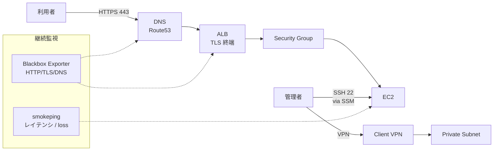
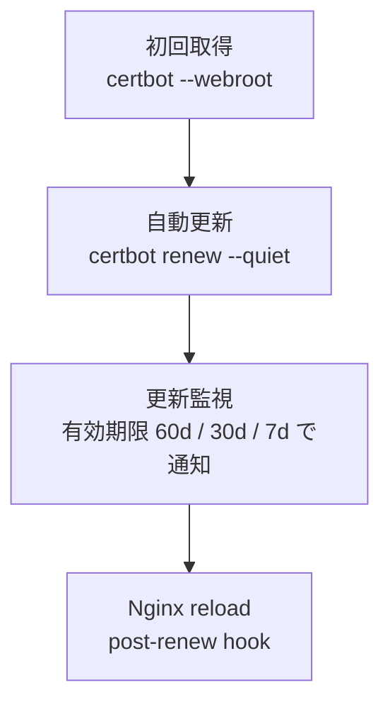

# 15. ネットワーク・DNS 運用設計

## 1. 背景・課題

server-monitor は Nginx + TLS で前段を構築しているが、**それ以前の層（DNS / 証明書 / FW / ネットワーク到達性）** の運用設計が薄い。

| 現状の課題 | リスク |
| --- | --- |
| DNS の TTL / 委譲先の設計が無い | 障害時の切替に時間がかかる |
| TLS 証明書の更新を監視していない | 期限切れで全停止 |
| Security Group / Firewall ルールの棚卸しが無い | 「とりあえず開けた」ルールが残存 |
| VPN 接続設計が無い | 商用案件で必須要件に対応不可 |
| ネットワーク監視が「ping 通る」だけ | 帯域 / レイテンシ / パケットロスを定量化できない |

> ポートフォリオ観点：CCNA 取得（[資格ロードマップ](../certifications/roadmap.md)）と連動した「**ネットワーク運用** が分かるインフラ運用担当」訴求の設計書。

---

## 2. 全体像



---

## 3. DNS 運用

### 3.1 Route 53 設計

| 項目 | 設定 | 理由 |
| --- | --- | --- |
| Hosted Zone | `monitor.example.com.` | サブドメイン分離で本番影響を避ける |
| TTL（A レコード） | 60 秒 | 障害時の切替を高速化 |
| TTL（NS / SOA） | 172800 秒（48h） | 委譲先は頻繁に変えない |
| Health Check | ALB エンドポイントの 30 秒間隔 | 障害時に自動フェイルオーバー可能化 |
| DNSSEC | 有効化（v2.0 で） | DNS 改ざん対策 |

### 3.2 委譲・委譲先のドキュメント化

`docs/network/dns.md` に以下を明文化：

```text
monitor.example.com.    A      <ALB-A>     TTL 60   (active)
                        A      <ALB-B>     TTL 60   (standby, weight 0)
www.monitor.example.com CNAME  monitor.example.com.
api.monitor.example.com CNAME  monitor.example.com.

NS レコード委譲先: AWS Route 53
レジストラ: <記載>
レジストラ管理者: <記載>
レジストリロック: 有効
```

### 3.3 DNS 障害時のランブック

| 症状 | 一次調査 | 二次調査 |
| --- | --- | --- |
| 名前解決失敗 | `dig +trace monitor.example.com` | NS 委譲確認、レジストラ画面確認 |
| 古い IP が返る | TTL 確認 | 各リゾルバ（Google 8.8.8.8 / Cloudflare 1.1.1.1）で比較 |
| Route 53 障害 | AWS Health Dashboard 確認 | 別 DNS（Cloudflare）への副ホスティング検討 |

---

## 4. TLS 証明書ライフサイクル

### 4.1 取得・更新フロー



### 4.2 監視

- **Blackbox Exporter で TLS 期限監視**：

```yaml
# prometheus/rules/tls.yml
groups:
  - name: tls
    rules:
      - alert: TLSCertExpiringSoon
        expr: |
          probe_ssl_earliest_cert_expiry - time() < 30 * 24 * 3600
        for: 1h
        labels:
          severity: warning
        annotations:
          summary: "TLS cert expires in less than 30 days on {{ $labels.instance }}"
          runbook_url: "/runbooks/tls-renewal.md"

      - alert: TLSCertExpiringCritical
        expr: |
          probe_ssl_earliest_cert_expiry - time() < 7 * 24 * 3600
        for: 1h
        labels:
          severity: critical
```

- **UptimeRobot の SSL モニタ**を冗長化として併用（[12 §5](./12-meta-monitoring.md)）

### 4.3 更新失敗時のフォールバック

```bash
# /etc/cron.daily/certbot-check
#!/bin/bash
if ! certbot renew --dry-run --quiet; then
  curl -X POST -H 'Content-type: application/json' \
    --data '{"text":"❌ certbot renew --dry-run failed"}' \
    "${SLACK_WEBHOOK_URL}"
fi
```

---

## 5. ファイアウォール / Security Group 設計

### 5.1 原則

1. **最小権限**：必要な送信元・ポート・プロトコルだけ開放
2. **送信元を CIDR で限定**：可能な限り 0.0.0.0/0 を使わない
3. **管理アクセスは SSM 経由**：SSH 22 を直接インターネットに開けない（v2.0）
4. **棚卸し可能なタグ**：各ルールに `Purpose` `CreatedBy` `Reviewed` タグ

### 5.2 v1.0（オンプレ / UFW）

```bash
# /etc/ufw/applications.d/server-monitor
[Server-Monitor]
title=Server Monitor Web UI
description=HTTPS + Prometheus federation
ports=443/tcp|9090/tcp

# 適用
ufw default deny incoming
ufw default allow outgoing
ufw allow from <office-cidr> to any app Server-Monitor
ufw limit ssh/tcp comment 'rate limit ssh'
```

### 5.3 v2.0（AWS Security Group）

| SG 名 | 着信ルール | 用途 |
| --- | --- | --- |
| `sg-alb` | 443 from 0.0.0.0/0 | ALB の Listener |
| `sg-ec2-app` | 443 from sg-alb | EC2 への TLS（ALB 経由のみ） |
| `sg-ec2-mgmt` | 22 from 0.0.0.0/0（**SSM 移行で削除**） | 管理 SSH |
| `sg-rds` | 3306 from sg-ec2-app | DB 接続 |

→ **Terraform で `aws_security_group` と `aws_security_group_rule` を分離管理**し、ルール変更を PR レビュー必須化。

### 5.4 月次棚卸し

```bash
# 棚卸しスクリプト例
aws ec2 describe-security-groups \
  --query 'SecurityGroups[*].{Name:GroupName,Rules:IpPermissions[*]}' \
  --output table > /tmp/sg-snapshot-$(date +%F).txt

# 前月分との diff を Slack 投稿
diff /tmp/sg-snapshot-{last-month,this-month}.txt | ...
```

---

## 6. VPN / 管理アクセス

### 6.1 AWS Client VPN（v2.0 で導入）

| 項目 | 設計 |
| --- | --- |
| 認証 | OIDC SSO（[16 ID 運用](../roadmap/16-identity-operations.md)）+ MFA |
| 経路 | Split Tunnel（業務 CIDR のみ VPN、それ以外は直接） |
| ログ | CloudWatch Logs に接続記録、Loki にも転送 |
| 接続切断 | 12 時間 idle で自動切断 |

### 6.2 AWS SSM Session Manager（SSH 鍵レス化）

| 項目 | 内容 |
| --- | --- |
| 認証 | IAM Role + IAM Identity Center |
| 監査 | セッションログを S3 + CloudWatch Logs に保管 |
| ポートフォワード | RDS / 内部 Web UI へのトンネルも SSM 経由 |
| SSH 廃止 | EC2 の 22 番を Security Group で完全閉鎖 |

```bash
# ローカルから
aws ssm start-session --target i-xxxxxx

# ポートフォワード（RDS へ）
aws ssm start-session --target i-xxxxxx \
  --document-name AWS-StartPortForwardingSessionToRemoteHost \
  --parameters '{"host":["rds-endpoint"],"portNumber":["3306"],"localPortNumber":["13306"]}'
```

---

## 7. ネットワーク監視

### 7.1 計測すべき指標

| 層 | メトリクス | ツール |
| --- | --- | --- |
| L3 到達性 | ping RTT、パケットロス | smokeping / fping |
| L4 ポート疎通 | TCP connect 時間 | blackbox-exporter |
| L7 HTTP | レスポンス時間、ステータス | blackbox-exporter |
| DNS | 名前解決時間 | blackbox-exporter（dns module） |
| TLS | ハンドシェイク時間、証明書期限 | blackbox-exporter |
| 帯域 | ifin / ifout octets | node-exporter |
| AWS | NAT GW 帯域、ALB Request Count、TargetResponseTime | CloudWatch |

### 7.2 Blackbox Exporter サンプル

```yaml
# blackbox.yml
modules:
  http_2xx:
    prober: http
    timeout: 5s
    http:
      preferred_ip_protocol: ip4
      valid_status_codes: [200]
      fail_if_ssl: false
      tls_config:
        insecure_skip_verify: false

  tcp_connect:
    prober: tcp
    timeout: 5s

  icmp:
    prober: icmp
    timeout: 5s

  dns_a:
    prober: dns
    timeout: 5s
    dns:
      query_name: monitor.example.com
      query_type: A
      validate_answer_rrs:
        fail_if_not_matches_regexp:
          - "monitor\\.example\\.com\\.\\s+\\d+\\s+IN\\s+A\\s+.*"
```

### 7.3 Smokeping（パケットロス・jitter）

シンプルだが「**ピーク時の不安定さ**」を捉えるには Blackbox より優秀。

```text
# /etc/smokeping/config.d/Targets
+ Servers
menu = Servers
title = Server health
++ web
menu = web
title = Monitor Web
host = monitor.example.com
```

---

## 8. アラート設計

| アラート | 閾値 | Sev |
| --- | --- | --- |
| `ProbeHTTPFailed` | `probe_success == 0` for 2m | Critical |
| `ProbeHTTPSlow` | `probe_duration_seconds > 2` for 5m | Warning |
| `ProbeDNSFailed` | DNS resolve fail for 5m | Critical |
| `TLSCertExpiringSoon` | < 30d | Warning |
| `TLSCertExpiringCritical` | < 7d | Critical |
| `PacketLossHigh` | `loss > 5%` for 5m | Warning |
| `BandwidthExhausted` | `ifout > NIC 帯域の 80%` for 5m | Warning |

---

## 9. ランブック

- `runbooks/dns-fail.md`：DNS 名前解決失敗
- `runbooks/tls-renewal.md`：証明書更新失敗
- `runbooks/firewall-block.md`：誤って閉じた場合の復旧
- `runbooks/network-loss.md`：パケットロス急増の切り分け
- `runbooks/ssm-session.md`：SSM 接続できない場合

---

## 10. 段階的導入

| 週 | 内容 |
| --- | --- |
| 1 | Blackbox Exporter 導入、HTTP / TLS / DNS の基本プローブ追加 |
| 2 | TLS 期限アラート、Slack 通知確認、`docs/network/dns.md` 整備 |
| 3 | UFW / Security Group の棚卸し、未使用ルール削除 PR |
| 4 | Smokeping（または同等）でパケットロス可視化 |
| v2.0 | AWS Client VPN + SSM Session Manager 移行、SSH 22 を完全閉鎖 |

---

## 11. 完了条件（Definition of Done）

- [ ] Blackbox Exporter で HTTP / TLS / DNS の継続プローブが動作
- [ ] `TLSCertExpiringSoon`（30d）が Slack 通知されている
- [ ] `docs/network/dns.md` / `firewall.md` / `vpn.md` が整備
- [ ] Security Group 棚卸しスクリプトが月次で実行されている
- [ ] v2.0 時点で SSH 22 が 0.0.0.0/0 から閉鎖されている
- [ ] `runbooks/dns-fail.md` ほか主要ランブックが server-monitor 側に存在
- [ ] パケットロス / レイテンシのトレンドダッシュボードが Grafana に存在

---

## 12. CCNA 学習との対応

| CCNA トピック | 本ドキュメント該当箇所 |
| --- | --- |
| Network Fundamentals（OSI 層） | §2 全体像、§7 計測層 |
| Network Access（VLAN / Trunk） | v2.0 VPC / Subnet（[03](./03-terraform-aws.md)） |
| IP Connectivity（Routing） | §2 Subnet → Route Table |
| IP Services（DNS / NAT） | §3 DNS、AWS NAT GW |
| Security Fundamentals | §5 SG、§6 VPN / SSM、§4 TLS |
| Automation and Programmability | Terraform / Ansible 全般 |

CCNA の知識を「**実運用設計に落とす**」訴求が本ドキュメントの狙い。

---

## 13. 関連設計書・ADR

- [03 Terraform / AWS](./03-terraform-aws.md) — Network / SG / Route 53 の実装基盤
- [04 SLO 設計](./04-slo-design.md) — DNS / TLS 障害も SLI に組込み
- [09 セキュリティ運用](./09-security-operations.md) — SG 監査、TLS シークレット管理
- [12 メタモニタリング](./12-meta-monitoring.md) — UptimeRobot による外部 TLS / DNS 監視
- [16 ID 運用](../roadmap/16-identity-operations.md) — VPN / SSM の認証統合
- [ADR-0005 Terraform 採用](../adr/0005-terraform-for-iac.md)

---

## 14. 参考

- [Cisco CCNA 200-301 Official Cert Guide](https://www.ciscopress.com/store/ccna-200-301-official-cert-guide-library-9780138229382)
- [AWS VPC User Guide](https://docs.aws.amazon.com/vpc/)
- [Prometheus Blackbox Exporter](https://github.com/prometheus/blackbox_exporter)
- [Mozilla TLS Configuration Generator](https://ssl-config.mozilla.org/)
- [Let's Encrypt Best Practice](https://letsencrypt.org/docs/integration-guide/)
