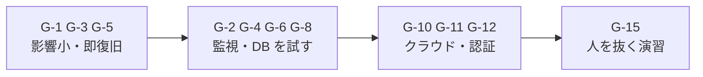
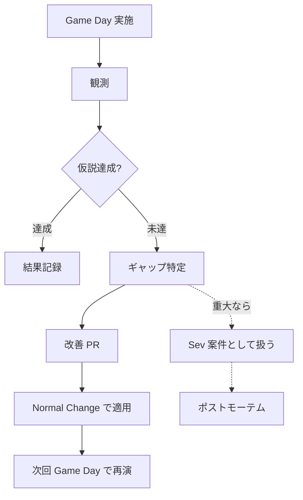
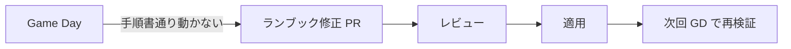

# 17. カオスエンジニアリング・Game Day

## 1. 背景・課題

[05 復旧演習](./05-backup-recovery-drill.md) は「**計画されたシナリオを練習する**」プロセスだが、それだけでは **「想定外」が起きた時に対応できる組織か** が分からない。

| 復旧演習で分かること | カオスエンジニアリングで分かること |
| --- | --- |
| 手順通りなら復旧できる | 手順書に無い事象でも切り分けできる |
| RTO / RPO は守れる | 監視は本当に検知するか |
| バックアップは使える | 自動復旧 / フェイルオーバーは本当に動くか |

> ポートフォリオ観点：「**Game Day を運用に組み込んでいる**」訴求は、シニア寄り（SRE / インフラリード）の役職で強い差別化要因。

---

## 2. 設計原則（Principles of Chaos Engineering）

[Principles of Chaos Engineering](https://principlesofchaos.org/) に準拠：

1. **Build a Hypothesis around Steady State Behavior**：何が「正常」かを定義してから壊す
2. **Vary Real-world Events**：現実に起きる事象を再現（プロセス停止 / ネットワーク遅延 / ディスク満杯）
3. **Run Experiments in Production**：本番でやって初めて意味がある（ただし段階的に）
4. **Automate Experiments to Run Continuously**：手作業ではなく仕組み化
5. **Minimize Blast Radius**：影響を限定し、abort 可能にする

「**壊して気付く**」が目的だが、「**気付かないまま放置**」を防ぐのが本質。

---

## 3. Game Day シナリオ

### 3.1 シナリオ一覧

| # | カテゴリ | シナリオ | 期待される反応 |
| --- | --- | --- | --- |
| G-1 | プロセス | アプリコンテナを kill | Alertmanager 通知 < 2 分、自動再起動 |
| G-2 | プロセス | Prometheus を停止 | メタモニタリング（[12](./12-meta-monitoring.md)）が外部通知 |
| G-3 | リソース | CPU 100% 持続 | `HighCpuUsage` アラート、HPA 動作（v3.0） |
| G-4 | リソース | メモリリーク（OOM） | `OOMKilled` 検知、再起動、根本原因調査ランブック |
| G-5 | リソース | ディスク満杯（`/var/log`） | `DiskFull` アラート、ローテート確認 |
| G-6 | ネットワーク | パケットロス 30% | `PacketLossHigh`、上流ネットワーク調査 |
| G-7 | ネットワーク | DNS 解決失敗（IP テーブルブロック） | `ProbeDNSFailed`、フェイルオーバー |
| G-8 | DB | MySQL プロセス停止 | `MySQLDown`、PITR 演習との連動 |
| G-9 | DB | コネクション枯渇 | `MySQLConnectionsExhausted`、アプリ側調査 |
| G-10 | クラウド（v2.0） | EC2 強制終了 | ALB から自動切り離し、スタンバイ昇格 |
| G-11 | クラウド（v2.0） | AZ 障害シミュレート | 別 AZ への切替、SLO 影響 |
| G-12 | 認証 | IdP 接続失敗 | Break-glass 経路で復旧 |
| G-13 | 監視 | Alertmanager 通知失敗（Slack 障害） | 副経路（メール）への切替 |
| G-14 | 時刻 | NTP ズレ（数分） | 認証・ログ整合性への影響を確認 |
| G-15 | 人 | 「中の人」がいない状況での復旧 | ランブックの完成度確認 |

### 3.2 段階導入順



---

## 4. ツール選定

| ツール | 用途 | 採用 |
| --- | --- | --- |
| **pumba** | Docker コンテナのカオス（kill / pause / NW 遅延） | v1.0 でメイン採用、軽量 |
| **stress-ng** | CPU / mem / IO 負荷 | 汎用、補助 |
| **tc**（Linux） | NW 遅延・パケットロス・帯域制御 | 標準ツール、必須 |
| **iptables**（Linux） | ポート遮断・DNS 解決失敗の演出 | 標準、補助 |
| **chaos-mesh** | Kubernetes 上のカオス | v3.0 K8s で採用 |
| **AWS Fault Injection Simulator (FIS)** | AWS リソースのカオス | v2.0 で採用 |
| **gremlin**（SaaS） | UI 付きカオス | コスト面で個人では不採用 |

### 4.1 pumba コマンド例

```bash
# G-1: アプリコンテナを kill
docker run --rm -v /var/run/docker.sock:/var/run/docker.sock \
  gaiaadm/pumba:latest \
  kill --signal SIGKILL "re2:server-monitor-app.*"

# G-6: NW にパケットロス 30% を 5 分間注入
docker run --rm --net=host --cap-add=NET_ADMIN \
  -v /var/run/docker.sock:/var/run/docker.sock \
  gaiaadm/pumba:latest \
  netem --duration 5m --tc-image gaiadocker/iproute2 \
  loss --percent 30 "re2:server-monitor-app.*"
```

### 4.2 tc コマンド例

```bash
# eth0 で 200ms の遅延 + 5% の損失
sudo tc qdisc add dev eth0 root netem delay 200ms loss 5%

# 復元
sudo tc qdisc del dev eth0 root
```

---

## 5. 安全な実施プロトコル

### 5.1 Pre-Game Day チェックリスト

- [ ] **対象環境**：staging（最低）/ production（実施熟度 G-3 以上）
- [ ] **時間帯**：業務時間内（緊急時の対応者を確保）
- [ ] **周知**：Slack `#ops` `#alerts` に 24 時間前 + 直前
- [ ] **Hypothesis（仮説）**：何が観測されるべきか、事前に文書化
- [ ] **Blast Radius**：影響範囲を限定（タグ / コンテナ / 単一ホスト）
- [ ] **Abort 条件**：「これを観測したら止める」を明文化
- [ ] **ロールバック**：実施手順と同時に復元手順も書面化
- [ ] **オブザーバー配置**：実施者と別の人が監視ダッシュボードを見る役割

### 5.2 実施テンプレ

```markdown
# Game Day GD-2026-001: G-1 アプリコンテナ強制終了

## 仮説
1. SIGKILL から 60 秒以内にコンテナが再起動する（docker restart policy）
2. その間に Alertmanager → Slack 通知が届く
3. SLO バーンレートが 5 分以内に検知される

## 実施手順
1. T-0: pumba で SIGKILL 注入
2. T+0〜2 分: 監視を観察
3. T+5 分: 状態確認
4. T+10 分: 復元（必要なら手動再起動）

## 観測項目
- [ ] 再起動までの実時間
- [ ] Slack 通知の到達時刻
- [ ] バーンレートグラフの動き

## Abort 条件
- 5 分以内に再起動しない
- アプリが永続的にクラッシュループ
- 想定外のアラート発火（DB 等）

## 結果
- 再起動: 12 秒
- Slack 通知: 1 分 42 秒
- 仮説 1, 2 達成、仮説 3 は要再演（バーンレートウィンドウが大きすぎ）

## 学び
- runbook `app-restart.md` の冒頭で「自動再起動を待つ」を明示する
- バーンレート 5 分窓は早すぎる、要再設計（SLO 04 と連動）
```

---

## 6. SLO / インシデント運用との連動



「**Game Day で見つけた問題はインシデントと同じ重さで扱う**」のがポイント。後回しにすると形骸化する。

---

## 7. 頻度と運用

| 期間 | 内容 |
| --- | --- |
| 月次 | G-1〜G-5 のローテーション、staging で実施 |
| 四半期 | G-6〜G-10 を含む大規模 Game Day、production も対象に検討 |
| 年次 | G-15「中の人がいない」演習（ランブックだけで他者が復旧できるか） |

実施記録は `docs/game-days/YYYY-MM-DD-GD-XXX.md`。

---

## 8. ランブック更新ループ



「**ランブックは Game Day で検証される**」運用にすると、書きっぱなしを防げる。

---

## 9. メタモニタリングとの連動（G-2）

[12 メタモニタリング](./12-meta-monitoring.md) の検証は Game Day でしか実施できない。

```bash
# G-2: Prometheus を停止
docker stop server-monitor-prometheus

# 期待:
# - Healthchecks.io が 7 分以内に外部通知（メール）
# - Watchdog アラートの停止が Alertmanager で検知
# - UptimeRobot の SSL / HTTP モニタは別経路で稼働継続
```

→ 「メタモニタリング設計が **本当に動くか** を 1 回でも実演する」のが本ドキュメントの最重要価値。

---

## 10. 段階的導入

| 週 | 内容 |
| --- | --- |
| 1 | `docs/game-days/` ディレクトリ整備、テンプレ作成、初回 G-1 を staging で実施 |
| 2 | G-2 メタモニタリング検証（[12](./12-meta-monitoring.md) との連動） |
| 3 | G-3 / G-5（CPU / Disk）でしきい値を実証 |
| 4 | 結果を [04 SLO](./04-slo-design.md) [07 IR](./07-incident-response.md) と統合レビュー |
| 月次 | ローテーション運用 |
| 四半期 | 大規模 Game Day（G-10 以降） |
| v2.0 | AWS FIS で G-10 G-11 を実施 |
| v3.0 | chaos-mesh で K8s カオスを実施 |

---

## 11. 完了条件（Definition of Done）

- [ ] `docs/game-days/template.md` にプロトコルテンプレがある
- [ ] G-1（コンテナ kill）が staging で実施され、結果が記録されている
- [ ] G-2（Prometheus 停止）が staging で実施され、メタモニタリングが機能することを実証
- [ ] Game Day 結果に基づくランブック修正 PR が 1 件以上 merge されている
- [ ] 月次レビューで Game Day の結果が議題に上がっている（[04 SLO](./04-slo-design.md) [07 IR](./07-incident-response.md) と統合）
- [ ] 四半期に 1 回、大規模 Game Day（G-10 以降）が計画されている

---

## 12. アンチパターン

避けるべきこと：

- **本番でいきなり大規模カオス**：staging で慣れてから
- **Blast Radius 無制限**：「念の為全部止める」は単なる障害
- **Abort 条件を決めない**：「やってみて駄目だったら戻す」は危険
- **結果を共有しない**：個人の経験で終わると組織学習にならない
- **手作業のみ**：再現できない実験は仮説検証として弱い
- **Game Day を「カオス祭り」化**：目的は壊すことではなく、**気付くこと**

---

## 13. 関連設計書・ADR

- [04 SLO 設計](./04-slo-design.md) — Game Day はバーンレート検証の機会
- [05 復旧演習](./05-backup-recovery-drill.md) — 計画演習とカオスは相補的
- [07 インシデント対応](./07-incident-response.md) — Game Day 結果はインシデントと同じ重さ
- [10 キャパシティプランニング](./10-capacity-planning.md) — 負荷試験と Game Day は別物（負荷 = 想定内ピーク、カオス = 想定外）
- [12 メタモニタリング](./12-meta-monitoring.md) — メタ監視は Game Day で初めて実証される
- [14 DB 運用](./14-database-operations.md) — G-8 / G-9 で DB を試す

---

## 14. 参考

- [Principles of Chaos Engineering](https://principlesofchaos.org/)
- [Netflix Chaos Monkey & Chaos Engineering 論文](https://netflixtechblog.com/the-netflix-simian-army-16e57fbab116)
- [Casey Rosenthal & Nora Jones, "Chaos Engineering"（O'Reilly）](https://www.oreilly.com/library/view/chaos-engineering/9781492043850/)
- [pumba（Docker Chaos）](https://github.com/alexei-led/pumba)
- [AWS Fault Injection Simulator](https://aws.amazon.com/fis/)
- [Chaos Mesh（K8s）](https://chaos-mesh.org/)
