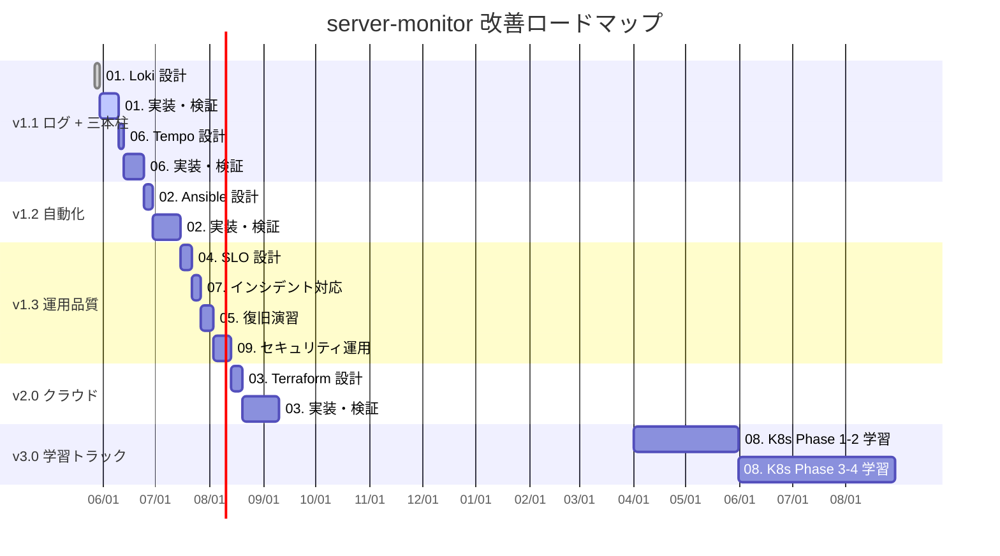
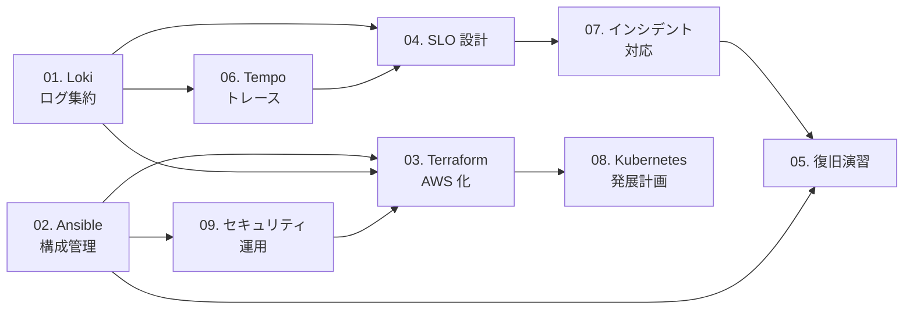

# server-monitor 改善計画 一覧

[server-monitor](https://github.com/ns7jp/server-monitor) リポジトリに対して着手予定の改善を、設計書として先行整備したものです。
本リポジトリ（プロフィール）上で設計を固めてから、server-monitor 側で実装します。

---

## 改善テーマ一覧

### 運用基盤の強化（v1.1 〜 v2.0 実装対象）

| # | テーマ | 目的 | 想定工数 | 優先度 |
| --- | --- | --- | --- | --- |
| 01 | [Loki + Promtail によるログ集約](./01-loki-log-aggregation.md) | メトリクスとログを同一ダッシュボードで可視化 | 約 2 週間 | 高 |
| 02 | [Ansible による構成管理自動化](./02-ansible-automation.md) | 手順書をコード化し、再現性と移植性を確保 | 約 3 週間 | 高 |
| 03 | [AWS + Terraform 化](./03-terraform-aws.md) | クラウド + IaC への移行（学習要素を兼ねる） | 約 4 週間 | 中 |
| 04 | [SLO / SLI / エラーバジェット設計](./04-slo-design.md) | 「何を守るか」を数値で定義し、運用品質を可視化 | 約 1 週間 | 中 |
| 05 | [バックアップ・復旧演習](./05-backup-recovery-drill.md) | 設計だけでなく実演し、復旧手順を実証 | 約 1 週間 | 中 |
| 06 | [分散トレーシング（Tempo + OpenTelemetry）](./06-observability-traces.md) | 可観測性の三本柱（Metrics / Logs / **Traces**）を完成 | 約 2 週間 | 中 |
| 07 | [インシデント対応プロセス・ポストモーテム](./07-incident-response.md) | 障害から「組織として学ぶ仕組み」を整備 | 約 1 週間 | 高 |
| 09 | [セキュリティ運用プロセス](./09-security-operations.md) | 設定だけでなく運用継続できるセキュリティへ | 約 2 週間 | 中 |

### 学習ロードマップ寄り（実装は中長期）

| # | テーマ | 目的 | 想定期間 | 優先度 |
| --- | --- | --- | --- | --- |
| 08 | [Kubernetes / EKS 発展計画](./08-kubernetes-roadmap.md) | CKAD / CKA と連動した段階的 K8s 習得 | 5 か月（学習） | 低（中長期） |

合計：実装系（01〜07, 09）で約 16 週間（並列実施で 12 週間想定）。08 は資格学習と連動して 2027 年以降。

---

## 全体ロードマップ

---

## 各テーマ間の依存関係

- **Loki → SLO**：ログ由来の SLI（エラー率）を測るために Loki が先
- **Loki → Tempo**：Trace から Log への相関ジャンプを使うため、ログ集約が先
- **Tempo → SLO**：レイテンシ SLI の調査を Exemplars でトレースに繋ぐため
- **Ansible → Terraform**：OS 内の構成を Ansible で完全自動化してから AWS にコピーする
- **SLO → インシデント対応**：Sev 判定の数値根拠（バーンレート）として SLO が必要
- **インシデント対応 → 復旧演習**：演習の振り返りで初回ポストモーテムを生む流れ
- **Ansible → セキュリティ運用**：パッチ管理の実体が Ansible にあるため
- **Terraform → Kubernetes**：VM ベース AWS 環境を理解してから EKS に進む

---

## 関連ドキュメント

- [アーキテクチャ図（現状 / 将来構想）](../architecture-diagram.md)
- [資格取得ロードマップ](../certifications/roadmap.md)
