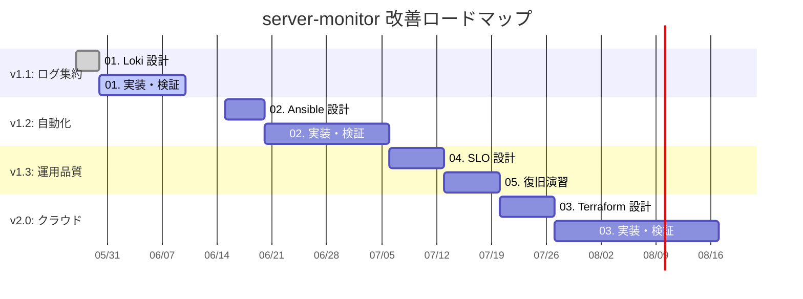
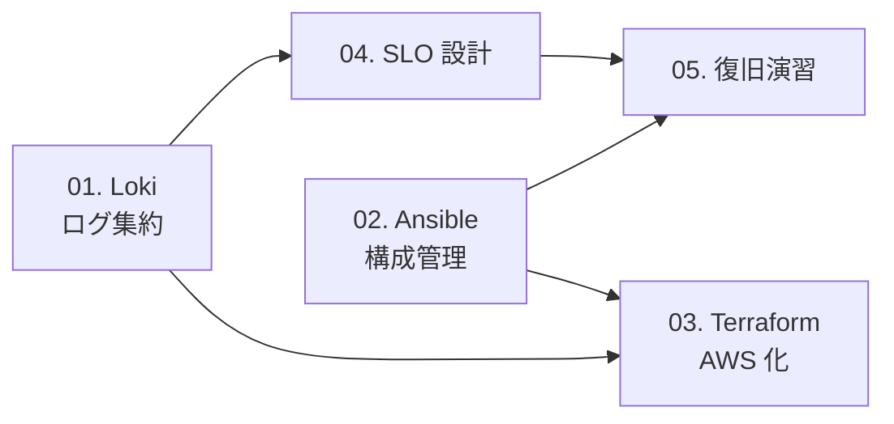

# server-monitor 改善計画 一覧

[server-monitor](https://github.com/ns7jp/server-monitor) リポジトリに対して着手予定の改善を、設計書として先行整備したものです。
本リポジトリ（プロフィール）上で設計を固めてから、server-monitor 側で実装します。

---

## 改善テーマ一覧

| # | テーマ | 目的 | 想定工数 | 優先度 |
| --- | --- | --- | --- | --- |
| 01 | [Loki + Promtail によるログ集約](./01-loki-log-aggregation.md) | メトリクスとログを同一ダッシュボードで可視化 | 約 2 週間 | 高 |
| 02 | [Ansible による構成管理自動化](./02-ansible-automation.md) | 手順書をコード化し、再現性と移植性を確保 | 約 3 週間 | 高 |
| 03 | [AWS + Terraform 化](./03-terraform-aws.md) | クラウド + IaC への移行（学習要素を兼ねる） | 約 4 週間 | 中 |
| 04 | [SLO / SLI / エラーバジェット設計](./04-slo-design.md) | 「何を守るか」を数値で定義し、運用品質を可視化 | 約 1 週間 | 中 |
| 05 | [バックアップ・復旧演習](./05-backup-recovery-drill.md) | 設計だけでなく実演し、復旧手順を実証 | 約 1 週間 | 中 |

合計：約 11 週間（並列実施で 8 週間程度を想定）

---

## 全体ロードマップ

---

## 各テーマ間の依存関係

- **Loki → SLO**：ログ由来の SLI（エラー率）を測るために Loki が先
- **Ansible → Terraform**：OS 内の構成を Ansible で完全自動化してから AWS にコピーする
- **SLO → 復旧演習**：「何分以内に復旧すべきか」を SLO で決めてから演習する

---

## 関連ドキュメント

- [アーキテクチャ図（現状 / 将来構想）](../architecture-diagram.md)
- [資格取得ロードマップ](../certifications/roadmap.md)
