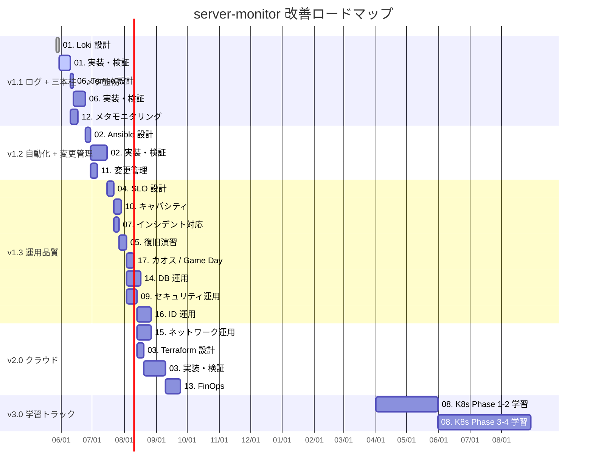
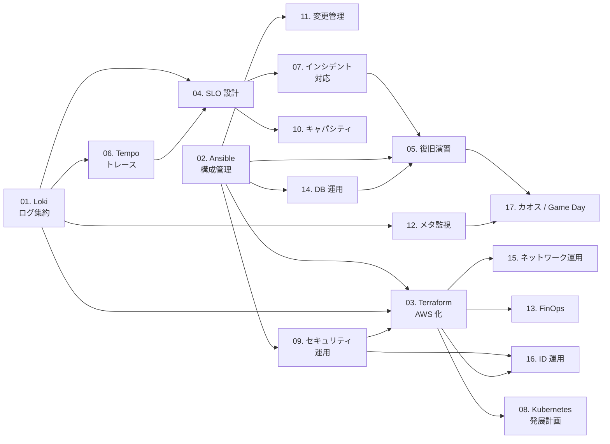

# server-monitor 改善設計の実装対応表

このディレクトリは [server-monitor](https://github.com/ns7jp/server-monitor) に対して
先行作成した設計資料である。現在は server-monitor 側へ実装済みの内容と、
実環境での検証証跡が未収録の内容を分けて管理する。

## 対応状況

技術選定の根拠は [ADR（アーキテクチャ決定記録）](../adr/README.md) に分離して記録しています。

---

| # | テーマ | server-monitor 側の反映 | 証跡状態 |
| --- | --- | --- | --- |
| 01 | [Loki + ログ収集](./01-loki-log-aggregation.md) | Loki + Grafana Alloy、Grafana query / dashboard | Promtail 設計は EOL により Alloy へ置換。Linux Docker での実行ログは未収録 |
| 02 | [Ansible 構成管理](./02-ansible-automation.md) | roles、playbooks、構文 CI、手動 full Molecule workflow | full `molecule test` の結果は未収録 |
| 03 | [AWS + Terraform](./03-terraform-aws.md) | network / compute / alb / monitoring / backup modules、dev / prod | `apply` / `destroy` と実費は未収録 |
| 04 | [SLO / SLI](./04-slo-design.md) | blackbox、recording / burn-rate rules、dashboard、runbooks | 同一ホスト内のラボ SLI。外部 probe による SLO は未実装 |
| 05 | [バックアップ・復旧演習](./05-backup-recovery-drill.md) | backup verification CI、D-1 script、D-2 runbook、templates | D-1 / D-2 の RTO / RPO 実測は未収録 |
| 11 | [変更管理プロセス](./11-change-management.md) | PR テンプレート、Change request / Evidence capture Issue、変更管理ミニ運用 | PR ごとの検証・ロールバック・証跡リンクを蓄積する |

## 重要な更新

- Promtail は 2026 年 3 月 2 日に EOL となったため、実装は Grafana Alloy に移行した。
- AWS Terraform はコードとして用意されているが、稼働中の環境や費用実績を示すものではない。
- AWS の本番相当 SLO では、対象 EC2 外からの synthetic probe と中央 metrics / logs
  保存先が必要であり、現時点では追加実装・検証対象である。
- 変更管理は CAB など組織前提の部分を設計サンプルとして残しつつ、個人ラボでは
  PR / Issue テンプレートで実運用できる軽量版へ落とし込んだ。
- 実装着手が 1 年以上先の中長期テーマ（13 / 14 / 16 / 17）は、選考フェーズでは
  実装済みテーマと証跡を主軸にするため、2026-07 に
  [中長期ロードマップ](../roadmap/README.md) へ移動した（設計は継続して保守する）。
- 証跡は server-monitor の
  [検証証跡台帳](https://github.com/ns7jp/server-monitor/blob/main/docs/evidence/README.md)
  に沿って採録する。

### 運用基盤の強化（v1.1 〜 v2.0 実装対象）

| # | テーマ | 目的 | 想定工数 | 優先度 |
| --- | --- | --- | --- | --- |
| 01 | [Loki + Grafana Alloy によるログ集約](./01-loki-log-aggregation.md) | メトリクスとログを同一ダッシュボードで可視化 | 約 2 週間 | 高 |
| 02 | [Ansible による構成管理自動化](./02-ansible-automation.md) | 手順書をコード化し、再現性と移植性を確保 | 約 3 週間 | 高 |
| 03 | [AWS + Terraform 化](./03-terraform-aws.md) | クラウド + IaC への移行（学習要素を兼ねる） | 約 4 週間 | 中 |
| 04 | [SLO / SLI / エラーバジェット設計](./04-slo-design.md) | 「何を守るか」を数値で定義し、運用品質を可視化 | 約 1 週間 | 中 |
| 05 | [バックアップ・復旧演習](./05-backup-recovery-drill.md) | 設計だけでなく実演し、復旧手順を実証 | 約 1 週間 | 中 |
| 06 | [分散トレーシング（Tempo + OpenTelemetry）](./06-observability-traces.md) | 可観測性の三本柱（Metrics / Logs / **Traces**）を完成 | 約 2 週間 | 中 |
| 07 | [インシデント対応プロセス・ポストモーテム](./07-incident-response.md) | 障害から「組織として学ぶ仕組み」を整備 | 約 1 週間 | 高 |
| 09 | [セキュリティ運用プロセス](./09-security-operations.md) | 設定だけでなく運用継続できるセキュリティへ | 約 2 週間 | 中 |

### 運用品質・周辺技術の拡張（v1.1 〜 v2.0 実装対象、第二弾）

| # | テーマ | 目的 | 想定工数 | 優先度 |
| --- | --- | --- | --- | --- |
| 10 | [キャパシティプランニング・負荷試験](./10-capacity-planning.md) | k6 で SLO 限界値を実測、スケール判断を数値化 | 約 1 週間 | 中 |
| 11 | [変更管理プロセス](./11-change-management.md) | 平常時変更の統制、ITIL Change Enablement 準拠 | 約 1 週間 | 高 |
| 12 | [メタモニタリング（監視の監視）](./12-meta-monitoring.md) | Prometheus 自身が落ちた時の外部検知設計 | 約 1 週間 | 高 |
| 13 | [FinOps（コスト最適化運用）](../roadmap/13-finops.md) | タグ規約・コストアラート・Rightsizing 月次運用 | 約 2 週間 | 中長期ロードマップへ移動（2026-07 縮退） |
| 14 | [データベース運用設計](../roadmap/14-database-operations.md) | バックアップ階層化・PITR・スロークエリ調査 | 約 2 週間 | 中長期ロードマップへ移動（2026-07 縮退） |
| 15 | [ネットワーク・DNS 運用](./15-network-operations.md) | TLS 期限監視・SG 棚卸し・VPN / SSM 設計 | 約 2 週間 | 中 |
| 16 | [アイデンティティ運用](../roadmap/16-identity-operations.md) | ID ライフサイクル・SSO・特権管理・MFA | 約 2 週間 | 中長期ロードマップへ移動（2026-07 縮退） |
| 17 | [カオスエンジニアリング・Game Day](../roadmap/17-chaos-engineering.md) | 「想定外」を仕組みで気付く、メタ監視の実証 | 約 1 週間 | 中長期ロードマップへ移動（2026-07 縮退） |

実装着手が 1 年以上先のテーマ（13 / 14 / 16 / 17）は、一次導線を実装済み + 証跡に絞るため
2026-07 に [中長期ロードマップ](../roadmap/README.md) へ移動した。
行は経緯が辿れるよう表に残している。

### 学習ロードマップ寄り（実装は中長期）

| # | テーマ | 目的 | 想定期間 | 優先度 |
| --- | --- | --- | --- | --- |
| 08 | [Kubernetes / EKS 発展計画](./08-kubernetes-roadmap.md) | CKAD / CKA と連動した段階的 K8s 習得 | 5 か月（学習） | 低（中長期） |

合計：実装系（01〜07、09〜17）で約 28 週間（並列実施で 20 週間想定）。08 は資格学習と連動して 2027 年以降。

## 証跡追加の順序

1. Linux Docker host で Loki / Alloy の収集と D-1 復旧時間を記録する。
2. 手動 CI または Linux host で Ansible の full Molecule 結果を記録する。
3. 承認された短時間 AWS 検証で `apply` / `destroy` と Cost Explorer 実費を記録する。
4. 外部 probe と中央 telemetry の構成を追加した後、AWS 向け SLO を再定義する。

## 主要リンク

- [アーキテクチャ図（実装済み構成 / 検証境界）](../architecture-diagram.md)

## 全体ロードマップ

---

## 各テーマ間の依存関係

### 主要な依存関係

- **Loki → SLO**：ログ由来の SLI（エラー率）を測るために Loki が先
- **Loki → Tempo**：Trace から Log への相関ジャンプを使うため、ログ集約が先
- **Tempo → SLO**：レイテンシ SLI の調査を Exemplars でトレースに繋ぐため
- **Ansible → Terraform**：OS 内の構成を Ansible で完全自動化してから AWS にコピーする
- **Ansible → 変更管理**：構成変更が PR 化される基盤として Ansible が先
- **SLO → キャパシティ**：「守るべき品質」を決めてから「容量」を語る順序
- **SLO → インシデント対応**：Sev 判定の数値根拠（バーンレート）として SLO が必要
- **インシデント対応 → 復旧演習 → カオス**：計画演習からカオスへ徐々に拡張
- **Loki → メタ監視**：自身のログ集約状態を Loki でも観測
- **メタ監視 → カオス**：「気付ける設計」を Game Day で実証
- **Ansible → セキュリティ運用**：パッチ管理の実体が Ansible にあるため
- **セキュリティ運用 → ID 運用**：SSO / MFA 統合の前段
- **Terraform → ネットワーク / FinOps / ID**：クラウドリソースが揃ってからの周辺運用
- **Terraform → Kubernetes**：VM ベース AWS 環境を理解してから EKS に進む

---

## ADR（アーキテクチャ決定記録）との対応

各設計書の **「なぜこの技術か」** は [ADR](../adr/README.md) に分離記録しています。

| 設計書 | 主要 ADR |
| --- | --- |
| 01 Loki | [ADR-0003 Loki 採用](../adr/0003-loki-for-logs.md) |
| 02 Ansible | [ADR-0004 Ansible 採用](../adr/0004-ansible-for-config.md) |
| 03 Terraform/AWS | [ADR-0005 Terraform 採用](../adr/0005-terraform-for-iac.md) |
| 04 SLO | [ADR-0001 Prometheus 採用](../adr/0001-monitoring-stack.md) |
| 07 IR | [ADR-0007 Slack 通知](../adr/0007-slack-notifications.md) |
| 08 K8s | [ADR-0002 Docker Compose 採用](../adr/0002-deploy-with-docker-compose.md) |
| 09 セキュリティ運用 | [ADR-0008 段階的認証](../adr/0008-stepwise-auth.md) |
| 13 FinOps | [ADR-0006 監視自前運用](../adr/0006-self-host-monitoring.md) |
| 16 ID 運用 | [ADR-0008 段階的認証](../adr/0008-stepwise-auth.md) |

---

## 関連ドキュメント

- [ADR 一覧](../adr/README.md)
- [アーキテクチャ図（現状 / 将来構想）](../architecture-diagram.md)
- [資格取得ロードマップ](../certifications/roadmap.md)
- [現場経験 ↔ インフラ運用 橋渡し](../career-bridge.md)
