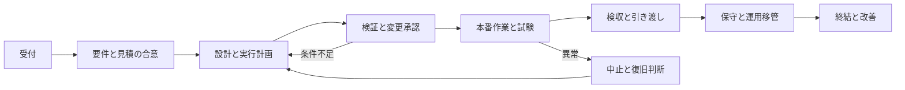

# サーバー案件を受付から終結まで進める

**依頼を整理し、必要な合意を取り、作業を分けて実行し、結果を確かめ、次の担当へ渡すための案件運用システム**です。小規模Linuxサーバーの構築・更改・設定変更を中心に使います。Windowsやクラウドでも仕事の進め方は利用できますが、製品固有の設計・試験・権限は別に確認します。

[育成システム](../server-engineer/README.md)は「何をできるようにするか」、この仕組みは「一件の仕事をどう進め、複数の仕事をどう配分するか」を扱います。主作品の[構築案件パック](https://github.com/ns7jp/server/tree/main/docs/build-package)を実装・試験の書類として利用し、受付・合意・優先順位・例外対応をその前後につなぎます。

## 今日の始め方

1. 実案件を持ち出さず、架空案件 `demo-a` で [PJ00 受付](stages/00-intake.md)を読む。
2. [受付票](templates/intake.md)を自分の作業場所へコピーし、目的・依頼者・対象・期限・未確認事項を埋める。分からない値は未確認とする。
3. [ツール操作](tracker-guide.md)で案件を作成する。初期値は全工程 `NOT RUN`。Node.jsが使えない場合は同じ様式を手で管理できる。
4. 今回の「次の一手」を一つ決め、担当と確認期限を書く。調査・断り・相談も正当な判断として残す。
5. 作業前後に結果を記録し、工程を進めるときは担当する確認者の記録を付ける。

顧客名、実IP、認証情報、契約書、生ログはこの公開リポジトリへ置きません。実案件の原本は所属組織が許可した管理場所で扱います。ローカルCLIは `.local/server-projects/` へ保存しますが、その場所を業務に利用できるかは組織の規則で判断します。

## 一件を進める8工程

| 工程 | 終わったと言える条件 | 主な成果物 | 確認者 |
| --- | --- | --- | --- |
| [PJ00 受付](stages/00-intake.md) | 依頼内容と担当可否、次の期限が明確 | 受付票・不足情報 | 案件責任者 |
| [PJ01 要件・見積](stages/01-scope-estimate.md) | 対象・対象外・受入条件・前提が合意済み | 要件・工数幅・役割・日程 | 案件責任者 |
| [PJ02 設計・計画](stages/02-design-plan.md) | 要件・設計・手順・試験・戻し方が対応 | 設計一式・作業計画 | 技術確認者 |
| [PJ03 本番前確認](stages/03-readiness.md) | 検証が完了し、対象版と変更窓の承認がある | 検証結果・変更計画・承認 | 変更責任者 |
| [PJ04 本番作業](stages/04-execution.md) | 実行結果と事後試験、中止・戻しの判断を記録 | 時系列・試験結果・報告 | 変更責任者 |
| [PJ05 検収・引き渡し](stages/05-acceptance.md) | 受領者が受入条件を確認し、操作と残事項を受領 | 検収・引き渡し記録 | 受領者 |
| [PJ06 保守・移管](stages/06-support.md) | 合意期間の観測と残課題、運用担当への移管が完了 | 保守台帳・運用受領 | 運用受領者 |
| [PJ07 終結](stages/07-closure.md) | 未完了の移管、事務、保管、振り返りを確認 | 完了報告・実績と改善 | 案件責任者 |

各工程は3条件、合計24条件です。条件IDと工程順序の正本は [workflow.json](workflow.json)。条件を満たした申告だけでは工程はPASSにならず、最新の証跡に対する確認が必要です。台帳の承認記録は組織の正式な承認を記録するためのもので、ツールが本番権限を発行することはありません。

## 複数案件を回す

毎朝、[日々の運営](operations.md)と案件ボードで、障害・今日の約束・止まっている依存・残作業量を確認します。全案件を同時に進める前に、その日の作業枠へ配分します。

- 通常作業は一人あたり同時進行2件を初期の目安にし、割込みとレビューの時間を空ける。
- 優先度は影響・合意期限・依存で決める。声の大きさや受付順だけで決めない。
- 待ち時間にも問い合わせ担当・次回確認日を置く。催促した事実と回答が来た事実を分ける。
- 期限を動かすときは、元の期限・変更前後・理由・合意を残す。
- [週次配分票](templates/portfolio-review.md)で、翌週に割り当てた時間と全残作業時間を分ける。

この数字は初期運用の設計値です。実際のチームの人数・勤務時間・当番・契約に合わせて調整します。[架空3案件の運用例](examples/three-projects.md)で具体的に追えます。

## 予定どおりに進まないとき

| 起きたこと | 最初の対応 | 開く手順 |
| --- | --- | --- |
| 依頼が曖昧・担当範囲外 | 調査事項と判断者を決める | [受付](stages/00-intake.md) |
| 「ついでに追加して」 | 元の合意と影響を比べ、採否待ちにする | [変更・障害対応](change-incident.md) |
| 本番試験FAIL・切戻し時間不足 | 新しい変更を止め、決めた責任者へ状況を渡す | [本番作業](stages/04-execution.md) |
| 顧客回答待ち・環境未提供 | 保留理由、依存、次回確認日を記録する | [日々の運営](operations.md) |
| 検収で不一致 | 不適合か追加要望かを受入条件に照らして整理する | [検収](stages/05-acceptance.md) |
| 案件が中止 | 取消記録、残作業・費用確認・アクセス・保管の処置を残す | [終結](stages/07-closure.md) |

## 書類と運営

[様式一覧](templates/README.md) / [役割と報告](roles-and-communication.md) / [変更・障害対応](change-incident.md) / [日々の運営](operations.md) / [ツール操作](tracker-guide.md) / [実装仕様](implementation-contract.md) / [保守と確認範囲](maintenance.md) / [参考資料](sources.md)

**導入した仕組みの動作確認と、実案件を成功させた実績は別です。** 初期案件に実績を入れず、実際の作業・承認・受領に対応する記録だけを残します。契約条件、価格、請求・入金の判断は担当者の確認を記録し、このツールで代行しません。
