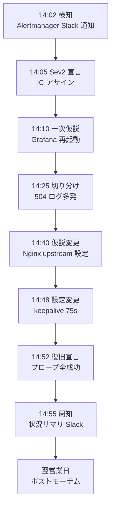

# ビジュアルショーケース

> **本ドキュメントの位置付け**
>
> 採用ご担当者様が **数十秒で** 「何ができる人か」を判断できるよう、主要画面と動作のサンプルをまとめたページです。
>
> - **テキストモックアップ部分**：設計済みの内容を ASCII で先行表示しています
> - **実機キャプチャ予定**：[server-monitor](https://github.com/ns7jp/server-monitor) 本体への [改善計画](../server-monitor-improvements/README.md) 実装が進むタイミングで、実画面のスクリーンショットへ差し替えます
>
> 「実物（既に動いているもの）」「設計サンプル」「未実装の計画」を **混同せず提示する** ことを意識しています。

---

## 目次

- [1. 統合監視ダッシュボード（Grafana）](#1-統合監視ダッシュボードgrafana)
- [2. アラート通知（Slack）](#2-アラート通知slack)
- [3. SLO ダッシュボード](#3-slo-ダッシュボード)
- [4. インシデントタイムライン](#4-インシデントタイムライン)
- [5. ポストモーテム](#5-ポストモーテム)
- [6. 障害復旧演習の記録](#6-障害復旧演習の記録)

---

## 1. 統合監視ダッシュボード（Grafana）

### 1.1 現状（v1.0 — 実装済み）

[server-monitor](https://github.com/ns7jp/server-monitor) で稼働中。

```text
┌──────────────────────────────────────────────────────────────────┐
│ server-monitor v1.0 — Grafana                          Last 6h ▼ │
├──────────────────────────────────────────────────────────────────┤
│ CPU 使用率                          メモリ使用率                  │
│   ┌─────────────────────┐            ┌─────────────────────┐     │
│   │     ╭─╮      ╭───╮  │            │   ╭────────────────╮ │     │
│   │   ╭─╯ ╰──────╯   ╰─ │ 28%        │ ╭─╯                │ 64%   │
│   │ ╭─╯               │ │            │─╯                  │     │
│   └─────────────────────┘            └─────────────────────┘     │
├──────────────────────────────────────────────────────────────────┤
│ ディスク使用率              HTTP ステータス分布（直近1h）           │
│   /     ████░░░░░░ 41%      2xx ████████████████░ 96.2%          │
│   /var  ███░░░░░░░ 33%      4xx ░░░░░░░░░░░░░░░░░  3.5%          │
│                              5xx ░░░░░░░░░░░░░░░░░  0.3%          │
├──────────────────────────────────────────────────────────────────┤
│ アラート状態：● Firing 0   ● Pending 0   ● OK 12                  │
└──────────────────────────────────────────────────────────────────┘
```

**キャプチャ予定**：上記レイアウトのスクリーンショット（解像度 1920×1080）

### 1.2 将来構想（v2.0 — [計画書](../server-monitor-improvements/01-loki-log-aggregation.md) [06](../server-monitor-improvements/06-observability-traces.md)）

Metrics + Logs + Traces を 1 画面に統合した姿。

```text
┌──────────────────────────────────────────────────────────────────┐
│ server-monitor v2.0 — Unified Observability         Last 24h ▼   │
├──────────────────────────────────────────────────────────────────┤
│ SLO 達成率: 99.62% ✓    エラーバジェット残: ████████░░ 78%        │
├──────────────────────────────────────────────────────────────────┤
│ レイテンシ p95 (with Exemplars)                                   │
│   500ms ─ ─ ─ ─ ● ─ ─ ─ ─ ─ ─ ─ ─ ─ ─ ─ ─ ─ SLO                  │
│           ╭────╯╲      ●                                          │
│   ─────╯       ╲    ●     ←── 点クリックでトレース表示             │
├──────────────────────────────────────────────────────────────────┤
│ エラーログ（traceID リンク付き）                                    │
│   14:32:17 ERROR [trace=a3f...] DB connection timeout            │
│   14:32:43 ERROR [trace=b1c...] Upstream 504                     │
│                            ↑ クリックで Tempo へジャンプ            │
└──────────────────────────────────────────────────────────────────┘
```

---

## 2. アラート通知（Slack）

### 2.1 現状（v1.0 — 実装済み）

Alertmanager → Slack Webhook で稼働中。

```text
┌─────────────────────────────────────────────────────────────┐
│ #alerts                                                      │
├─────────────────────────────────────────────────────────────┤
│ ⚠️  Alertmanager BOT     14:32                              │
│                                                              │
│  🔥 [FIRING] HighCpuUsage                                    │
│  ─────────────────────────────────                          │
│  instance: monitor-01:9100                                   │
│  severity: warning                                           │
│  value: 87.4%                                                │
│  threshold: 80%                                              │
│  for: 5 minutes                                              │
│                                                              │
│  📖 Runbook: docs/runbooks/cpu-high.md                       │
│  📊 Grafana: https://monitor.example.com/d/host             │
└─────────────────────────────────────────────────────────────┘
```

### 2.2 将来構想（v1.3 — [計画書](../server-monitor-improvements/04-slo-design.md)）

SLO バーンレート通知（閾値型ではなく **バジェット消費速度** で警告）。

```text
┌─────────────────────────────────────────────────────────────┐
│ #alerts                                                      │
├─────────────────────────────────────────────────────────────┤
│ ⚠️  Alertmanager BOT     14:32                              │
│                                                              │
│  🔥 [CRITICAL] SLO Fast Burn                                 │
│  ─────────────────────────────────                          │
│  SLO: availability 99.5% (30d)                               │
│  Burn rate: 14.4x (現速度なら数時間でバジェット枯渇)            │
│  消費済: 22% / バジェット 216 分                              │
│                                                              │
│  📖 Runbook: docs/runbooks/slo-fast-burn.md                  │
│  📊 SLO Dashboard: https://monitor.example.com/d/slo         │
└─────────────────────────────────────────────────────────────┘
```

---

## 3. SLO ダッシュボード

[04. SLO 設計](../server-monitor-improvements/04-slo-design.md) 計画書通りのレイアウト。

```text
┌──────────────────────────────────────────────────────────────┐
│ SLO Dashboard — server-monitor                  May 2026     │
├──────────────────────────────────────────────────────────────┤
│ 当月の可用性 SLO 達成率                       99.62%  ✓      │
├──────────────────────────────────────────────────────────────┤
│ エラーバジェット残量                                          │
│  ████████████░░░░░░░░  62% 残  (216 分中 82 分消費)            │
├──────────────────────────────────────────────────────────────┤
│ 直近 28 日の p95 レイテンシ                                   │
│   500ms ─ ─ ─ ─ ─ ─ ─ ─ ─ ─ ─ ─ ─ ─ ─ ─ ─ ─ SLO              │
│         ╭──╮       ╭──────╮                                  │
│   ──╯  ╰────╯    ╰─────╯                                   │
├──────────────────────────────────────────────────────────────┤
│ インシデント履歴 (当月)                                       │
│  - 05/12 02:34 (15 分)  Disk full on /var/log                │
│  - 05/18 11:02 ( 8 分)  Nginx restart for cert               │
└──────────────────────────────────────────────────────────────┘
```

**キャプチャ予定**：v1.3（[04. SLO](../server-monitor-improvements/04-slo-design.md) 実装後）

---

## 4. インシデントタイムライン

[07. インシデント対応](../server-monitor-improvements/07-incident-response.md) 計画書の運用イメージ。



---

## 5. ポストモーテム

[07. インシデント対応 §6](../server-monitor-improvements/07-incident-response.md) のテンプレート出力例。

```text
┌────────────────────────────────────────────────────────────────┐
│ INC-2026-0001: Grafana 接続断続的失敗            Status: Final │
├────────────────────────────────────────────────────────────────┤
│ Detect → Resolve: 50 分    Severity: Sev2                       │
│ 影響: 監視運用者 3 名 / SLO バジェット 50 分消費（残 78%）       │
├────────────────────────────────────────────────────────────────┤
│ Timeline (JST)                                                  │
│  14:02 GrafanaProbeFailed 発火                                  │
│  14:05 Sev2 宣言、IC アサイン                                   │
│  14:25 access.log で 504 多発確認                              │
│  14:48 keepalive_timeout 10s → 75s                              │
│  14:52 Resolved                                                 │
├────────────────────────────────────────────────────────────────┤
│ Action Items                                                    │
│  [#123] Prevent: Nginx 設定を IaC で明示       期限: 06/15      │
│  [#124] Detect:  長時間接続シナリオを CI 化     期限: 06/22      │
│  [#125] Process: IC / Investigator 分担を整備   期限: 06/10      │
└────────────────────────────────────────────────────────────────┘
```

---

## 6. 障害復旧演習の記録

[05. 復旧演習](../server-monitor-improvements/05-backup-recovery-drill.md) D-2「ホスト障害」シナリオの計測表（テンプレ）。

```text
┌────────────────────────────────────────────────────────┐
│ Drill: D-2 ホスト障害復旧            Date: 2026-MM-DD  │
├────────────────────────────────────────────────────────┤
│ 項目                       │ 目標   │ 実測   │ 評価   │
├────────────────────────────────────────────────────────┤
│ 検知（アラート受信）        │  1 分  │ ? 分   │  ?     │
│ 1 次切り分け完了           │  5 分  │ ? 分   │  ?     │
│ スナップショット特定        │  2 分  │ ? 分   │  ?     │
│ 新 EC2 起動完了            │ 10 分  │ ? 分   │  ?     │
│ Ansible 適用完了           │ 15 分  │ ? 分   │  ?     │
│ ヘルスチェック OK          │  5 分  │ ? 分   │  ?     │
├────────────────────────────────────────────────────────┤
│ RTO（合計）                │ 60 分 │ ? 分   │  ?     │
│ RPO                        │ 24 h  │ ? h    │  ?     │
└────────────────────────────────────────────────────────┘
```

**キャプチャ予定**：v1.3（[05](../server-monitor-improvements/05-backup-recovery-drill.md) の D-2 演習を初回実施した際の実測値）

---

## 関連ドキュメント

- [プロフィール README](../../README.md)
- [アーキテクチャ図（現状 / 将来構想）](../architecture-diagram.md)
- [サーバー監視ラボ 改善計画](../server-monitor-improvements/README.md)
- [ポートフォリオ進捗 STATUS](../../STATUS.md)
